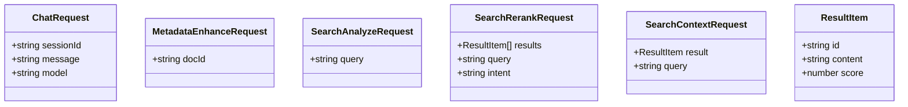

# Types and Interfaces

<cite>
**Referenced Files in This Document**
- [sonar-types.ts](file://src/daemon/sonar-types.ts)
- [artifact.ts](file://src/types/artifact.ts)
- [reranking.ts](file://src/types/reranking.ts)
- [sidecar.ts](file://src/types/sidecar.ts)
- [tools.ts](file://src/types/tools.ts)
- [schema.ts](file://src/config/schema.ts)
- [defaults.ts](file://src/config/defaults.ts)
- [validator.ts](file://src/utils/validator.ts)
- [sonar-client.ts](file://src/utils/sonar-client.ts)
</cite>

## Table of Contents
1. [Introduction](#introduction)
2. [Project Structure](#project-structure)
3. [Core Components](#core-components)
4. [Architecture Overview](#architecture-overview)
5. [Detailed Component Analysis](#detailed-component-analysis)
6. [Dependency Analysis](#dependency-analysis)
7. [Performance Considerations](#performance-considerations)
8. [Troubleshooting Guide](#troubleshooting-guide)
9. [Conclusion](#conclusion)
10. [Appendices](#appendices)

## Introduction
This document provides comprehensive documentation for the Sonar Agent’s type definitions and interface specifications. It covers core data structures (SonarTask, ChatSession, and task-specific interfaces), configuration types and model specifications, validation schemas, error types and status enums, result structures, type guards, utility types, and generic constraints. It also documents serialization formats, API response structures, and data transformation patterns, with practical examples of type usage and integration patterns.

## Project Structure
The type-related definitions are organized across several modules:
- Daemon-level types for Sonar Agent requests and sessions
- Shared type modules for artifacts, reranking, sidecars, and tools
- Configuration schema and defaults for Sonar and related subsystems
- Validation utilities and client utilities that rely on these types

**Diagram sources**
- [sonar-types.ts](file://src/daemon/sonar-types.ts#L1-L69)
- [artifact.ts](file://src/types/artifact.ts#L1-L13)
- [reranking.ts](file://src/types/reranking.ts#L1-L30)
- [sidecar.ts](file://src/types/sidecar.ts#L1-L30)
- [tools.ts](file://src/types/tools.ts#L1-L21)
- [schema.ts](file://src/config/schema.ts#L1-L298)
- [defaults.ts](file://src/config/defaults.ts#L1-L143)
- [validator.ts](file://src/utils/validator.ts#L1-L265)
- [sonar-client.ts](file://src/utils/sonar-client.ts#L51-L98)

**Section sources**
- [sonar-types.ts](file://src/daemon/sonar-types.ts#L1-L69)
- [artifact.ts](file://src/types/artifact.ts#L1-L13)
- [reranking.ts](file://src/types/reranking.ts#L1-L30)
- [sidecar.ts](file://src/types/sidecar.ts#L1-L30)
- [tools.ts](file://src/types/tools.ts#L1-L21)
- [schema.ts](file://src/config/schema.ts#L1-L298)
- [defaults.ts](file://src/config/defaults.ts#L1-L143)
- [validator.ts](file://src/utils/validator.ts#L1-L265)
- [sonar-client.ts](file://src/utils/sonar-client.ts#L51-L98)

## Core Components
This section introduces the primary type categories used by the Sonar Agent and related systems.

- Message and ChatSession: Core chat message and session structures used by the Sonar Agent.
- SonarTask: Task descriptor with type discriminators and optional parameters for execution.
- RequestOptions: Inference request parameters for model invocation.
- API Request Types: Typed request shapes for chat, metadata enhancement, search analysis, reranking, and context retrieval.
- Artifact Types: Ingestion artifact shape for structured payloads.
- Reranking Types: Modes, configuration, and defaults for reranking strategies.
- Sidecar Types: Entity and relation extraction structures and sidecar manifest entries.
- Tools Types: Tool schema, implementation, and registry interfaces.
- Configuration Types: Zod-based schema for Sonar and related subsystems, including enums and sub-schemas.
- Validation Types: Validation report and error structures for pipeline validation.
- Error Types and Status Enums: SubstrateError enumeration and failure structure for provider errors.

**Section sources**
- [sonar-types.ts](file://src/daemon/sonar-types.ts#L5-L68)
- [artifact.ts](file://src/types/artifact.ts#L1-L13)
- [reranking.ts](file://src/types/reranking.ts#L5-L29)
- [sidecar.ts](file://src/types/sidecar.ts#L1-L30)
- [tools.ts](file://src/types/tools.ts#L1-L21)
- [schema.ts](file://src/config/schema.ts#L16-L297)
- [validator.ts](file://src/utils/validator.ts#L3-L30)
- [schema.ts](file://src/config/schema.ts#L274-L289)

## Architecture Overview
The type system supports a layered architecture:
- Configuration schema defines the canonical settings and defaults.
- Utilities consume configuration to construct clients and validate pipeline states.
- Daemon-level types define request/response contracts for the Sonar Agent.
- Shared types encapsulate domain-specific structures (artifacts, sidecars, reranking).
- Tools and API request types enable modular extension and standardized communication.

**Diagram sources**
- [schema.ts](file://src/config/schema.ts#L146-L266)
- [defaults.ts](file://src/config/defaults.ts#L84-L139)
- [sonar-client.ts](file://src/utils/sonar-client.ts#L54-L98)
- [sonar-types.ts](file://src/daemon/sonar-types.ts#L16-L68)
- [artifact.ts](file://src/types/artifact.ts#L1-L13)
- [reranking.ts](file://src/types/reranking.ts#L5-L29)
- [sidecar.ts](file://src/types/sidecar.ts#L1-L30)
- [tools.ts](file://src/types/tools.ts#L1-L21)
- [validator.ts](file://src/utils/validator.ts#L32-L203)

## Detailed Component Analysis

### SonarTask and ChatSession
SonarTask describes a unit of work with a type discriminator and optional parameters. ChatSession captures conversational context with a list of messages and a creation timestamp.

**Diagram sources**
- [sonar-types.ts](file://src/daemon/sonar-types.ts#L5-L32)

**Section sources**
- [sonar-types.ts](file://src/daemon/sonar-types.ts#L5-L32)

### API Request Types
The API request types define the contract for interacting with the Sonar Agent backend.

**Diagram sources**
- [sonar-types.ts](file://src/daemon/sonar-types.ts#L45-L68)

**Section sources**
- [sonar-types.ts](file://src/daemon/sonar-types.ts#L45-L68)

### RequestOptions and Inference Parameters
Options controlling model invocation, including temperature, generation limits, streaming, and format.

**Diagram sources**
- [sonar-types.ts](file://src/daemon/sonar-types.ts#L34-L40)

**Section sources**
- [sonar-types.ts](file://src/daemon/sonar-types.ts#L34-L40)

### Configuration Types and Model Specifications
The configuration schema defines canonical settings for Sonar and related subsystems, including provider enums, task configurations, and cloud settings. Defaults are loaded via a dedicated loader.

**Diagram sources**
- [schema.ts](file://src/config/schema.ts#L16-L88)

**Section sources**
- [schema.ts](file://src/config/schema.ts#L16-L88)
- [defaults.ts](file://src/config/defaults.ts#L84-L139)

### Reranking Types and Defaults
Reranking modes and configuration, including top-K and thresholds for different strategies.

**Diagram sources**
- [reranking.ts](file://src/types/reranking.ts#L5-L29)

**Section sources**
- [reranking.ts](file://src/types/reranking.ts#L5-L29)

### Sidecar Types and Manifest Entries
Sidecar manifest entries and extracted entities/relations for language extraction outputs.

**Diagram sources**
- [sidecar.ts](file://src/types/sidecar.ts#L1-L30)

**Section sources**
- [sidecar.ts](file://src/types/sidecar.ts#L1-L30)

### Tools Types and Registry
Tool schema, implementation, and registry interfaces enabling dynamic tool registration and invocation.

**Diagram sources**
- [tools.ts](file://src/types/tools.ts#L1-L21)

**Section sources**
- [tools.ts](file://src/types/tools.ts#L1-L21)

### Validation Types and Report Structures
Validation report and error structures used to assess pipeline health and compliance.

**Diagram sources**
- [validator.ts](file://src/utils/validator.ts#L3-L30)
- [validator.ts](file://src/utils/validator.ts#L32-L203)

**Section sources**
- [validator.ts](file://src/utils/validator.ts#L3-L30)
- [validator.ts](file://src/utils/validator.ts#L32-L203)

### Error Types and Status Enums
SubstrateError enumeration and failure structure for provider-related errors.

**Diagram sources**
- [schema.ts](file://src/config/schema.ts#L274-L289)

**Section sources**
- [schema.ts](file://src/config/schema.ts#L274-L289)

### Serialization Formats and API Response Structures
- Requests: ChatRequest, MetadataEnhanceRequest, SearchAnalyzeRequest, SearchRerankRequest, SearchContextRequest
- Responses: The Sonar client performs health checks and interacts with endpoints; responses are validated and transformed downstream by consumers.

**Diagram sources**
- [sonar-client.ts](file://src/utils/sonar-client.ts#L54-L98)
- [schema.ts](file://src/config/schema.ts#L54-L88)

**Section sources**
- [sonar-client.ts](file://src/utils/sonar-client.ts#L54-L98)
- [schema.ts](file://src/config/schema.ts#L54-L88)

### Data Transformation Patterns
- Configuration normalization: Legacy fields are normalized during settings loading.
- Validation pipeline: Baseline capture, expectation setting, and delta-based validation produce structured reports.
- Tool schema enforcement: Tool schemas define strict input contracts for handlers.

**Diagram sources**
- [defaults.ts](file://src/config/defaults.ts#L107-L124)
- [validator.ts](file://src/utils/validator.ts#L91-L203)

**Section sources**
- [defaults.ts](file://src/config/defaults.ts#L107-L124)
- [validator.ts](file://src/utils/validator.ts#L91-L203)

### Type Guards and Utility Types
- Type guards: Early-return patterns and strict pick utilities prevent undefined/null handling downstream.
- Utility types: Discriminated unions for result/error handling and readonly enforced shapes.

Examples of usage patterns:
- Guard clause pattern to short-circuit invalid arrays or inputs before processing.
- EnforceShape to restrict object properties and ensure immutability.

**Section sources**
- [validator.ts](file://src/utils/validator.ts#L32-L203)

## Dependency Analysis
The type system exhibits low coupling and high cohesion:
- Daemon types depend on shared types for artifacts and sidecars.
- Configuration schema is consumed by defaults and client utilities.
- Validation utilities depend on configuration for expectations and baseline comparisons.

**Diagram sources**
- [sonar-types.ts](file://src/daemon/sonar-types.ts#L16-L68)
- [artifact.ts](file://src/types/artifact.ts#L1-L13)
- [reranking.ts](file://src/types/reranking.ts#L5-L29)
- [sidecar.ts](file://src/types/sidecar.ts#L1-L30)
- [tools.ts](file://src/types/tools.ts#L1-L21)
- [schema.ts](file://src/config/schema.ts#L146-L266)
- [defaults.ts](file://src/config/defaults.ts#L84-L139)
- [validator.ts](file://src/utils/validator.ts#L32-L203)
- [sonar-client.ts](file://src/utils/sonar-client.ts#L54-L98)

**Section sources**
- [sonar-types.ts](file://src/daemon/sonar-types.ts#L16-L68)
- [artifact.ts](file://src/types/artifact.ts#L1-L13)
- [reranking.ts](file://src/types/reranking.ts#L5-L29)
- [sidecar.ts](file://src/types/sidecar.ts#L1-L30)
- [tools.ts](file://src/types/tools.ts#L1-L21)
- [schema.ts](file://src/config/schema.ts#L146-L266)
- [defaults.ts](file://src/config/defaults.ts#L84-L139)
- [validator.ts](file://src/utils/validator.ts#L32-L203)
- [sonar-client.ts](file://src/utils/sonar-client.ts#L54-L98)

## Performance Considerations
- Prefer discriminated unions for request/response types to minimize runtime checks.
- Use readonly enforced shapes to prevent accidental mutations and improve predictability.
- Keep configuration parsing centralized to reduce redundant validations.
- Cache availability checks for Sonar endpoints to avoid repeated network calls.

## Troubleshooting Guide
Common issues and resolutions:
- Configuration missing or invalid: The settings loader prints critical errors and exits when the Single Source of Truth is absent or fails schema validation.
- Pipeline validation failures: Review ValidationReport for errors and warnings; adjust expectations or fix data integrity issues (e.g., orphaned edges).
- Provider errors: Use SubstrateError enumeration to categorize failures and provide actionable suggestions.

**Section sources**
- [defaults.ts](file://src/config/defaults.ts#L94-L138)
- [validator.ts](file://src/utils/validator.ts#L191-L203)
- [schema.ts](file://src/config/schema.ts#L274-L289)

## Conclusion
The Sonar Agent’s type system provides a robust foundation for configuration, messaging, tooling, validation, and error handling. By leveraging Zod schemas, discriminated unions, and strict typing patterns, the system ensures correctness, maintainability, and extensibility across components.

## Appendices
- Example usage contexts:
  - Constructing a SonarTask for synthesis or research workflows.
  - Defining tool schemas for dynamic tool registration and invocation.
  - Normalizing configuration and validating pipeline state after ingestion.

[No sources needed since this section provides general guidance]