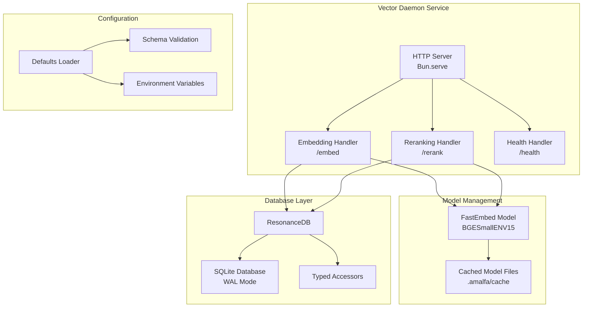
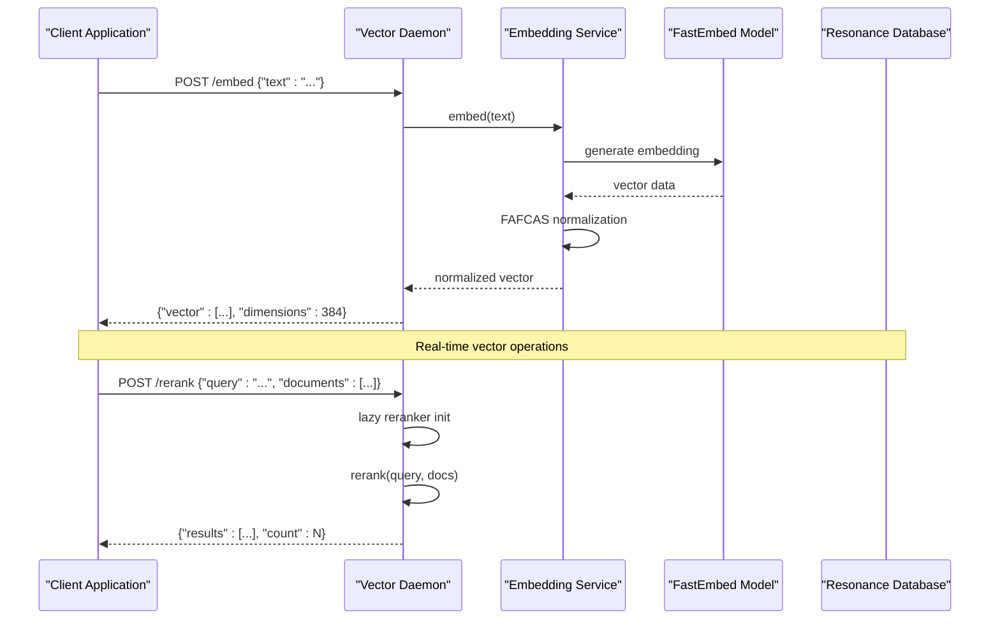
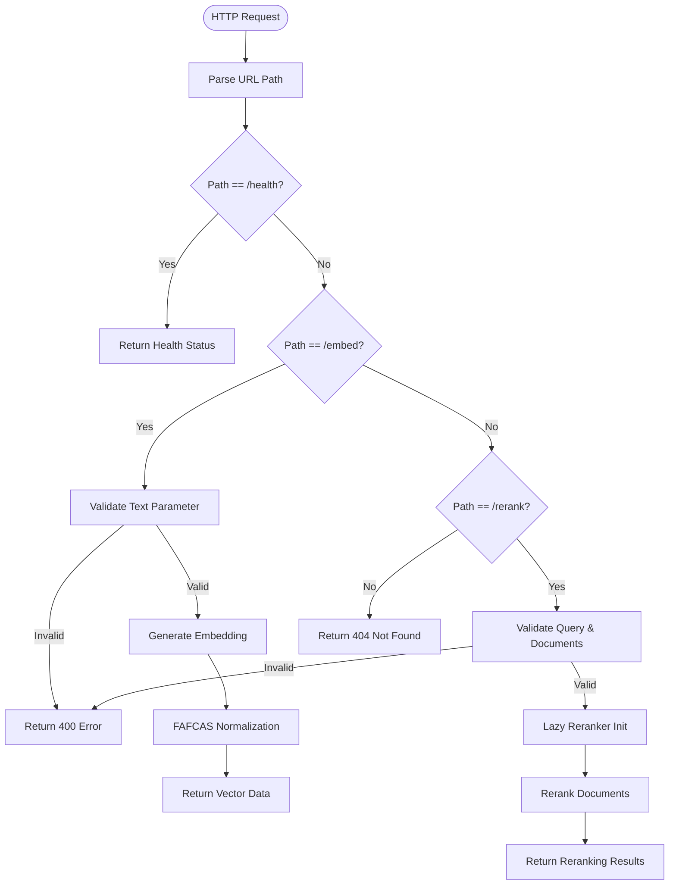
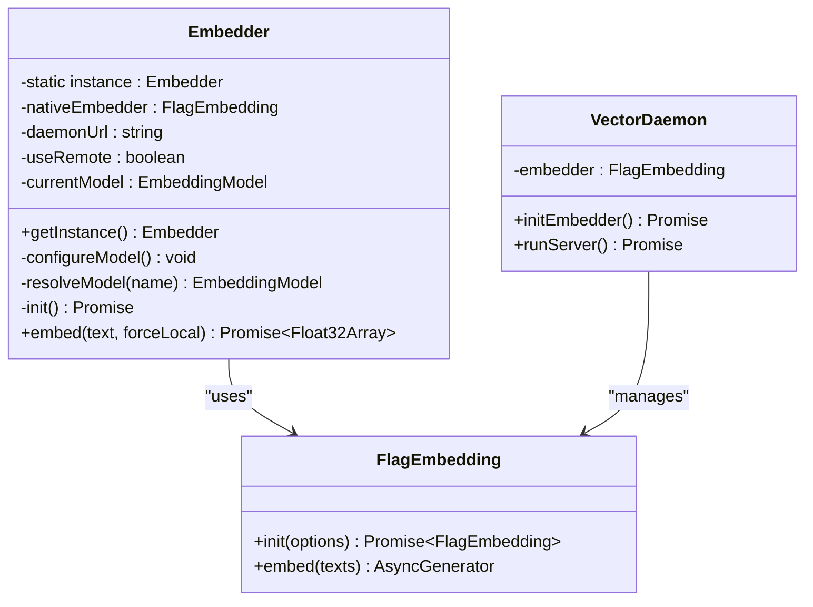
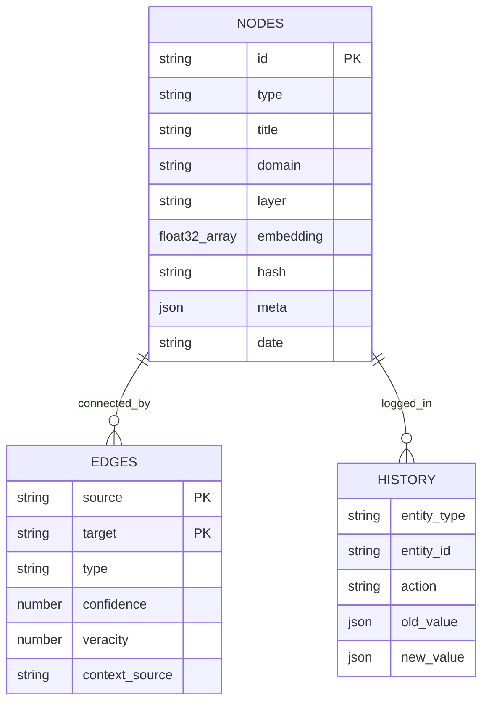
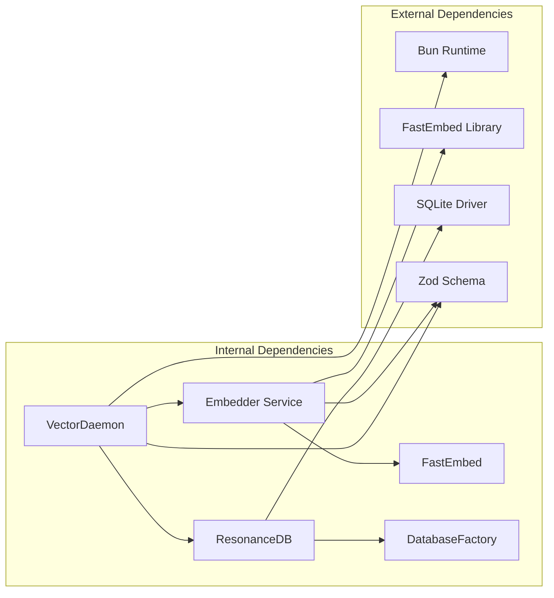

# Vector Daemon

<cite>
**Referenced Files in This Document**
- [vector-daemon.ts](file://src/resonance/services/vector-daemon.ts)
- [embedder.ts](file://src/resonance/services/embedder.ts)
- [VectorEngine.ts](file://src/core/VectorEngine.ts)
- [db.ts](file://src/resonance/db.ts)
- [DatabaseFactory.ts](file://src/resonance/DatabaseFactory.ts)
- [defaults.ts](file://src/config/defaults.ts)
- [schema.ts](file://src/config/schema.ts)
- [DaemonManager.ts](file://src/utils/DaemonManager.ts)
- [index.ts](file://src/daemon/index.ts)
- [fafcas_compliance.test.ts](file://tests/fafcas_compliance.test.ts)
- [03-fafcas-fix.ts](file://src/pipeline/cross-domain/03-fafcas-fix.ts)
- [local-first-vector-db-playbook.md](file://playbooks/local-first-vector-db-playbook.md)
- [vector-daemon-server.md](file://briefs/archive/2026-01-07-vector-daemon-server.md)
</cite>

## Table of Contents
1. [Introduction](#introduction)
2. [Project Structure](#project-structure)
3. [Core Components](#core-components)
4. [Architecture Overview](#architecture-overview)
5. [Detailed Component Analysis](#detailed-component-analysis)
6. [Dependency Analysis](#dependency-analysis)
7. [Performance Considerations](#performance-considerations)
8. [Troubleshooting Guide](#troubleshooting-guide)
9. [Conclusion](#conclusion)

## Introduction
The Vector Daemon is a high-performance HTTP service responsible for generating normalized embeddings and reranking documents. It integrates tightly with the Resonance database to provide real-time vector operations while maintaining FAFCAS protocol compliance for unit-normalized vectors. The daemon keeps the embedding model loaded in memory for sub-100ms response times and supports both local and remote embedding generation through a robust fallback mechanism.

## Project Structure
The Vector Daemon spans several key modules:
- Service Layer: HTTP server implementation with Bun's built-in server
- Embedding Engine: FastEmbed integration with model caching and normalization
- Database Integration: Resonance database connectivity with WAL mode and typed accessors
- Configuration Management: Centralized settings with schema validation
- Lifecycle Management: Unified daemon control with PID file management



**Diagram sources**
- [vector-daemon.ts](file://src/resonance/services/vector-daemon.ts#L72-L230)
- [embedder.ts](file://src/resonance/services/embedder.ts#L80-L124)
- [db.ts](file://src/resonance/db.ts#L25-L134)

**Section sources**
- [vector-daemon.ts](file://src/resonance/services/vector-daemon.ts#L1-L234)
- [embedder.ts](file://src/resonance/services/embedder.ts#L1-L126)
- [db.ts](file://src/resonance/db.ts#L1-L488)

## Core Components
The Vector Daemon consists of four primary components working in concert:

### HTTP Server and Endpoints
The service exposes three core endpoints:
- **GET /health**: Health check returning status, model info, and readiness indicators
- **POST /embed**: Generates normalized embeddings for input text
- **POST /rerank**: Reranks documents using BGE-M3 model with configurable thresholds

### Embedding Model Management
The daemon maintains a persistent FastEmbed model instance with automatic caching and lazy initialization. The current model is BGESmallENV15, optimized for balanced latency and semantic quality.

### Database Integration
Seamless integration with Resonance database through typed accessors and FAFCAS protocol compliance for vector storage and retrieval.

### Configuration and Lifecycle
Centralized configuration management with schema validation and unified daemon lifecycle control through ServiceLifecycle pattern.

**Section sources**
- [vector-daemon.ts](file://src/resonance/services/vector-daemon.ts#L72-L230)
- [embedder.ts](file://src/resonance/services/embedder.ts#L9-L126)
- [db.ts](file://src/resonance/db.ts#L25-L134)
- [defaults.ts](file://src/config/defaults.ts#L16-L59)

## Architecture Overview
The Vector Daemon follows a layered architecture with clear separation of concerns:



**Diagram sources**
- [vector-daemon.ts](file://src/resonance/services/vector-daemon.ts#L162-L219)
- [embedder.ts](file://src/resonance/services/embedder.ts#L80-L124)

The architecture emphasizes:
- **Persistence**: Model remains loaded in memory for sub-100ms response times
- **Normalization**: FAFCAS protocol ensures unit-normalized vectors
- **Integration**: Seamless database connectivity with typed accessors
- **Scalability**: HTTP-based service architecture supporting concurrent requests

## Detailed Component Analysis

### Vector Daemon HTTP Server
The HTTP server implementation provides a robust foundation for embedding generation:



**Diagram sources**
- [vector-daemon.ts](file://src/resonance/services/vector-daemon.ts#L79-L222)

Key features include:
- **Model Persistence**: Single FastEmbed instance maintained across requests
- **Lazy Initialization**: Reranker model loaded only on first use
- **Error Handling**: Comprehensive error catching with appropriate HTTP status codes
- **Health Monitoring**: Real-time status reporting for operational visibility

**Section sources**
- [vector-daemon.ts](file://src/resonance/services/vector-daemon.ts#L72-L230)

### Embedding Service and Model Management
The Embedder service provides dual-mode operation with intelligent fallback:



**Diagram sources**
- [embedder.ts](file://src/resonance/services/embedder.ts#L9-L126)
- [vector-daemon.ts](file://src/resonance/services/vector-daemon.ts#L28-L75)

The service implements:
- **Dual-Mode Operation**: Remote daemon calls with 200ms timeout, fallback to local model
- **Model Resolution**: Environment variable-driven model selection with validation
- **Cache Management**: Automatic model caching in `.amalfa/cache` directory
- **Protocol Compliance**: FAFCAS normalization at generation boundary

**Section sources**
- [embedder.ts](file://src/resonance/services/embedder.ts#L19-L126)

### Database Integration and Vector Operations
The Resonance database integration provides comprehensive vector storage and retrieval:



**Diagram sources**
- [db.ts](file://src/resonance/db.ts#L12-L431)

Key database features include:
- **Typed Accessors**: Safe node and edge retrieval with optional content exclusion
- **Vector Storage**: Efficient BLOB storage of normalized Float32 vectors
- **Transaction Management**: Atomic operations for data consistency
- **Statistics**: Built-in database statistics and health monitoring

**Section sources**
- [db.ts](file://src/resonance/db.ts#L83-L431)

### Configuration and Environment Management
Centralized configuration through Zod schema validation:

| Configuration Category | Key | Default Value | Description |
|----------------------|-----|---------------|-------------|
| Database | `database` | `.amalfa/runtime/resonance.db` | SQLite database path |
| Embeddings | `embeddings.model` | `BAAI/bge-small-en-v1.5` | Hugging Face model identifier |
| Embeddings | `embeddings.dimensions` | `384` | Vector dimensionality |
| Watcher | `watch.debounce` | `1000` | File change debounce interval (ms) |
| Watcher | `watch.notifications` | `true` | Desktop notification enablement |

**Section sources**
- [schema.ts](file://src/config/schema.ts#L164-L176)
- [defaults.ts](file://src/config/defaults.ts#L16-L59)

## Dependency Analysis
The Vector Daemon exhibits strong internal cohesion with clear external dependencies:



**Diagram sources**
- [vector-daemon.ts](file://src/resonance/services/vector-daemon.ts#L8-L15)
- [embedder.ts](file://src/resonance/services/embedder.ts#L1-L3)
- [db.ts](file://src/resonance/db.ts#L1-L7)

The dependency structure ensures:
- **Minimal External Coupling**: Only essential libraries (Bun, FastEmbed, SQLite)
- **Configuration Decoupling**: Schema-driven configuration reduces hard-coded values
- **Service Isolation**: Clear boundaries between HTTP service, embedding logic, and database operations

**Section sources**
- [vector-daemon.ts](file://src/resonance/services/vector-daemon.ts#L1-L293)
- [embedder.ts](file://src/resonance/services/embedder.ts#L1-L126)
- [db.ts](file://src/resonance/db.ts#L1-L488)

## Performance Considerations
The Vector Daemon implements several performance optimization strategies:

### Memory Management
- **Persistent Model Loading**: Single FastEmbed instance prevents repeated model initialization
- **Typed Array Usage**: Direct Float32Array manipulation avoids unnecessary conversions
- **Zero-Copy Operations**: Direct buffer sharing between database and computation layers

### Database Optimization
- **WAL Mode**: Write-Ahead Logging enables concurrent reads and writes
- **Busy Timeout**: 5-second timeout prevents deadlocks during heavy loads
- **Memory Temp Store**: Temporary tables stored in memory for faster operations
- **Foreign Keys**: Enabled integrity constraints with performance trade-offs

### Network Efficiency
- **Connection Pooling**: Single persistent connection to reduce overhead
- **Batch Processing**: Support for multiple embedding generations per request
- **Compression**: Automatic response compression for large vector arrays

### Model Optimization
- **Model Caching**: Persistent cache directory prevents repeated downloads
- **Lazy Loading**: Reranker model initialized only on first use
- **Dimension Matching**: Configurable embedding dimensions for optimal performance

**Section sources**
- [DatabaseFactory.ts](file://src/resonance/DatabaseFactory.ts#L44-L65)
- [vector-daemon.ts](file://src/resonance/services/vector-daemon.ts#L40-L56)

## Troubleshooting Guide

### Common Issues and Solutions

#### Model Loading Failures
**Symptoms**: `/health` returns `ready: false`, `/embed` fails with model initialization errors
**Causes**: 
- Missing model cache directory
- Corrupted model files
- Insufficient disk space
**Solutions**:
1. Verify cache directory exists: `.amalfa/cache`
2. Clear corrupted cache and retry
3. Check disk space availability
4. Validate model compatibility

#### Database Connection Problems
**Symptoms**: Database operations fail with connection errors
**Causes**:
- Database file corruption
- WAL file lock contention
- Permission issues
**Solutions**:
1. Run database integrity check
2. Perform WAL checkpoint
3. Verify file permissions
4. Restart database service

#### Performance Degradation
**Symptoms**: Slow response times, memory pressure
**Causes**:
- Insufficient system resources
- Large vector dimensions
- Memory leaks in long-running processes
**Solutions**:
1. Monitor system resource usage
2. Optimize vector dimensions
3. Implement proper garbage collection
4. Scale hardware resources

#### FAFCAS Protocol Compliance
**Symptoms**: Search results inconsistent, similarity scores incorrect
**Causes**:
- Non-unit normalized vectors
- Dimension mismatches
- Data corruption during storage
**Solutions**:
1. Verify FAFCAS normalization at generation boundary
2. Check vector dimensions match configuration
3. Validate database storage integrity
4. Run compliance tests

### Diagnostic Commands
```bash
# Check daemon status
amalfa vector status

# Test health endpoint
curl http://localhost:3010/health

# Test embedding generation
curl -X POST http://localhost:3010/embed \
  -H "Content-Type: application/json" \
  -d '{"text":"test query"}'

# Check database statistics
amalfa db stats
```

### Monitoring and Logging
The daemon provides comprehensive logging through the ServiceLifecycle pattern:
- **Runtime Logs**: `.amalfa/logs/vector-daemon.log`
- **PID Tracking**: `.amalfa/runtime/vector-daemon.pid`
- **Health Metrics**: Real-time status reporting
- **Error Tracking**: Structured error logging with stack traces

**Section sources**
- [vector-daemon.ts](file://src/resonance/services/vector-daemon.ts#L17-L26)
- [DaemonManager.ts](file://src/utils/DaemonManager.ts#L84-L98)

## Conclusion
The Vector Daemon represents a sophisticated, production-ready solution for embedding generation and vector database operations. Its architecture balances performance, reliability, and maintainability through persistent model loading, FAFCAS protocol compliance, and seamless database integration. The service provides essential infrastructure for real-time vector operations while maintaining strict operational standards through comprehensive error handling, monitoring, and configuration management.

Key strengths include:
- **High Performance**: Sub-100ms response times through model persistence
- **Reliability**: Comprehensive error handling and graceful degradation
- **Maintainability**: Clean separation of concerns and modular design
- **Standards Compliance**: FAFCAS protocol adherence for vector normalization
- **Operational Excellence**: Unified lifecycle management and monitoring

The implementation serves as a foundation for advanced vector-based applications while providing extensible patterns for future enhancements and integrations.