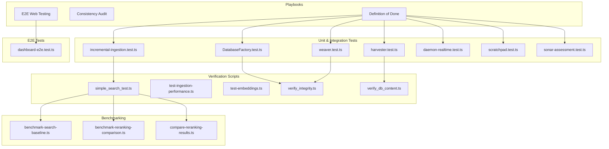
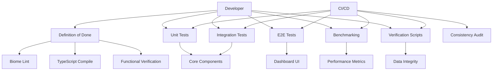
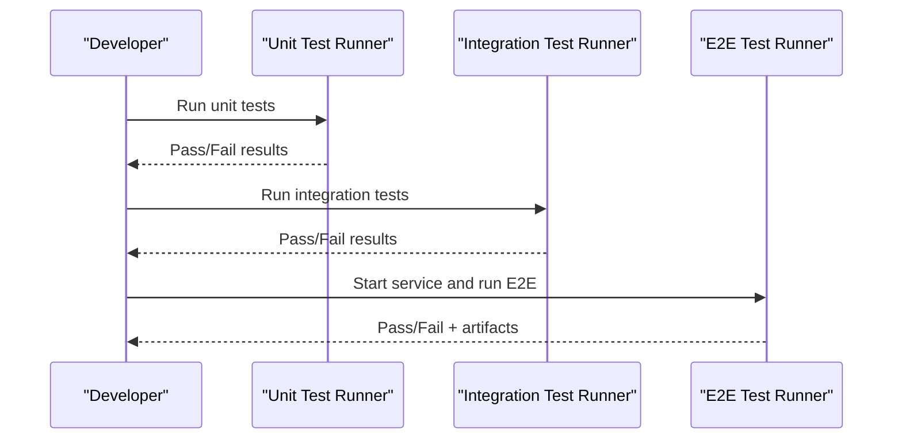
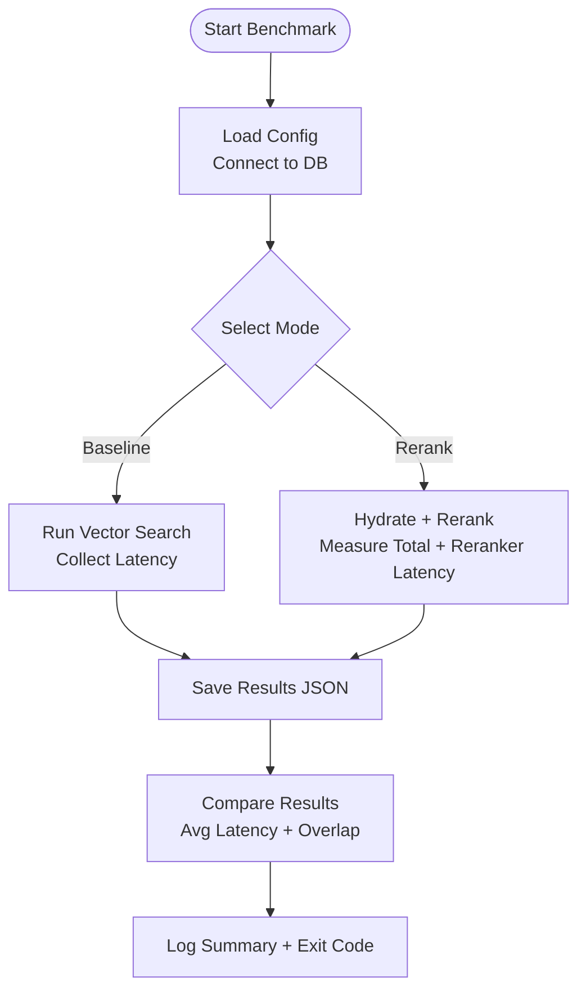
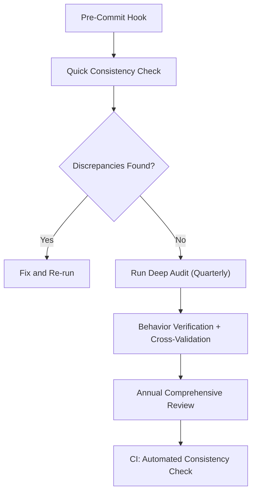
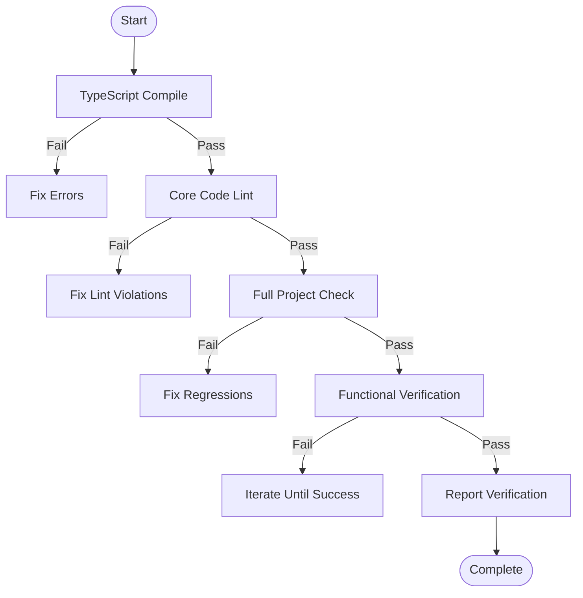
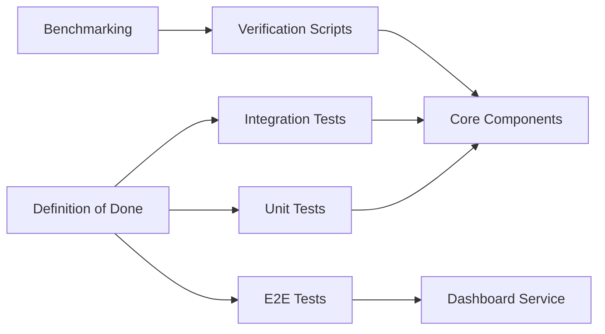

# Testing and Quality Assurance

<cite>
**Referenced Files in This Document**
- [definition-of-done-playbook.md](file://playbooks/definition-of-done-playbook.md)
- [consistency-audit-playbook.md](file://playbooks/consistency-audit-playbook.md)
- [e2e-web-testing-playbook.md](file://playbooks/e2e-web-testing-playbook.md)
- [dashboard-e2e.test.ts](file://tests/e2e/dashboard-e2e.test.ts)
- [incremental-ingestion.test.ts](file://tests/pipeline/incremental-ingestion.test.ts)
- [DatabaseFactory.test.ts](file://tests/DatabaseFactory.test.ts)
- [harvester.test.ts](file://tests/harvester.test.ts)
- [weaver.test.ts](file://tests/weaver.test.ts)
- [benchmark-search-baseline.ts](file://scripts/benchmarks/benchmark-search-baseline.ts)
- [benchmark-reranking-comparison.ts](file://scripts/benchmarks/benchmark-reranking-comparison.ts)
- [compare-reranking-results.ts](file://scripts/benchmarks/compare-reranking-results.ts)
- [simple_search_test.ts](file://scripts/verify/simple_search_test.ts)
- [test-ingestion-performance.ts](file://scripts/lab/test-ingestion-performance.ts)
- [test-embeddings.ts](file://scripts/verify/test-embeddings.ts)
- [test-hardening.ts](file://scripts/verify/test-hardening.ts)
- [test-queries.ts](file://scripts/verify/test-queries.ts)
- [verify_integrity.ts](file://scripts/verify/verify_integrity.ts)
- [verify_db_content.ts](file://scripts/verify/verify_db_content.ts)
- [verify_rescue.ts](file://scripts/verify/verify_rescue.ts)
- [verify_sync.ts](file://scripts/verify/verify_sync.ts)
- [verify_unification.ts](file://scripts/verify/verify_unification.ts)
- [verify_graph_integrity.ts](file://scripts/verify/verify_graph_integrity.ts)
- [verify_pipeline_stages.ts](file://scripts/verify/verify_pipeline_stages.ts)
- [verify_root_cause.ts](file://scripts/verify/verify_root_ause.ts)
- [round-trip-test.ts](file://scripts/lab/round-trip-test.ts)
- [consistency-analysis.ts](file://scripts/lab/consistency-analysis.ts)
- [audit_vectors.ts](file://scripts/lab/audit_vectors.ts)
- [test-id-generation.ts](file://scripts/lab/test-id-generation.ts)
- [test-squasher.ts](file://scripts/lab/test-squasher.ts)
- [test-vector-engine.ts](file://scripts/verify/test-vector-engine.ts)
- [test-mcp-query.ts](file://scripts/verify/test-mcp-query.ts)
- [test-mcp-concurrent.ts](file://scripts/verify/test-mcp-concurrent.ts)
- [test-mcp-lifecycle.ts](file://scripts/verify/test-mcp-lifecycle.ts)
- [test-phi3-agent.ts](file://scripts/verify/test-phi3-agent.ts)
- [test-provider-comparison.ts](file://scripts/test-provider-comparison.ts)
- [test-reranker.ts](file://scripts/test-reranker.ts)
- [test-reranking-pipeline.ts](file://scripts/test-reranking-pipeline.ts)
- [test-reranking-quality.ts](file://scripts/test-reranking-quality.ts)
- [test-config-search.ts](file://scripts/test-config-search.ts)
- [test-notification.ts](file://scripts/test-notification.ts)
- [test-sidecar-generation.ts](file://scripts/test-sidecar-generation.ts)
- [test-sonar-capabilities.test.ts](file://scripts/verify/verify-sonar-capabilities.test.ts)
- [daemon-realtime.test.ts](file://tests/daemon-realtime.test.ts)
- [scratchpad.test.ts](file://tests/scratchpad.test.ts)
- [strategies.test.ts](file://tests/strategies.test.ts)
- [sonar-assessment.test.ts](file://tests/sonar-assessment.test.ts)
- [sonar-server.test.ts](file://tests/sonar-server.test.ts)
- [bento_normalizer.test.ts](file://tests/bento_normalizer.test.ts)
- [fafcas_compliance.test.ts](file://tests/fafcas_compliance.test.ts)
- [louvain_config.test.ts](file://tests/louvain_config.test.ts)
- [mcp-server-settings.json](file://tests/mcp-server-settings.json)
- [test-providers.ts](file://tests/ollama/test-providers.ts)
- [TERRAIN_MAP.md](file://tests/ollama/TERRAIN_MAP.md)
- [COMPARISON.md](file://tests/langextract-comparison/COMPARISON.md)
- [SUMMARY.md](file://tests/langextract-comparison/SUMMARY.md)
- [REPORT.md](file://tests/langextract-comparison/REPORT.md)
- [TEST_RESULTS.md](file://tests/langextract-comparison/TEST_RESULTS.md)
- [RESULTS.md](file://tests/langextract-results/RESULTS.md)
- [test-models.ts](file://tests/langextract-comparison/test-models.ts)
- [health-check.ts](file://tests/langextract-comparison/health-check.ts)
- [results.jsonl](file://tests/langextract-results/results.jsonl)
- [test-ollama-cloud.ts](file://tests/substrate/test-ollama-cloud.ts)
- [ping-substrates.ts](file://tests/substrate/ping-substrates.ts)
- [debug-substrate.ts](file://tests/substrate/debug-substrate.ts)
- [test-parsing.ts](file://tests/substrate/test-parsing.ts)
- [test-vectors.jsonl](file://.amalfa/test-vectors.jsonl)
- [cross-domain-edges.jsonl](file://.amalfa/cross-domain-edges.jsonl)
- [golden-lexicon.jsonl](file://.amalfa/golden-lexicon.jsonl)
- [final-nodes.jsonl](file://.amalfa/final-nodes.jsonl)
- [pipeline-history.jsonl](file://.amalfa/pipeline-history.jsonl)
- [runs.jsonl](file://.amalfa/runs.jsonl)
- [.amalfa-test-env/resonance.db](file://.amalfa-test-env/resonance.db)
- [resonance.db](file://.amalfa/resonance.db)
- [resonance.db-shm](file://.amalfa/resonance.db-shm)
- [resonance.db-wal](file://.amalfa/resonance.db-wal)
</cite>

## Table of Contents
1. [Introduction](#introduction)
2. [Project Structure](#project-structure)
3. [Core Components](#core-components)
4. [Architecture Overview](#architecture-overview)
5. [Detailed Component Analysis](#detailed-component-analysis)
6. [Dependency Analysis](#dependency-analysis)
7. [Performance Considerations](#performance-considerations)
8. [Troubleshooting Guide](#troubleshooting-guide)
9. [Conclusion](#conclusion)
10. [Appendices](#appendices)

## Introduction
This document describes Amalfa’s testing strategy and quality assurance processes. It covers the testing framework (unit, integration, and end-to-end), benchmarking and performance regression detection, consistency audits for data integrity across the knowledge graph, quality gates defined in the Definition of Done playbook, and practical guidance for writing effective tests across the ingestion pipeline, search engine, and service components. It also outlines continuous integration and automated workflows, debugging techniques, test data management, and strategies for reliable cross-environment testing.

## Project Structure
Testing and QA resources are distributed across playbooks, unit/integration tests, E2E tests, verification scripts, and benchmarking utilities:
- Playbooks define quality gates, consistency auditing, and E2E patterns.
- Unit and integration tests live under tests/ and exercise core components.
- E2E tests validate the dashboard UI and real-time behavior.
- Scripts under scripts/verify, scripts/lab, and scripts/benchmarks support verification, benchmarking, and diagnostics.
- Test data and fixtures are stored under .amalfa/, tests/fixtures, and tests/langextract-*.

**Diagram sources**
- [definition-of-done-playbook.md](file://playbooks/definition-of-done-playbook.md#L15-L40)
- [consistency-audit-playbook.md](file://playbooks/consistency-audit-playbook.md#L186-L256)
- [e2e-web-testing-playbook.md](file://playbooks/e2e-web-testing-playbook.md#L53-L104)
- [dashboard-e2e.test.ts](file://tests/e2e/dashboard-e2e.test.ts#L62-L178)
- [incremental-ingestion.test.ts](file://tests/pipeline/incremental-ingestion.test.ts#L6-L28)
- [DatabaseFactory.test.ts](file://tests/DatabaseFactory.test.ts#L6-L36)
- [harvester.test.ts](file://tests/harvester.test.ts#L4-L22)
- [weaver.test.ts](file://tests/weaver.test.ts#L34-L60)
- [simple_search_test.ts](file://scripts/verify/simple_search_test.ts)
- [test-ingestion-performance.ts](file://scripts/lab/test-ingestion-performance.ts)
- [test-embeddings.ts](file://scripts/verify/test-embeddings.ts)
- [verify_integrity.ts](file://scripts/verify/verify_integrity.ts)
- [verify_db_content.ts](file://scripts/verify/verify_db_content.ts)
- [benchmark-search-baseline.ts](file://scripts/benchmarks/benchmark-search-baseline.ts#L63-L113)
- [benchmark-reranking-comparison.ts](file://scripts/benchmarks/benchmark-reranking-comparison.ts#L160-L220)
- [compare-reranking-results.ts](file://scripts/benchmarks/compare-reranking-results.ts#L19-L77)

**Section sources**
- [definition-of-done-playbook.md](file://playbooks/definition-of-done-playbook.md#L15-L40)
- [consistency-audit-playbook.md](file://playbooks/consistency-audit-playbook.md#L186-L256)
- [e2e-web-testing-playbook.md](file://playbooks/e2e-web-testing-playbook.md#L53-L104)
- [dashboard-e2e.test.ts](file://tests/e2e/dashboard-e2e.test.ts#L62-L178)
- [incremental-ingestion.test.ts](file://tests/pipeline/incremental-ingestion.test.ts#L6-L28)
- [DatabaseFactory.test.ts](file://tests/DatabaseFactory.test.ts#L6-L36)
- [harvester.test.ts](file://tests/harvester.test.ts#L4-L22)
- [weaver.test.ts](file://tests/weaver.test.ts#L34-L60)
- [simple_search_test.ts](file://scripts/verify/simple_search_test.ts)
- [test-ingestion-performance.ts](file://scripts/lab/test-ingestion-performance.ts)
- [test-embeddings.ts](file://scripts/verify/test-embeddings.ts)
- [verify_integrity.ts](file://scripts/verify/verify_integrity.ts)
- [verify_db_content.ts](file://scripts/verify/verify_db_content.ts)
- [benchmark-search-baseline.ts](file://scripts/benchmarks/benchmark-search-baseline.ts#L63-L113)
- [benchmark-reranking-comparison.ts](file://scripts/benchmarks/benchmark-reranking-comparison.ts#L160-L220)
- [compare-reranking-results.ts](file://scripts/benchmarks/compare-reranking-results.ts#L19-L77)

## Core Components
- Definition of Done playbook establishes mandatory verification gates before claiming completion, including compilation, linting, functional verification, and reporting templates.
- Consistency Audit playbook defines automated and manual checks to ensure code, docs, and behavior remain aligned, with CI integration and prevention strategies.
- E2E Web Testing playbook specifies browser automation patterns for dashboard UI, API parity, SSE streams, and logging verification.

Quality gates and consistency checks are foundational to all testing efforts and must be satisfied prior to merging changes.

**Section sources**
- [definition-of-done-playbook.md](file://playbooks/definition-of-done-playbook.md#L15-L40)
- [consistency-audit-playbook.md](file://playbooks/consistency-audit-playbook.md#L186-L256)
- [e2e-web-testing-playbook.md](file://playbooks/e2e-web-testing-playbook.md#L53-L104)

## Architecture Overview
The testing architecture integrates:
- Unit and integration tests validating core components (ingestion, graph weaving, database factory).
- E2E tests validating the dashboard UI and real-time behavior.
- Verification scripts supporting search, embeddings, integrity, and pipeline stages.
- Benchmarking scripts measuring latency and reranking performance.
- Consistency checks integrated into CI to prevent documentation and naming drift.

**Diagram sources**
- [definition-of-done-playbook.md](file://playbooks/definition-of-done-playbook.md#L15-L40)
- [consistency-audit-playbook.md](file://playbooks/consistency-audit-playbook.md#L186-L256)
- [e2e-web-testing-playbook.md](file://playbooks/e2e-web-testing-playbook.md#L53-L104)
- [dashboard-e2e.test.ts](file://tests/e2e/dashboard-e2e.test.ts#L62-L178)
- [benchmark-search-baseline.ts](file://scripts/benchmarks/benchmark-search-baseline.ts#L63-L113)
- [benchmark-reranking-comparison.ts](file://scripts/benchmarks/benchmark-reranking-comparison.ts#L160-L220)

## Detailed Component Analysis

### Testing Framework: Unit, Integration, and E2E
- Unit tests validate isolated logic and component behavior:
  - Incremental ingestion tests assert file processing, hash-based deduplication, and node creation/update.
  - Database factory tests verify pragmas and health checks.
  - Harvester tests validate filtering and regex cleanup logic.
  - Weaver tests validate edge creation for tags, aliases, and wiki-links.
- Integration tests validate cross-component behavior:
  - Daemon and Sonar tests exercise lifecycle and capability verification.
  - Scrathpad and strategies tests validate runtime and orchestration behavior.
- E2E tests validate the dashboard UI:
  - Page load, system health, services table, graph stats, navigation, SSE updates, console errors, and action buttons.

**Diagram sources**
- [incremental-ingestion.test.ts](file://tests/pipeline/incremental-ingestion.test.ts#L6-L28)
- [DatabaseFactory.test.ts](file://tests/DatabaseFactory.test.ts#L6-L36)
- [harvester.test.ts](file://tests/harvester.test.ts#L4-L22)
- [weaver.test.ts](file://tests/weaver.test.ts#L34-L60)
- [daemon-realtime.test.ts](file://tests/daemon-realtime.test.ts)
- [scratchpad.test.ts](file://tests/scratchpad.test.ts)
- [sonar-assessment.test.ts](file://tests/sonar-assessment.test.ts)
- [dashboard-e2e.test.ts](file://tests/e2e/dashboard-e2e.test.ts#L62-L178)

**Section sources**
- [incremental-ingestion.test.ts](file://tests/pipeline/incremental-ingestion.test.ts#L6-L28)
- [DatabaseFactory.test.ts](file://tests/DatabaseFactory.test.ts#L6-L36)
- [harvester.test.ts](file://tests/harvester.test.ts#L4-L22)
- [weaver.test.ts](file://tests/weaver.test.ts#L34-L60)
- [daemon-realtime.test.ts](file://tests/daemon-realtime.test.ts)
- [scratchpad.test.ts](file://tests/scratchpad.test.ts)
- [sonar-assessment.test.ts](file://tests/sonar-assessment.test.ts)
- [dashboard-e2e.test.ts](file://tests/e2e/dashboard-e2e.test.ts#L62-L178)

### Benchmarking System: Performance Measurement and Regression Detection
- Baseline search benchmark captures latency across difficulty levels and saves results for comparison.
- Reranking comparison benchmark evaluates multiple modes (none, BGE-M3, Sonar, hybrid) and records reranker latency.
- Comparison script aggregates averages and top-result overlap to detect regressions.

**Diagram sources**
- [benchmark-search-baseline.ts](file://scripts/benchmarks/benchmark-search-baseline.ts#L63-L113)
- [benchmark-reranking-comparison.ts](file://scripts/benchmarks/benchmark-reranking-comparison.ts#L160-L220)
- [compare-reranking-results.ts](file://scripts/benchmarks/compare-reranking-results.ts#L19-L77)

**Section sources**
- [benchmark-search-baseline.ts](file://scripts/benchmarks/benchmark-search-baseline.ts#L63-L113)
- [benchmark-reranking-comparison.ts](file://scripts/benchmarks/benchmark-reranking-comparison.ts#L160-L220)
- [compare-reranking-results.ts](file://scripts/benchmarks/compare-reranking-results.ts#L19-L77)

### Consistency Audit Processes: Ensuring Data Integrity Across the Knowledge Graph
- Automated checks validate documented files, CLI commands, config keys, and service naming.
- Manual audits include command verification, file path audits, naming matrices, and cross-document validation.
- CI integration enforces consistency on every push and pull request.

**Diagram sources**
- [consistency-audit-playbook.md](file://playbooks/consistency-audit-playbook.md#L61-L115)
- [consistency-audit-playbook.md](file://playbooks/consistency-audit-playbook.md#L119-L160)
- [consistency-audit-playbook.md](file://playbooks/consistency-audit-playbook.md#L162-L185)
- [consistency-audit-playbook.md](file://playbooks/consistency-audit-playbook.md#L186-L256)

**Section sources**
- [consistency-audit-playbook.md](file://playbooks/consistency-audit-playbook.md#L61-L115)
- [consistency-audit-playbook.md](file://playbooks/consistency-audit-playbook.md#L119-L160)
- [consistency-audit-playbook.md](file://playbooks/consistency-audit-playbook.md#L162-L185)
- [consistency-audit-playbook.md](file://playbooks/consistency-audit-playbook.md#L186-L256)

### Quality Gates Defined in the Definition of Done Playbook
- Compilation gate ensures zero TypeScript errors.
- Linting gate enforces strict linting for core code.
- Full project check gate validates no regressions.
- Functional verification requires running the actual changed code.
- Reporting template standardizes verification documentation.

**Diagram sources**
- [definition-of-done-playbook.md](file://playbooks/definition-of-done-playbook.md#L15-L40)
- [definition-of-done-playbook.md](file://playbooks/definition-of-done-playbook.md#L48-L54)
- [definition-of-done-playbook.md](file://playbooks/definition-of-done-playbook.md#L56-L89)

**Section sources**
- [definition-of-done-playbook.md](file://playbooks/definition-of-done-playbook.md#L15-L40)
- [definition-of-done-playbook.md](file://playbooks/definition-of-done-playbook.md#L48-L54)
- [definition-of-done-playbook.md](file://playbooks/definition-of-done-playbook.md#L56-L89)

### Writing Effective Tests: Ingestion Pipeline, Search Engine, and Service Components
- Ingestion pipeline tests:
  - Validate single-file processing, empty lists, hash-based deduplication, and content-change updates.
  - Use an in-memory database to isolate state and assert node creation and metadata.
- Search engine tests:
  - Use verification scripts to measure latency and correctness across difficulty levels.
  - Compare reranking modes and analyze top-result overlap to detect regressions.
- Service components tests:
  - Validate lifecycle, concurrent operations, and query handling.
  - Use fixtures and controlled test environments to ensure determinism.

Examples of test files to reference:
- Ingestion: [incremental-ingestion.test.ts](file://tests/pipeline/incremental-ingestion.test.ts#L6-L28)
- Search: [simple_search_test.ts](file://scripts/verify/simple_search_test.ts), [benchmark-search-baseline.ts](file://scripts/benchmarks/benchmark-search-baseline.ts#L63-L113)
- Services: [test-mcp-query.ts](file://scripts/verify/test-mcp-query.ts), [test-mcp-concurrent.ts](file://scripts/verify/test-mcp-concurrent.ts), [test-mcp-lifecycle.ts](file://scripts/verify/test-mcp-lifecycle.ts)

**Section sources**
- [incremental-ingestion.test.ts](file://tests/pipeline/incremental-ingestion.test.ts#L6-L28)
- [simple_search_test.ts](file://scripts/verify/simple_search_test.ts)
- [benchmark-search-baseline.ts](file://scripts/benchmarks/benchmark-search-baseline.ts#L63-L113)
- [test-mcp-query.ts](file://scripts/verify/test-mcp-query.ts)
- [test-mcp-concurrent.ts](file://scripts/verify/test-mcp-concurrent.ts)
- [test-mcp-lifecycle.ts](file://scripts/verify/test-mcp-lifecycle.ts)

### Continuous Integration Setup, Automated Testing Workflows, and Performance Monitoring
- CI jobs should:
  - Run Definition of Done gates (compile, lint, full check).
  - Execute unit and integration tests.
  - Run E2E tests against a started service.
  - Execute consistency checks.
  - Trigger benchmarking on schedule or PRs to detect regressions.
- Performance monitoring:
  - Store benchmark results in cache directories for trend analysis.
  - Compare reranking modes and alert on significant latency increases.

[No sources needed since this section provides general guidance]

### Debugging Techniques, Test Data Management, and Cross-Environment Reliability
- Debugging:
  - Use verification scripts to analyze health, orphans, domains, and sync issues.
  - Inspect logs and database state to isolate failures.
- Test data management:
  - Use fixtures and temporary files for ingestion tests.
  - Leverage .amalfa-test-env for isolated environments.
  - Maintain golden datasets and pipeline history for reproducibility.
- Cross-environment reliability:
  - Normalize database connections and pragmas via DatabaseFactory tests.
  - Validate vector engine behavior and embedding quality with dedicated scripts.
  - Use deterministic queries and controlled reranker ports for reranking comparisons.

**Section sources**
- [verify_integrity.ts](file://scripts/verify/verify_integrity.ts)
- [verify_db_content.ts](file://scripts/verify/verify_db_content.ts)
- [verify_rescue.ts](file://scripts/verify/verify_rescue.ts)
- [verify_sync.ts](file://scripts/verify/verify_sync.ts)
- [verify_unification.ts](file://scripts/verify/verify_unification.ts)
- [verify_graph_integrity.ts](file://scripts/verify/verify_graph_integrity.ts)
- [verify_pipeline_stages.ts](file://scripts/verify/verify_pipeline_stages.ts)
- [verify_root_ause.ts](file://scripts/verify/verify_root_ause.ts)
- [round-trip-test.ts](file://scripts/lab/round-trip-test.ts)
- [consistency-analysis.ts](file://scripts/lab/consistency-analysis.ts)
- [audit_vectors.ts](file://scripts/lab/audit_vectors.ts)
- [test-id-generation.ts](file://scripts/lab/test-id-generation.ts)
- [test-squasher.ts](file://scripts/lab/test-squasher.ts)
- [test-vector-engine.ts](file://scripts/verify/test-vector-engine.ts)
- [test-embeddings.ts](file://scripts/verify/test-embeddings.ts)
- [test-hardening.ts](file://scripts/verify/test-hardening.ts)
- [test-queries.ts](file://scripts/verify/test-queries.ts)
- [test-provider-comparison.ts](file://scripts/test-provider-comparison.ts)
- [test-reranker.ts](file://scripts/test-reranker.ts)
- [test-reranking-pipeline.ts](file://scripts/test-reranking-pipeline.ts)
- [test-reranking-quality.ts](file://scripts/test-reranking-quality.ts)
- [test-config-search.ts](file://scripts/test-config-search.ts)
- [test-notification.ts](file://scripts/test-notification.ts)
- [test-sidecar-generation.ts](file://scripts/test-sidecar-generation.ts)
- [test-sonar-capabilities.test.ts](file://scripts/verify/verify-sonar-capabilities.test.ts)
- [daemon-realtime.test.ts](file://tests/daemon-realtime.test.ts)
- [scratchpad.test.ts](file://tests/scratchpad.test.ts)
- [strategies.test.ts](file://tests/strategies.test.ts)
- [sonar-assessment.test.ts](file://tests/sonar-assessment.test.ts)
- [sonar-server.test.ts](file://tests/sonar-server.test.ts)
- [bento_normalizer.test.ts](file://tests/bento_normalizer.test.ts)
- [fafcas_compliance.test.ts](file://tests/fafcas_compliance.test.ts)
- [louvain_config.test.ts](file://tests/louvain_config.test.ts)
- [mcp-server-settings.json](file://tests/mcp-server-settings.json)
- [test-providers.ts](file://tests/ollama/test-providers.ts)
- [TERRAIN_MAP.md](file://tests/ollama/TERRAIN_MAP.md)
- [COMPARISON.md](file://tests/langextract-comparison/COMPARISON.md)
- [SUMMARY.md](file://tests/langextract-comparison/SUMMARY.md)
- [REPORT.md](file://tests/langextract-comparison/REPORT.md)
- [TEST_RESULTS.md](file://tests/langextract-comparison/TEST_RESULTS.md)
- [RESULTS.md](file://tests/langextract-results/RESULTS.md)
- [test-models.ts](file://tests/langextract-comparison/test-models.ts)
- [health-check.ts](file://tests/langextract-comparison/health-check.ts)
- [results.jsonl](file://tests/langextract-results/results.jsonl)
- [test-ollama-cloud.ts](file://tests/substrate/test-ollama-cloud.ts)
- [ping-substrates.ts](file://tests/substrate/ping-substrates.ts)
- [debug-substrate.ts](file://tests/substrate/debug-substrate.ts)
- [test-parsing.ts](file://tests/substrate/test-parsing.ts)
- [test-vectors.jsonl](file://.amalfa/test-vectors.jsonl)
- [cross-domain-edges.jsonl](file://.amalfa/cross-domain-edges.jsonl)
- [golden-lexicon.jsonl](file://.amalfa/golden-lexicon.jsonl)
- [final-nodes.jsonl](file://.amalfa/final-nodes.jsonl)
- [pipeline-history.jsonl](file://.amalfa/pipeline-history.jsonl)
- [runs.jsonl](file://.amalfa/runs.jsonl)
- [.amalfa-test-env/resonance.db](file://.amalfa-test-env/resonance.db)
- [resonance.db](file://.amalfa/resonance.db)
- [resonance.db-shm](file://.amalfa/resonance.db-shm)
- [resonance.db-wal](file://.amalfa/resonance.db-wal)

## Dependency Analysis
The testing ecosystem exhibits layered dependencies:
- Definition of Done gates underpin all tests.
- Unit and integration tests depend on core components and database factories.
- E2E tests depend on a running service and browser automation.
- Verification scripts depend on search engines and vector databases.
- Benchmarking depends on verification scripts and reranking infrastructure.

**Diagram sources**
- [definition-of-done-playbook.md](file://playbooks/definition-of-done-playbook.md#L15-L40)
- [dashboard-e2e.test.ts](file://tests/e2e/dashboard-e2e.test.ts#L62-L178)
- [incremental-ingestion.test.ts](file://tests/pipeline/incremental-ingestion.test.ts#L6-L28)
- [DatabaseFactory.test.ts](file://tests/DatabaseFactory.test.ts#L6-L36)
- [simple_search_test.ts](file://scripts/verify/simple_search_test.ts)
- [benchmark-search-baseline.ts](file://scripts/benchmarks/benchmark-search-baseline.ts#L63-L113)
- [benchmark-reranking-comparison.ts](file://scripts/benchmarks/benchmark-reranking-comparison.ts#L160-L220)

**Section sources**
- [definition-of-done-playbook.md](file://playbooks/definition-of-done-playbook.md#L15-L40)
- [dashboard-e2e.test.ts](file://tests/e2e/dashboard-e2e.test.ts#L62-L178)
- [incremental-ingestion.test.ts](file://tests/pipeline/incremental-ingestion.test.ts#L6-L28)
- [DatabaseFactory.test.ts](file://tests/DatabaseFactory.test.ts#L6-L36)
- [simple_search_test.ts](file://scripts/verify/simple_search_test.ts)
- [benchmark-search-baseline.ts](file://scripts/benchmarks/benchmark-search-baseline.ts#L63-L113)
- [benchmark-reranking-comparison.ts](file://scripts/benchmarks/benchmark-reranking-comparison.ts#L160-L220)

## Performance Considerations
- Prefer deterministic test queries grouped by difficulty to capture realistic latency distributions.
- Use in-memory databases for unit tests to avoid I/O overhead.
- Centralize benchmark outputs for trend analysis and regression detection.
- Monitor reranker latency separately to isolate performance bottlenecks.

[No sources needed since this section provides general guidance]

## Troubleshooting Guide
Common issues and resolutions:
- Dashboard E2E failures:
  - Ensure the dashboard is started before running tests and that the port is free.
  - Use verbose browser sessions to capture screenshots and console logs.
- Database factory failures:
  - Confirm pragmas and health checks pass; clean stale SHM/WAL files if present.
- Ingestion test flakiness:
  - Use deterministic filenames and content; verify hash-based deduplication and node creation.
- Reranking comparison failures:
  - Ensure reranker service is reachable and port is configured; handle fallbacks gracefully.

**Section sources**
- [e2e-web-testing-playbook.md](file://playbooks/e2e-web-testing-playbook.md#L315-L326)
- [dashboard-e2e.test.ts](file://tests/e2e/dashboard-e2e.test.ts#L22-L50)
- [DatabaseFactory.test.ts](file://tests/DatabaseFactory.test.ts#L9-L35)
- [incremental-ingestion.test.ts](file://tests/pipeline/incremental-ingestion.test.ts#L6-L28)
- [benchmark-reranking-comparison.ts](file://scripts/benchmarks/benchmark-reranking-comparison.ts#L63-L90)

## Conclusion
Amalfa’s testing and QA strategy combines rigorous quality gates, comprehensive unit and integration tests, robust E2E validation, and systematic benchmarking with consistency audits. By enforcing the Definition of Done, automating consistency checks, and leveraging targeted verification and benchmarking scripts, the project maintains high code quality, reliable performance, and trustworthy documentation across environments.

[No sources needed since this section summarizes without analyzing specific files]

## Appendices
- Example test references:
  - Ingestion: [incremental-ingestion.test.ts](file://tests/pipeline/incremental-ingestion.test.ts#L6-L28)
  - Database Factory: [DatabaseFactory.test.ts](file://tests/DatabaseFactory.test.ts#L6-L36)
  - Harvester: [harvester.test.ts](file://tests/harvester.test.ts#L4-L22)
  - Weaver: [weaver.test.ts](file://tests/weaver.test.ts#L34-L60)
  - E2E Dashboard: [dashboard-e2e.test.ts](file://tests/e2e/dashboard-e2e.test.ts#L62-L178)
  - Search Baseline: [benchmark-search-baseline.ts](file://scripts/benchmarks/benchmark-search-baseline.ts#L63-L113)
  - Reranking Comparison: [benchmark-reranking-comparison.ts](file://scripts/benchmarks/benchmark-reranking-comparison.ts#L160-L220)
  - Consistency Audit: [consistency-audit-playbook.md](file://playbooks/consistency-audit-playbook.md#L186-L256)
  - Definition of Done: [definition-of-done-playbook.md](file://playbooks/definition-of-done-playbook.md#L15-L40)

[No sources needed since this section lists references without analysis]