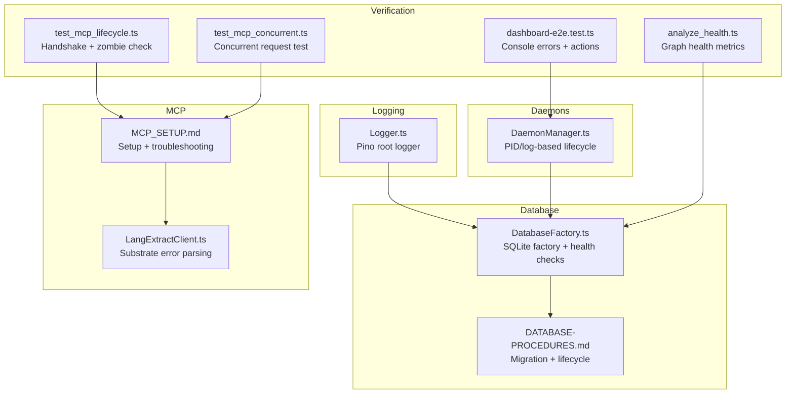
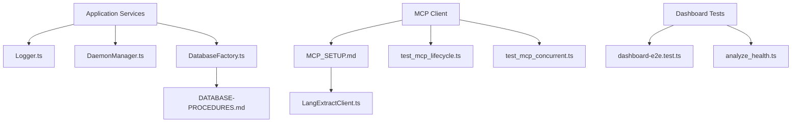
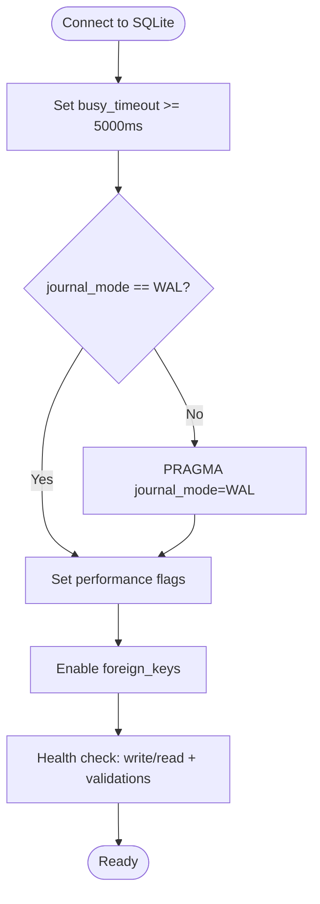
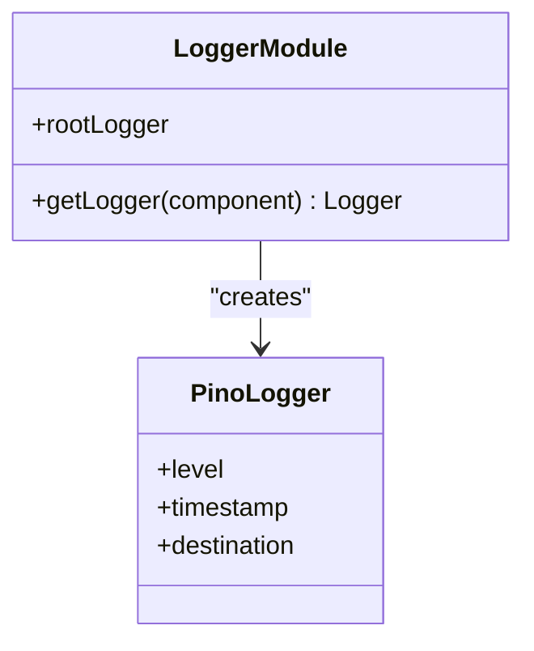
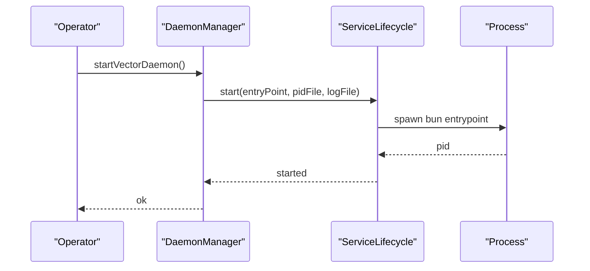
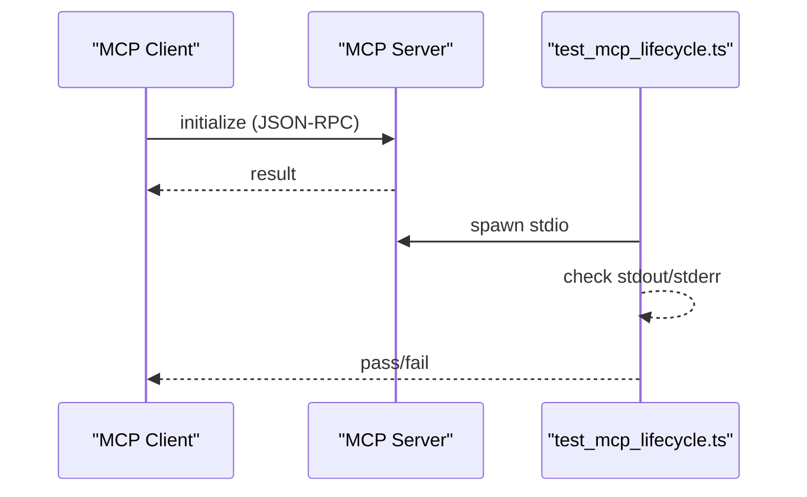
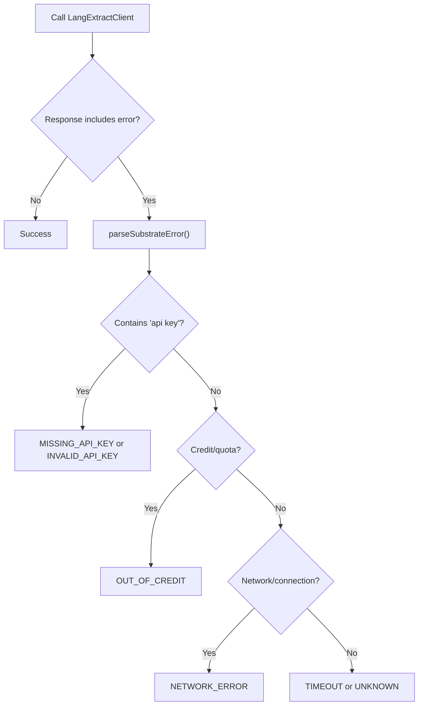
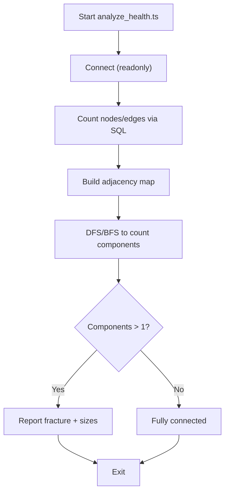
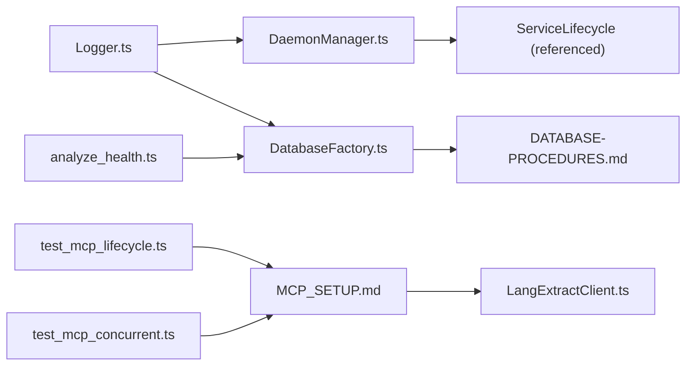

# Troubleshooting and Maintenance

<cite>
**Referenced Files in This Document**
- [DATABASE-PROCEDURES.md](file://src/resonance/DATABASE-PROCEDURES.md)
- [DatabaseFactory.ts](file://src/resonance/DatabaseFactory.ts)
- [Logger.ts](file://src/utils/Logger.ts)
- [DaemonManager.ts](file://src/utils/DaemonManager.ts)
- [MCP_SETUP.md](file://docs/setup/MCP_SETUP.md)
- [API_KEYS.md](file://docs/API_KEYS.md)
- [LangExtractClient.ts](file://src/services/LangExtractClient.ts)
- [test_mcp_lifecycle.ts](file://scripts/verify/test_mcp_lifecycle.ts)
- [test_mcp_concurrent.ts](file://scripts/verify/test_mcp_concurrent.ts)
- [analyze_health.ts](file://scripts/verify/analyze_health.ts)
- [dashboard-e2e.test.ts](file://tests/e2e/dashboard-e2e.test.ts)
- [DAEMON-CONFIG-ROOT-CAUSE.md](file://docs/audits/DAEMON-CONFIG-ROOT-CAUSE.md)
- [sqlite-standards.md](file://playbooks/sqlite-standards.md)
- [remeda-self-healing-pipeline.md](file://playbooks/remeda-self-healing-pipeline.md)
- [e2e-web-testing-playbook.md](file://playbooks/e2e-web-testing-playbook.md)
- [database-connection-hygiene.md](file://playbooks/database-connection-hygiene.md)
- [harden-and-flense-protocol.md](file://playbooks/harden-and-flense-protocol.md)
</cite>

## Table of Contents
1. [Introduction](#introduction)
2. [Project Structure](#project-structure)
3. [Core Components](#core-components)
4. [Architecture Overview](#architecture-overview)
5. [Detailed Component Analysis](#detailed-component-analysis)
6. [Dependency Analysis](#dependency-analysis)
7. [Performance Considerations](#performance-considerations)
8. [Troubleshooting Guide](#troubleshooting-guide)
9. [Conclusion](#conclusion)
10. [Appendices](#appendices)

## Introduction
This document provides comprehensive troubleshooting and maintenance guidance for Amalfa. It covers database integrity and recovery, service lifecycle management, logging and diagnostics, API key configuration, MCP connectivity, embedding generation, and search performance. It also outlines preventive maintenance, backup strategies, disaster recovery, and emergency procedures.

## Project Structure
Amalfa organizes maintenance-critical concerns across several modules:
- Database operations and migration protocol are defined centrally for consistency and safety.
- Logging uses a standardized Pino-based logger with component-scoped child loggers.
- Daemons are managed uniformly via a centralized manager with PID/log files and health checks.
- MCP setup and troubleshooting are documented for client integration and diagnostics.
- Scripts and playbooks provide verification, diagnostics, and self-healing patterns.

**Diagram sources**
- [Logger.ts](file://src/utils/Logger.ts#L1-L23)
- [DatabaseFactory.ts](file://src/resonance/DatabaseFactory.ts#L1-L103)
- [DATABASE-PROCEDURES.md](file://src/resonance/DATABASE-PROCEDURES.md#L1-L348)
- [DaemonManager.ts](file://src/utils/DaemonManager.ts#L1-L260)
- [MCP_SETUP.md](file://docs/setup/MCP_SETUP.md#L1-L318)
- [LangExtractClient.ts](file://src/services/LangExtractClient.ts#L106-L148)
- [test_mcp_lifecycle.ts](file://scripts/verify/test_mcp_lifecycle.ts#L1-L79)
- [test_mcp_concurrent.ts](file://scripts/verify/test_mcp_concurrent.ts#L61-L125)
- [analyze_health.ts](file://scripts/verify/analyze_health.ts#L1-L88)
- [dashboard-e2e.test.ts](file://tests/e2e/dashboard-e2e.test.ts#L143-L178)

**Section sources**
- [Logger.ts](file://src/utils/Logger.ts#L1-L23)
- [DatabaseFactory.ts](file://src/resonance/DatabaseFactory.ts#L1-L103)
- [DATABASE-PROCEDURES.md](file://src/resonance/DATABASE-PROCEDURES.md#L1-L348)
- [DaemonManager.ts](file://src/utils/DaemonManager.ts#L1-L260)
- [MCP_SETUP.md](file://docs/setup/MCP_SETUP.md#L1-L318)
- [LangExtractClient.ts](file://src/services/LangExtractClient.ts#L106-L148)
- [test_mcp_lifecycle.ts](file://scripts/verify/test_mcp_lifecycle.ts#L1-L79)
- [test_mcp_concurrent.ts](file://scripts/verify/test_mcp_concurrent.ts#L61-L125)
- [analyze_health.ts](file://scripts/verify/analyze_health.ts#L1-L88)
- [dashboard-e2e.test.ts](file://tests/e2e/dashboard-e2e.test.ts#L143-L178)

## Core Components
- DatabaseFactory: Centralized SQLite connection creation with enforced WAL mode, busy timeout, and integrity settings. Includes a health-check routine.
- Logger: Standardized Pino logger with component-scoped child loggers and stderr destination to avoid polluting stdout for piping.
- DaemonManager: Unified lifecycle management for vector daemon, reranker daemon, file watcher, and Sonar Agent, with PID/log files and health probing.
- MCP Setup and Diagnostics: End-to-end setup, troubleshooting steps, and verification scripts for lifecycle and concurrency.
- Self-Healing Pipelines: Playbook guidance for resilient ingestion with idempotent processing and error isolation.

**Section sources**
- [DatabaseFactory.ts](file://src/resonance/DatabaseFactory.ts#L1-L103)
- [Logger.ts](file://src/utils/Logger.ts#L1-L23)
- [DaemonManager.ts](file://src/utils/DaemonManager.ts#L1-L260)
- [MCP_SETUP.md](file://docs/setup/MCP_SETUP.md#L1-L318)
- [remeda-self-healing-pipeline.md](file://playbooks/remeda-self-healing-pipeline.md#L71-L98)

## Architecture Overview
The maintenance architecture emphasizes:
- Single sources of truth for database schema and operations.
- Strict enforcement of SQLite standards for concurrency and integrity.
- Centralized logging and daemon lifecycle management.
- Client-side diagnostics for MCP connectivity and performance.
- Automated verification and self-healing ingestion patterns.

**Diagram sources**
- [Logger.ts](file://src/utils/Logger.ts#L1-L23)
- [DaemonManager.ts](file://src/utils/DaemonManager.ts#L1-L260)
- [DatabaseFactory.ts](file://src/resonance/DatabaseFactory.ts#L1-L103)
- [DATABASE-PROCEDURES.md](file://src/resonance/DATABASE-PROCEDURES.md#L1-L348)
- [MCP_SETUP.md](file://docs/setup/MCP_SETUP.md#L1-L318)
- [LangExtractClient.ts](file://src/services/LangExtractClient.ts#L106-L148)
- [test_mcp_lifecycle.ts](file://scripts/verify/test_mcp_lifecycle.ts#L1-L79)
- [test_mcp_concurrent.ts](file://scripts/verify/test_mcp_concurrent.ts#L61-L125)
- [dashboard-e2e.test.ts](file://tests/e2e/dashboard-e2e.test.ts#L143-L178)
- [analyze_health.ts](file://scripts/verify/analyze_health.ts#L1-L88)

## Detailed Component Analysis

### Database Factory and Integrity
- Enforced settings: busy_timeout, WAL journal mode, synchronous, foreign_keys, and mmap disabled for stability.
- Health checks validate configuration and perform a write/read test.
- Migration protocol via Drizzle ensures schema integrity and rollback capability.

**Diagram sources**
- [DatabaseFactory.ts](file://src/resonance/DatabaseFactory.ts#L44-L66)
- [DatabaseFactory.ts](file://src/resonance/DatabaseFactory.ts#L72-L101)
- [sqlite-standards.md](file://playbooks/sqlite-standards.md)

**Section sources**
- [DatabaseFactory.ts](file://src/resonance/DatabaseFactory.ts#L1-L103)
- [DATABASE-PROCEDURES.md](file://src/resonance/DATABASE-PROCEDURES.md#L46-L100)

### Logging System
- Root logger configured with ISO timestamps and environment-controlled level.
- Child loggers bound with a component field for contextual filtering.
- Logs directed to stderr to preserve stdout for piping (e.g., MCP/CLI).

**Diagram sources**
- [Logger.ts](file://src/utils/Logger.ts#L1-L23)

**Section sources**
- [Logger.ts](file://src/utils/Logger.ts#L1-L23)

### Daemon Lifecycle Management
- Centralized management of vector, reranker, file watcher, and Sonar Agent daemons.
- PID/log files per service enable status checks and controlled restarts.
- Health probes for Sonar Agent to surface active model info.

**Diagram sources**
- [DaemonManager.ts](file://src/utils/DaemonManager.ts#L103-L107)

**Section sources**
- [DaemonManager.ts](file://src/utils/DaemonManager.ts#L1-L260)

### MCP Connectivity Diagnostics
- Setup includes absolute path generation, client configuration, and tool availability.
- Lifecycle test validates handshake and zombie process behavior.
- Concurrency test verifies multiple requests and response parsing.

**Diagram sources**
- [MCP_SETUP.md](file://docs/setup/MCP_SETUP.md#L124-L150)
- [test_mcp_lifecycle.ts](file://scripts/verify/test_mcp_lifecycle.ts#L47-L76)

**Section sources**
- [MCP_SETUP.md](file://docs/setup/MCP_SETUP.md#L1-L318)
- [test_mcp_lifecycle.ts](file://scripts/verify/test_mcp_lifecycle.ts#L1-L79)
- [test_mcp_concurrent.ts](file://scripts/verify/test_mcp_concurrent.ts#L61-L125)

### Embedding Generation and API Key Issues
- LangExtractClient parses substrate errors and maps them to standardized categories (missing/invalid API key, out of credit, network, timeout).
- API keys are validated and documented with provider-specific guidance and rotation practices.

**Diagram sources**
- [LangExtractClient.ts](file://src/services/LangExtractClient.ts#L106-L148)
- [API_KEYS.md](file://docs/API_KEYS.md#L342-L414)

**Section sources**
- [LangExtractClient.ts](file://src/services/LangExtractClient.ts#L106-L148)
- [API_KEYS.md](file://docs/API_KEYS.md#L269-L414)

### Search Performance Diagnostics
- Dashboard E2E tests capture console errors and verify service action buttons, aiding in diagnosing UI-level issues.
- Graph health analysis computes node/edge counts, density, average degree, and connected components to detect fragmentation.

**Diagram sources**
- [analyze_health.ts](file://scripts/verify/analyze_health.ts#L1-L88)

**Section sources**
- [dashboard-e2e.test.ts](file://tests/e2e/dashboard-e2e.test.ts#L143-L178)
- [analyze_health.ts](file://scripts/verify/analyze_health.ts#L1-L88)

## Dependency Analysis
- DatabaseFactory depends on SQLite and enforces standards; it is consumed by ResonanceDB and diagnostics.
- Logger is used across services and daemons for consistent telemetry.
- DaemonManager orchestrates multiple services and relies on PID/log files for lifecycle control.
- MCP diagnostics depend on MCP server configuration and client-side verification scripts.

**Diagram sources**
- [DatabaseFactory.ts](file://src/resonance/DatabaseFactory.ts#L1-L103)
- [DATABASE-PROCEDURES.md](file://src/resonance/DATABASE-PROCEDURES.md#L1-L348)
- [Logger.ts](file://src/utils/Logger.ts#L1-L23)
- [DaemonManager.ts](file://src/utils/DaemonManager.ts#L1-L260)
- [MCP_SETUP.md](file://docs/setup/MCP_SETUP.md#L1-L318)
- [LangExtractClient.ts](file://src/services/LangExtractClient.ts#L106-L148)
- [test_mcp_lifecycle.ts](file://scripts/verify/test_mcp_lifecycle.ts#L1-L79)
- [test_mcp_concurrent.ts](file://scripts/verify/test_mcp_concurrent.ts#L61-L125)
- [analyze_health.ts](file://scripts/verify/analyze_health.ts#L1-L88)

**Section sources**
- [DatabaseFactory.ts](file://src/resonance/DatabaseFactory.ts#L1-L103)
- [Logger.ts](file://src/utils/Logger.ts#L1-L23)
- [DaemonManager.ts](file://src/utils/DaemonManager.ts#L1-L260)
- [MCP_SETUP.md](file://docs/setup/MCP_SETUP.md#L1-L318)
- [LangExtractClient.ts](file://src/services/LangExtractClient.ts#L106-L148)
- [test_mcp_lifecycle.ts](file://scripts/verify/test_mcp_lifecycle.ts#L1-L79)
- [test_mcp_concurrent.ts](file://scripts/verify/test_mcp_concurrent.ts#L61-L125)
- [analyze_health.ts](file://scripts/verify/analyze_health.ts#L1-L88)

## Performance Considerations
- Use WAL mode and busy_timeout to minimize contention and lock timeouts.
- Prefer readonly connections for diagnostics to avoid write locks.
- Monitor graph health metrics (density, average degree, connected components) to detect fragmentation early.
- Validate MCP server responsiveness under concurrent load to identify bottlenecks.

[No sources needed since this section provides general guidance]

## Troubleshooting Guide

### Database Corruption and Integrity
- Symptoms: “Database is locked,” “Table does not exist,” “Schema mismatch.”
- Actions:
  - Investigate locks and terminate rogue processes; restart services.
  - Ensure migrations are applied; regenerate and review migration SQL if needed.
  - For schema mismatches, restore from a pre-migration backup and re-apply migrations.

**Section sources**
- [DATABASE-PROCEDURES.md](file://src/resonance/DATABASE-PROCEDURES.md#L234-L275)
- [DatabaseFactory.ts](file://src/resonance/DatabaseFactory.ts#L72-L101)

### Service Startup Failures
- Symptoms: Daemons not running, stale PIDs, missing logs.
- Actions:
  - Check PID files and process existence; remove stale PID files if processes are not running.
  - Use the unified manager to start/stop services and verify logs.
  - Validate environment and PATH for Bun-based daemons.

**Section sources**
- [DaemonManager.ts](file://src/utils/DaemonManager.ts#L68-L79)
- [DAEMON-CONFIG-ROOT-CAUSE.md](file://docs/audits/DAEMON-CONFIG-ROOT-CAUSE.md#L324-L326)

### API Key Configuration Problems
- Symptoms: Authentication errors, “API key not configured,” “API key rejected,” “Out of credit.”
- Actions:
  - Confirm provider-specific keys are present in environment variables.
  - Validate key format and permissions; rotate keys as needed.
  - For Ollama device keys, sign in once and ensure the daemon is running.

**Section sources**
- [API_KEYS.md](file://docs/API_KEYS.md#L342-L414)
- [LangExtractClient.ts](file://src/services/LangExtractClient.ts#L106-L148)

### MCP Connectivity Issues
- Symptoms: Server not connecting, no results from search, ENOENT for paths.
- Actions:
  - Verify Bun is in PATH and absolute paths in MCP client configs are correct.
  - Ensure the database exists and has ingested content; re-run ingestion if needed.
  - Use lifecycle and concurrency verification scripts to isolate issues.

**Section sources**
- [MCP_SETUP.md](file://docs/setup/MCP_SETUP.md#L206-L257)
- [test_mcp_lifecycle.ts](file://scripts/verify/test_mcp_lifecycle.ts#L1-L79)
- [test_mcp_concurrent.ts](file://scripts/verify/test_mcp_concurrent.ts#L61-L125)

### Embedding Generation Failures
- Symptoms: Network errors, timeouts, provider quota limits.
- Actions:
  - Inspect substrate error mapping and adjust provider selection or credentials.
  - Switch providers or increase timeouts; monitor usage and billing.

**Section sources**
- [LangExtractClient.ts](file://src/services/LangExtractClient.ts#L106-L148)
- [API_KEYS.md](file://docs/API_KEYS.md#L342-L414)

### Search Performance Problems
- Symptoms: Slow responses, fragmented graph, UI console errors.
- Actions:
  - Run graph health analysis to detect fragmentation and compute density/degree metrics.
  - Use dashboard E2E tests to capture console errors and verify service actions.
  - Optimize ingestion batch sizes and reduce contention via WAL and busy_timeout.

**Section sources**
- [analyze_health.ts](file://scripts/verify/analyze_health.ts#L1-L88)
- [dashboard-e2e.test.ts](file://tests/e2e/dashboard-e2e.test.ts#L143-L178)
- [database-connection-hygiene.md](file://playbooks/database-connection-hygiene.md#L359-L365)

### Maintenance Procedures
- Database Regeneration:
  - Back up before schema changes; apply migrations; verify schema and integrity.
  - Use vacuum and analyze after large deletions; maintain retention and location for automated backups.
- Service Restart Strategies:
  - Use the unified daemon manager to stop/start services; probe health endpoints for readiness.
- Log Analysis Techniques:
  - Use component-scoped child loggers; filter by component and level; monitor stderr for critical errors.

**Section sources**
- [DATABASE-PROCEDURES.md](file://src/resonance/DATABASE-PROCEDURES.md#L207-L231)
- [DaemonManager.ts](file://src/utils/DaemonManager.ts#L233-L246)
- [Logger.ts](file://src/utils/Logger.ts#L20-L23)

### Preventive Maintenance and Disaster Recovery
- Preventive:
  - Enforce SQLite standards and health checks; monitor graph metrics; validate MCP connectivity regularly.
  - Adopt self-healing ingestion patterns with idempotent processing and error isolation.
- Disaster Recovery:
  - Maintain pre-migration backups; rollback via Drizzle and re-apply migrations if schema drift occurs.
  - Use standardized logging and PID/log files to accelerate incident triage.

**Section sources**
- [remeda-self-healing-pipeline.md](file://playbooks/remeda-self-healing-pipeline.md#L71-L98)
- [DATABASE-PROCEDURES.md](file://src/resonance/DATABASE-PROCEDURES.md#L88-L99)
- [harden-and-flense-protocol.md](file://playbooks/harden-and-flense-protocol.md#L21-L35)

### Emergency Procedures
- Immediate Actions:
  - Stop affected services, kill stale processes, and restart with correct configuration.
  - Validate environment variables and paths; re-run MCP setup if needed.
- Data Restoration:
  - Restore from the most recent pre-migration backup; reset Drizzle state and re-apply migrations.

**Section sources**
- [DAEMON-CONFIG-ROOT-CAUSE.md](file://docs/audits/DAEMON-CONFIG-ROOT-CAUSE.md#L324-L326)
- [DATABASE-PROCEDURES.md](file://src/resonance/DATABASE-PROCEDURES.md#L88-L99)

## Conclusion
This guide consolidates Amalfa’s maintenance and troubleshooting practices around centralized database enforcement, robust logging, unified daemon lifecycle management, and rigorous MCP diagnostics. By following the documented procedures and leveraging the included scripts and playbooks, operators can quickly diagnose and resolve common issues, maintain system health, and recover from critical failures.

## Appendices
- Additional references for observability and testing coverage are available in the e2e web testing playbook and dashboard tests.

**Section sources**
- [e2e-web-testing-playbook.md](file://playbooks/e2e-web-testing-playbook.md#L383-L399)
- [dashboard-e2e.test.ts](file://tests/e2e/dashboard-e2e.test.ts#L143-L178)