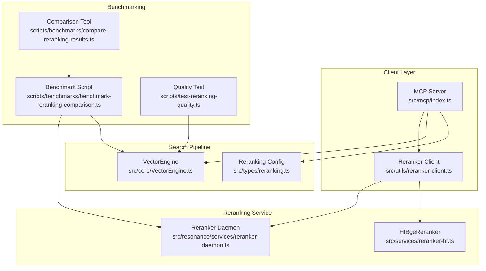
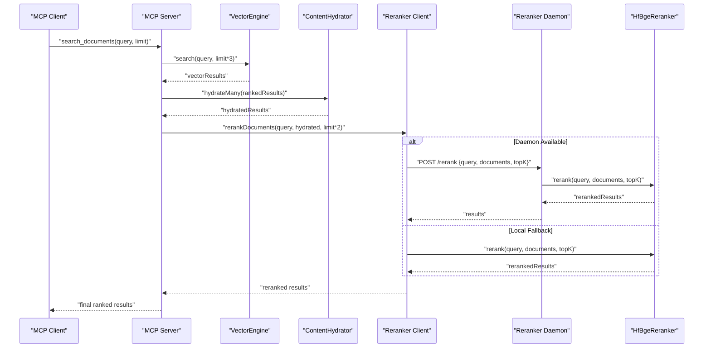
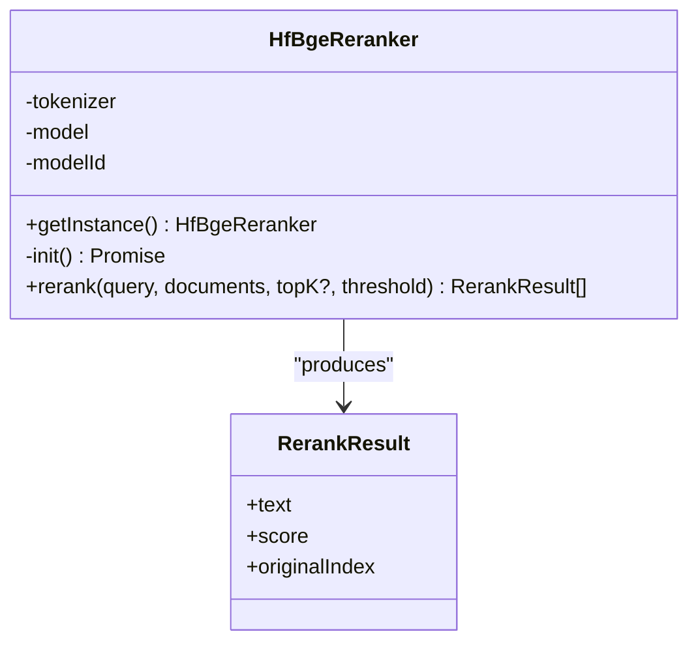
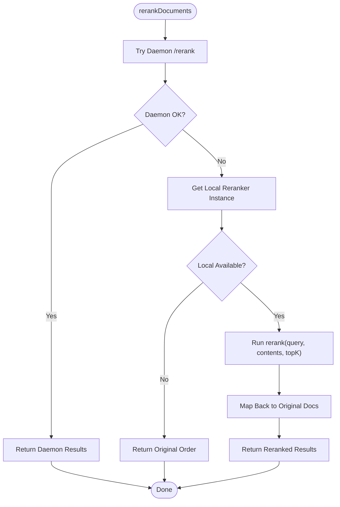
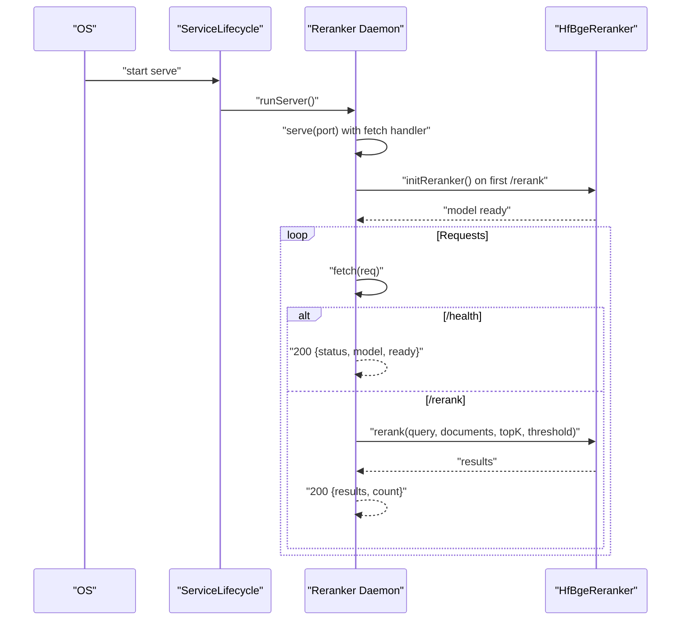
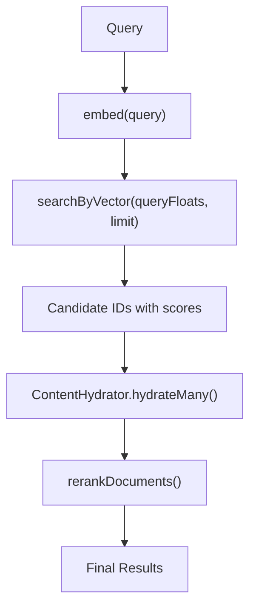
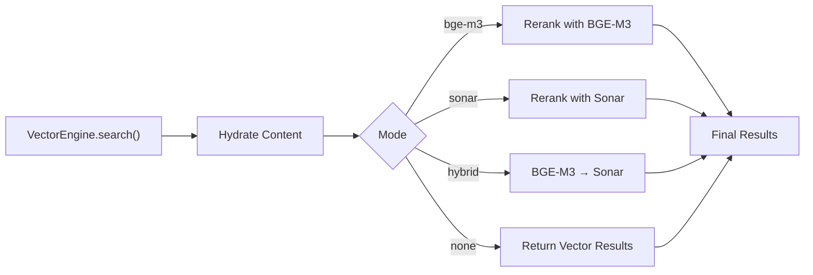
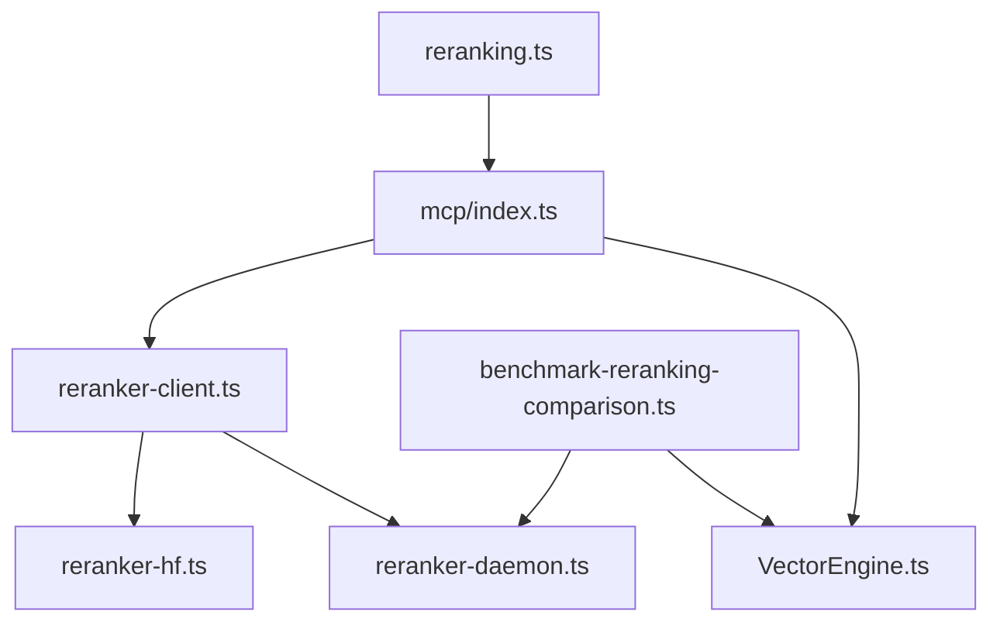

# Cross-Encoder Reranking System

<cite>
**Referenced Files in This Document**
- [reranker-hf.ts](file://src/services/reranker-hf.ts)
- [reranker-client.ts](file://src/utils/reranker-client.ts)
- [reranker-daemon.ts](file://src/resonance/services/reranker-daemon.ts)
- [VectorEngine.ts](file://src/core/VectorEngine.ts)
- [reranking.ts](file://src/types/reranking.ts)
- [benchmark-reranking-comparison.ts](file://scripts/benchmarks/benchmark-reranking-comparison.ts)
- [compare-reranking-results.ts](file://scripts/benchmarks/compare-reranking-results.ts)
- [test-reranking-quality.ts](file://scripts/test-reranking-quality.ts)
- [index.ts](file://src/mcp/index.ts)
- [amalfa.settings.json](file://amalfa.settings.json)
</cite>

## Table of Contents
1. [Introduction](#introduction)
2. [Project Structure](#project-structure)
3. [Core Components](#core-components)
4. [Architecture Overview](#architecture-overview)
5. [Detailed Component Analysis](#detailed-component-analysis)
6. [Dependency Analysis](#dependency-analysis)
7. [Performance Considerations](#performance-considerations)
8. [Troubleshooting Guide](#troubleshooting-guide)
9. [Conclusion](#conclusion)
10. [Appendices](#appendices)

## Introduction
This document describes the cross-encoder reranking system built around the BAAI BGE model, designed to improve search precision by re-ranking initial semantic search results using contextual scoring. The system integrates seamlessly with the VectorEngine search pipeline and provides multiple reranking modes, daemon-based inference for performance, and comprehensive benchmarking tools. It covers service lifecycle management, model loading strategies, concurrent request handling, hybrid retrieval integration, performance implications, client configuration, and practical guidelines for thresholds and result limits.

## Project Structure
The reranking system spans several modules:
- Core reranking service using Hugging Face Transformers.js with ONNX inference
- Client utility for graceful fallback between daemon and local reranking
- Dedicated reranker daemon for persistent model loading and HTTP endpoints
- Integration with VectorEngine for hybrid retrieval
- Benchmarking and quality assessment scripts
- MCP integration for production search workflows

**Diagram sources**
- [index.ts](file://src/mcp/index.ts#L267-L430)
- [reranker-client.ts](file://src/utils/reranker-client.ts#L137-L209)
- [reranker-daemon.ts](file://src/resonance/services/reranker-daemon.ts#L43-L141)
- [reranker-hf.ts](file://src/services/reranker-hf.ts#L22-L129)
- [VectorEngine.ts](file://src/core/VectorEngine.ts#L76-L241)
- [reranking.ts](file://src/types/reranking.ts#L5-L29)
- [benchmark-reranking-comparison.ts](file://scripts/benchmarks/benchmark-reranking-comparison.ts#L95-L158)
- [compare-reranking-results.ts](file://scripts/benchmarks/compare-reranking-results.ts#L19-L82)
- [test-reranking-quality.ts](file://scripts/test-reranking-quality.ts#L17-L124)

**Section sources**
- [reranker-hf.ts](file://src/services/reranker-hf.ts#L1-L130)
- [reranker-client.ts](file://src/utils/reranker-client.ts#L1-L225)
- [reranker-daemon.ts](file://src/resonance/services/reranker-daemon.ts#L1-L145)
- [VectorEngine.ts](file://src/core/VectorEngine.ts#L1-L242)
- [reranking.ts](file://src/types/reranking.ts#L1-L30)
- [benchmark-reranking-comparison.ts](file://scripts/benchmarks/benchmark-reranking-comparison.ts#L1-L280)
- [compare-reranking-results.ts](file://scripts/benchmarks/compare-reranking-results.ts#L1-L83)
- [test-reranking-quality.ts](file://scripts/test-reranking-quality.ts#L1-L125)
- [index.ts](file://src/mcp/index.ts#L267-L430)

## Core Components
- BGE Cross-Encoder Service: Implements a singleton reranker using Hugging Face Transformers.js with ONNX quantized model for CPU inference. It tokenizes query-document pairs and produces normalized relevance scores.
- Reranker Client: Provides graceful fallback between daemon and local reranking, with availability checks and error handling. It preserves original scores while promoting reranked scores as primary.
- Reranker Daemon: A dedicated service that loads the BGE model once and exposes HTTP endpoints for health checks and reranking. It supports lazy initialization and lifecycle management.
- VectorEngine Integration: Supplies initial candidate results for reranking, enabling hybrid retrieval where vector search feeds cross-encoder scoring.
- Configuration Types: Defines reranking modes and parameters (topK, threshold) for flexible tuning.
- Benchmarking Suite: Includes scripts to compare reranking modes, analyze latency, and validate quality improvements.

**Section sources**
- [reranker-hf.ts](file://src/services/reranker-hf.ts#L22-L129)
- [reranker-client.ts](file://src/utils/reranker-client.ts#L137-L209)
- [reranker-daemon.ts](file://src/resonance/services/reranker-daemon.ts#L26-L141)
- [VectorEngine.ts](file://src/core/VectorEngine.ts#L227-L241)
- [reranking.ts](file://src/types/reranking.ts#L5-L29)

## Architecture Overview
The reranking architecture follows a hybrid retrieval pattern:
- VectorEngine performs fast semantic search to retrieve candidate documents.
- ContentHydrator supplies document content for reranking.
- Reranker Client chooses between daemon and local reranking, applying cross-encoder scoring.
- Results are merged back into the search pipeline with reranked scores replacing vector scores.

**Diagram sources**
- [index.ts](file://src/mcp/index.ts#L371-L405)
- [reranker-client.ts](file://src/utils/reranker-client.ts#L144-L209)
- [reranker-daemon.ts](file://src/resonance/services/reranker-daemon.ts#L64-L114)
- [reranker-hf.ts](file://src/services/reranker-hf.ts#L74-L128)
- [VectorEngine.ts](file://src/core/VectorEngine.ts#L227-L241)

## Detailed Component Analysis

### BGE Cross-Encoder Service
The HfBgeReranker encapsulates:
- Singleton initialization with lazy model loading
- Tokenization of query-document pairs using the SEP separator
- Raw logits inference via Transformers.js ONNX runtime
- Sigmoid normalization to produce 0-1 relevance scores
- Threshold filtering and topK selection

**Diagram sources**
- [reranker-hf.ts](file://src/services/reranker-hf.ts#L22-L129)

**Section sources**
- [reranker-hf.ts](file://src/services/reranker-hf.ts#L22-L129)

### Reranker Client
The client provides:
- Daemon-first strategy with HTTP endpoint invocation and timeout handling
- Local fallback using singleton HfBgeReranker
- Graceful degradation returning original order on failure
- Status diagnostics and availability checks

**Diagram sources**
- [reranker-client.ts](file://src/utils/reranker-client.ts#L144-L209)

**Section sources**
- [reranker-client.ts](file://src/utils/reranker-client.ts#L1-L225)

### Reranker Daemon
The daemon offers:
- ServiceLifecycle integration with PID/log files
- Lazy model initialization on first request
- HTTP endpoints for health and reranking
- Concurrent request handling via Bun's HTTP server
- Error handling and structured logging

**Diagram sources**
- [reranker-daemon.ts](file://src/resonance/services/reranker-daemon.ts#L18-L141)

**Section sources**
- [reranker-daemon.ts](file://src/resonance/services/reranker-daemon.ts#L1-L145)

### VectorEngine Integration
VectorEngine supplies:
- Fast semantic search using FAFCAS protocol and cosine similarity
- Candidate retrieval for reranking
- Metadata hydration for display and context

**Diagram sources**
- [VectorEngine.ts](file://src/core/VectorEngine.ts#L227-L241)
- [index.ts](file://src/mcp/index.ts#L371-L405)

**Section sources**
- [VectorEngine.ts](file://src/core/VectorEngine.ts#L76-L241)
- [index.ts](file://src/mcp/index.ts#L371-L405)

### Configuration and Modes
Reranking modes define pipeline behavior:
- none: Vector-only baseline
- bge-m3: Vector (50) → BGE-M3 (15)
- sonar: Vector (20) → Sonar (5)
- hybrid: Vector (50) → BGE-M3 (15) → Sonar (5)

**Diagram sources**
- [reranking.ts](file://src/types/reranking.ts#L5-L29)
- [benchmark-reranking-comparison.ts](file://scripts/benchmarks/benchmark-reranking-comparison.ts#L95-L158)

**Section sources**
- [reranking.ts](file://src/types/reranking.ts#L5-L29)
- [benchmark-reranking-comparison.ts](file://scripts/benchmarks/benchmark-reranking-comparison.ts#L95-L158)

## Dependency Analysis
Key dependencies and relationships:
- Reranker Client depends on HfBgeReranker and optionally on the Reranker Daemon
- MCP Server orchestrates VectorEngine, ContentHydrator, and Reranker Client
- Benchmark scripts depend on VectorEngine and the daemon for reranking
- Configuration types define reranking parameters consumed by the client

**Diagram sources**
- [reranker-client.ts](file://src/utils/reranker-client.ts#L8-L13)
- [reranker-daemon.ts](file://src/resonance/services/reranker-daemon.ts#L9-L12)
- [reranker-hf.ts](file://src/services/reranker-hf.ts#L9-L14)
- [index.ts](file://src/mcp/index.ts#L22-L25)
- [benchmark-reranking-comparison.ts](file://scripts/benchmarks/benchmark-reranking-comparison.ts#L14-L21)
- [reranking.ts](file://src/types/reranking.ts#L7-L17)

**Section sources**
- [reranker-client.ts](file://src/utils/reranker-client.ts#L1-L225)
- [reranker-daemon.ts](file://src/resonance/services/reranker-daemon.ts#L1-L145)
- [reranker-hf.ts](file://src/services/reranker-hf.ts#L1-L130)
- [index.ts](file://src/mcp/index.ts#L1-L748)
- [benchmark-reranking-comparison.ts](file://scripts/benchmarks/benchmark-reranking-comparison.ts#L1-L280)
- [reranking.ts](file://src/types/reranking.ts#L1-L30)

## Performance Considerations
- Latency characteristics:
  - VectorEngine search is CPU-bound and optimized for speed using FAFCAS protocol
  - Cross-encoder reranking is significantly heavier, consuming most of the total latency in reranked modes
  - Daemon-based reranking avoids repeated model loading overhead and reduces cold-start latency
- Throughput optimization:
  - Use daemon-first strategy to minimize repeated model initialization
  - Tune topK and threshold to reduce reranking workload while preserving quality
  - Parallelize vector and grep retrieval before reranking to maximize candidate diversity
- Memory and model loading:
  - Singleton pattern ensures model is loaded once per process
  - Lazy initialization defers cost until first request
  - ONNX quantization reduces memory footprint and accelerates inference

[No sources needed since this section provides general guidance]

## Troubleshooting Guide
Common issues and resolutions:
- Daemon unavailability:
  - Verify daemon is running and responding to /health
  - Check port configuration and firewall settings
  - Confirm model initialization logs indicate readiness
- Model loading failures:
  - Inspect initialization errors and network connectivity for model artifacts
  - Ensure sufficient memory for model loading
- Graceful degradation:
  - Client falls back to local reranking if daemon fails
  - If both fail, results revert to original vector order with warnings logged
- Benchmark discrepancies:
  - Differences between baseline and "none" modes can arise from first-run model loading or cache effects
  - Use comparison tools to analyze latency breakdowns and result shifts

**Section sources**
- [reranker-daemon.ts](file://src/resonance/services/reranker-daemon.ts#L50-L62)
- [reranker-client.ts](file://src/utils/reranker-client.ts#L150-L208)
- [benchmark-reranking-comparison.ts](file://scripts/benchmarks/benchmark-reranking-comparison.ts#L63-L90)

## Conclusion
The cross-encoder reranking system leverages the BGE model to substantially improve search precision by capturing query-document interactions through contextual scoring. Its daemon-based architecture ensures efficient, scalable inference with graceful fallback, while integration with VectorEngine enables hybrid retrieval workflows. The benchmarking suite validates performance trade-offs and quality gains, providing actionable insights for tuning thresholds and result limits.

[No sources needed since this section summarizes without analyzing specific files]

## Appendices

### Benchmarking Results and Guidelines
- Pre-filtered vs full reranking:
  - Pre-filtered reranking (e.g., Vector (50) → BGE-M3 (15)) reduces computational cost while maintaining relevance
  - Full reranking (all candidates) maximizes precision but increases latency
- Optimal thresholds and result limits:
  - Start with default thresholds and topK values from configuration types
  - Adjust thresholds to prune low-relevance candidates early
  - Increase topK cautiously to balance recall and latency
- Determining thresholds:
  - Use quality tests to observe position changes and top result stability
  - Analyze comparison metrics to quantify improvement and latency impact

**Section sources**
- [reranking.ts](file://src/types/reranking.ts#L19-L29)
- [test-reranking-quality.ts](file://scripts/test-reranking-quality.ts#L17-L124)
- [compare-reranking-results.ts](file://scripts/benchmarks/compare-reranking-results.ts#L19-L82)

### Client Configuration and Integration
- Enabling reranking:
  - Configure reranking mode and parameters in the application settings
  - Ensure daemon is running for production deployments
- MCP integration:
  - The search tool orchestrates vector retrieval, hydration, and reranking
  - Results are merged with reranked scores and optional Sonar refinement

**Section sources**
- [amalfa.settings.json](file://amalfa.settings.json#L48-L81)
- [index.ts](file://src/mcp/index.ts#L371-L430)