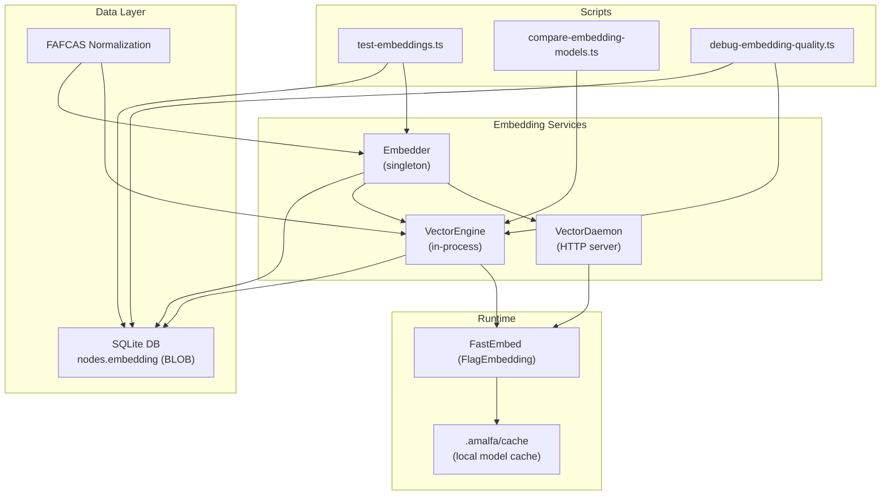
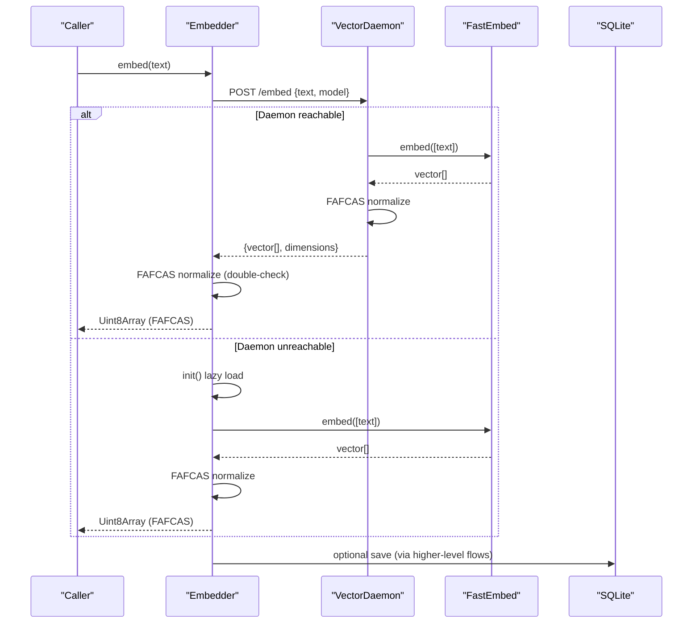
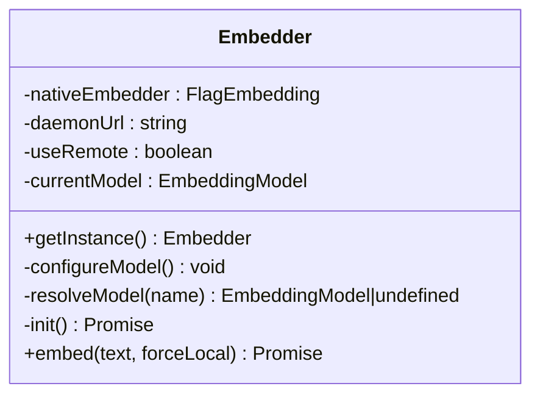
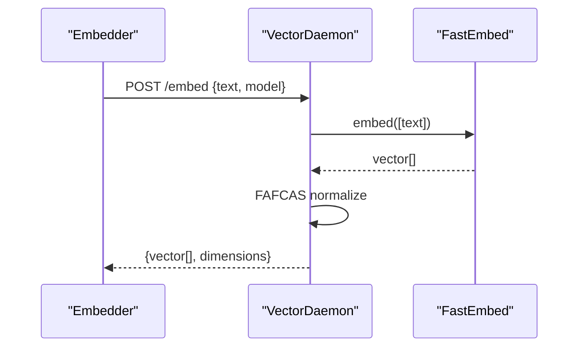
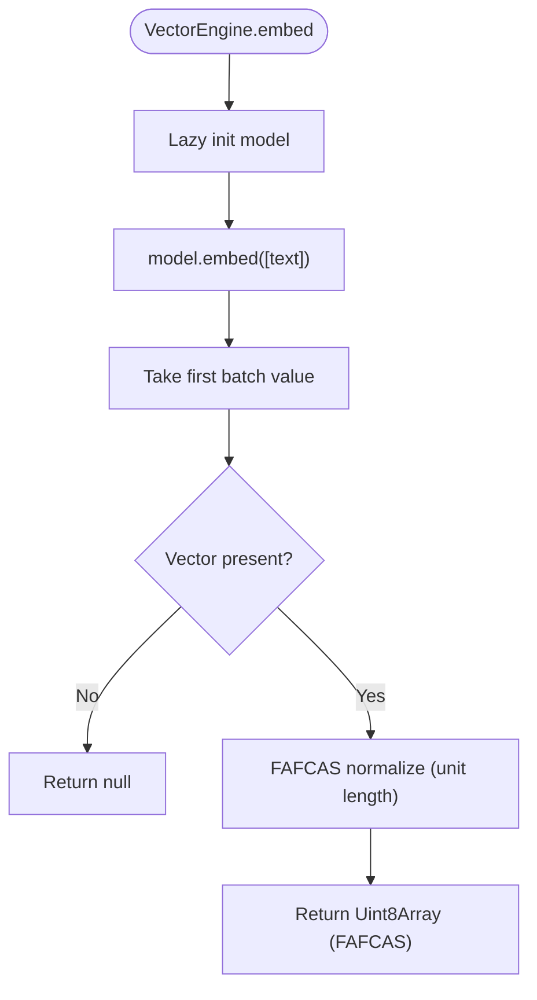
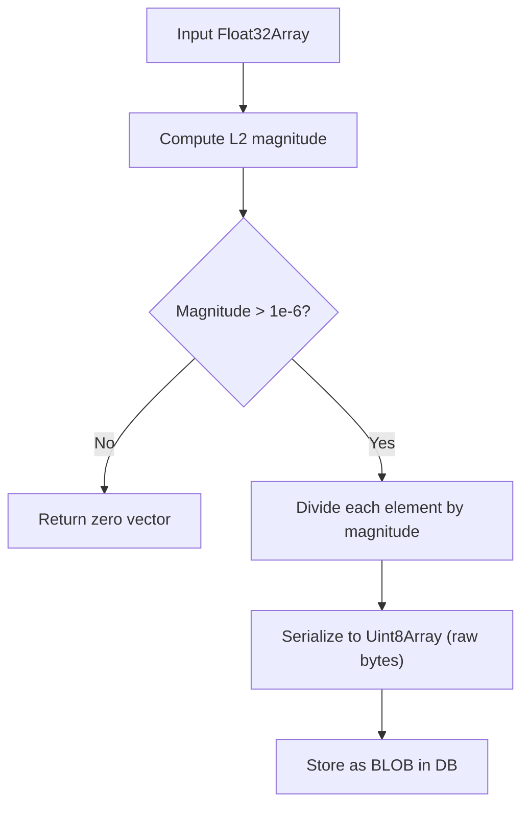
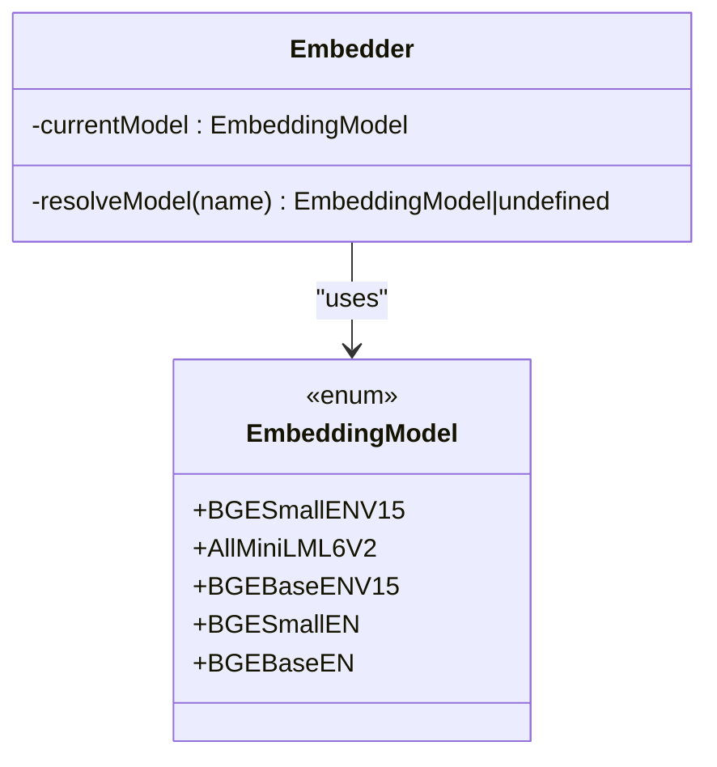
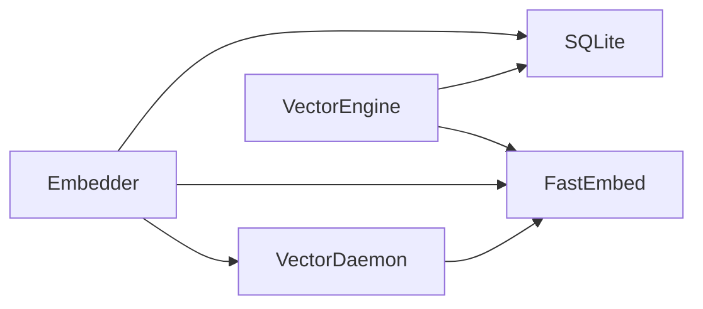
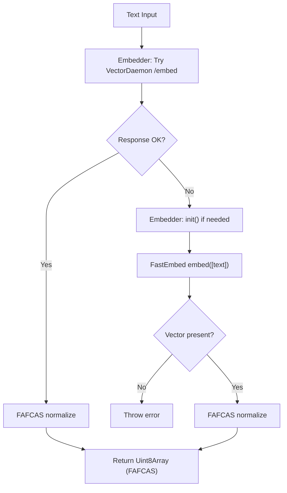

# Embedding Generation and Management

<cite>
**Referenced Files in This Document**
- [embedder.ts](file://src/resonance/services/embedder.ts)
- [vector-daemon.ts](file://src/resonance/services/vector-daemon.ts)
- [VectorEngine.ts](file://src/core/VectorEngine.ts)
- [db.ts](file://src/resonance/db.ts)
- [test-embeddings.ts](file://scripts/test-embeddings.ts)
- [compare-embedding-models.ts](file://scripts/compare-embedding-models.ts)
- [debug-embedding-quality.ts](file://scripts/lab/debug-embedding-quality.ts)
- [config-defaults.ts](file://src/config/defaults.ts)
- [amalfa.settings.json](file://amalfa.settings.json)
- [local_cache fast-bge-small-en-v1.5 config.json](file://local_cache/fast-bge-small-en-v1.5/config.json)
</cite>

## Table of Contents
1. [Introduction](#introduction)
2. [Project Structure](#project-structure)
3. [Core Components](#core-components)
4. [Architecture Overview](#architecture-overview)
5. [Detailed Component Analysis](#detailed-component-analysis)
6. [Dependency Analysis](#dependency-analysis)
7. [Performance Considerations](#performance-considerations)
8. [Troubleshooting Guide](#troubleshooting-guide)
9. [Conclusion](#conclusion)
10. [Appendices](#appendices)

## Introduction
This document explains the embedding generation system used to produce FAFCAS-compliant vector representations. It covers the integration with the FastEmbed library, the BGESmallENV15 model, and the embedder service architecture including lazy loading, model initialization, and memory management. It also details the end-to-end embedding pipeline from text input to normalized vector output, model selection criteria, dimensionality considerations, performance characteristics, local caching, and how to configure custom embedding providers. Finally, it provides troubleshooting guidance for common issues, memory optimization techniques, and strategies for handling out-of-memory scenarios during batch operations.

## Project Structure
The embedding system spans several modules:
- Embedder service: Provides a singleton embedder with remote-first fallback and local initialization.
- Vector daemon: An HTTP server that keeps a FastEmbed model loaded in memory for low-latency embeddings.
- VectorEngine: In-process embedding engine for batch workloads and FAFCAS-compliant storage/search.
- Database integration: FAFCAS normalization and storage of embeddings as BLOBs.
- Scripts: Validation, comparison, and quality checks for embeddings.
- Configuration: Settings for model selection and cache directories.

**Diagram sources**
- [embedder.ts](file://src/resonance/services/embedder.ts#L1-L126)
- [vector-daemon.ts](file://src/resonance/services/vector-daemon.ts#L1-L234)
- [VectorEngine.ts](file://src/core/VectorEngine.ts#L1-L242)
- [db.ts](file://src/resonance/db.ts#L1-L488)
- [test-embeddings.ts](file://scripts/test-embeddings.ts#L1-L222)
- [compare-embedding-models.ts](file://scripts/compare-embedding-models.ts#L1-L189)
- [debug-embedding-quality.ts](file://scripts/lab/debug-embedding-quality.ts#L1-L73)

**Section sources**
- [embedder.ts](file://src/resonance/services/embedder.ts#L1-L126)
- [vector-daemon.ts](file://src/resonance/services/vector-daemon.ts#L1-L234)
- [VectorEngine.ts](file://src/core/VectorEngine.ts#L1-L242)
- [db.ts](file://src/resonance/db.ts#L1-L488)
- [test-embeddings.ts](file://scripts/test-embeddings.ts#L1-L222)
- [compare-embedding-models.ts](file://scripts/compare-embedding-models.ts#L1-L189)
- [debug-embedding-quality.ts](file://scripts/lab/debug-embedding-quality.ts#L1-L73)

## Core Components
- Embedder: Singleton that lazily initializes a FastEmbed model and supports remote-first embedding via the VectorDaemon. It enforces FAFCAS normalization at the generation boundary and returns normalized vectors as Uint8Array.
- VectorDaemon: A long-running HTTP server that loads the FastEmbed model at startup and exposes /embed and /rerank endpoints. It maintains the model in memory for sub-100ms latency.
- VectorEngine: In-process engine for embedding generation, FAFCAS normalization, and FAFCAS-optimized search using dot products on unit vectors. It stores embeddings as BLOBs in SQLite.
- FAFCAS Normalization: L2-normalization and raw-byte serialization to ensure unit-length vectors and efficient storage/transmission.
- Configuration and Cache: Environment and settings drive model selection and cache directories for local model downloads.

**Section sources**
- [embedder.ts](file://src/resonance/services/embedder.ts#L9-L126)
- [vector-daemon.ts](file://src/resonance/services/vector-daemon.ts#L28-L75)
- [VectorEngine.ts](file://src/core/VectorEngine.ts#L76-L139)
- [db.ts](file://src/resonance/db.ts#L467-L487)
- [config-defaults.ts](file://src/config/defaults.ts#L16-L59)
- [amalfa.settings.json](file://amalfa.settings.json#L11-L14)

## Architecture Overview
The system supports two primary paths:
- Remote-first path: Embedder attempts to call VectorDaemon’s /embed endpoint. On success, it receives a normalized vector and returns a FAFCAS-compliant Uint8Array.
- Local path: Embedder initializes FastEmbed locally and generates embeddings directly.

VectorEngine provides an alternative in-process path for batch operations and FAFCAS-compliant storage and search.

**Diagram sources**
- [embedder.ts](file://src/resonance/services/embedder.ts#L80-L124)
- [vector-daemon.ts](file://src/resonance/services/vector-daemon.ts#L162-L219)
- [db.ts](file://src/resonance/db.ts#L94-L134)

## Detailed Component Analysis

### Embedder Service
- Singleton pattern ensures a single initialized FastEmbed instance is reused.
- Remote-first strategy: Attempts VectorDaemon /embed with a short timeout. On failure, falls back to local initialization.
- Model selection: Defaults to BGESmallENV15; configurable via environment variable mapping to supported FastEmbed models.
- FAFCAS normalization: Enforces unit-length vectors and returns raw bytes.

**Diagram sources**
- [embedder.ts](file://src/resonance/services/embedder.ts#L9-L126)

**Section sources**
- [embedder.ts](file://src/resonance/services/embedder.ts#L19-L124)

### VectorDaemon
- Loads BGESmallENV15 at startup and keeps it in memory.
- Exposes:
  - /health: readiness and model info.
  - /embed: generates normalized embedding for a single text.
  - /rerank: lazy-loads a reranker model and reranks documents.
- Uses FAFCAS normalization and returns vectors as JSON arrays with dimensions.

**Diagram sources**
- [vector-daemon.ts](file://src/resonance/services/vector-daemon.ts#L162-L219)

**Section sources**
- [vector-daemon.ts](file://src/resonance/services/vector-daemon.ts#L28-L75)
- [vector-daemon.ts](file://src/resonance/services/vector-daemon.ts#L162-L219)

### VectorEngine
- Lazy-loads BGESmallENV15 model promise.
- Embedding generation: Returns FAFCAS-compliant Uint8Array after normalization.
- Storage: Updates nodes.embedding with BLOB.
- Search: FAFCAS-optimized search using dot product on unit vectors, with metadata hydration for top-K results.

**Diagram sources**
- [VectorEngine.ts](file://src/core/VectorEngine.ts#L115-L139)

**Section sources**
- [VectorEngine.ts](file://src/core/VectorEngine.ts#L76-L139)
- [VectorEngine.ts](file://src/core/VectorEngine.ts#L144-L240)

### FAFCAS Normalization and Storage
- Normalization: L2 norm computation and division to unit length; zero-vector guard prevents NaN.
- Serialization: Raw bytes (Uint8Array) for compact storage and transport.
- Database: Embeddings stored as BLOB in nodes.embedding; VectorEngine and Embedder both enforce FAFCAS normalization before storage.

**Diagram sources**
- [db.ts](file://src/resonance/db.ts#L467-L487)
- [VectorEngine.ts](file://src/core/VectorEngine.ts#L17-L37)
- [embedder.ts](file://src/resonance/services/embedder.ts#L97-L123)

**Section sources**
- [db.ts](file://src/resonance/db.ts#L94-L134)
- [db.ts](file://src/resonance/db.ts#L467-L487)
- [VectorEngine.ts](file://src/core/VectorEngine.ts#L17-L37)
- [embedder.ts](file://src/resonance/services/embedder.ts#L97-L123)

### Model Selection and Dimensionality
- Default model: BGESmallENV15 (384 dimensions).
- Configurable via environment variable mapping to supported FastEmbed models.
- Dimensions: 384 for BGESmallENV15; script comparisons demonstrate trade-offs between accuracy and speed.

**Diagram sources**
- [embedder.ts](file://src/resonance/services/embedder.ts#L45-L57)

**Section sources**
- [embedder.ts](file://src/resonance/services/embedder.ts#L27-L57)
- [compare-embedding-models.ts](file://scripts/compare-embedding-models.ts#L163-L181)
- [local_cache fast-bge-small-en-v1.5 config.json](file://local_cache/fast-bge-small-en-v1.5/config.json#L10)

### Local Caching Strategy
- Cache directory: .amalfa/cache (created on demand by VectorDaemon; Embedder uses .amalfa/cache via cacheDir option).
- Model artifacts are downloaded and reused locally to avoid repeated network overhead.
- VectorDaemon ensures cache directory exists before initializing the model.

**Section sources**
- [embedder.ts](file://src/resonance/services/embedder.ts#L68-L77)
- [vector-daemon.ts](file://src/resonance/services/vector-daemon.ts#L40-L47)
- [config-defaults.ts](file://src/config/defaults.ts#L16-L29)

### Configuring Custom Embedding Providers
- Environment-driven model selection: Set EMBEDDING_MODEL to a supported FastEmbed model name; the resolver maps common variants to EmbeddingModel enum values.
- Settings-driven model: amalfa.settings.json specifies model name and dimensions for informational purposes; runtime selection is controlled by environment variable mapping.

**Section sources**
- [embedder.ts](file://src/resonance/services/embedder.ts#L27-L57)
- [amalfa.settings.json](file://amalfa.settings.json#L11-L14)

## Dependency Analysis
- Embedder depends on FastEmbed and VectorDaemon for remote embeddings; falls back to local FastEmbed initialization.
- VectorEngine depends on FastEmbed and SQLite for storage and search.
- VectorDaemon depends on FastEmbed and exposes HTTP endpoints.
- FAFCAS normalization is shared across Embedder and VectorEngine.

**Diagram sources**
- [embedder.ts](file://src/resonance/services/embedder.ts#L1-L126)
- [vector-daemon.ts](file://src/resonance/services/vector-daemon.ts#L1-L234)
- [VectorEngine.ts](file://src/core/VectorEngine.ts#L1-L242)
- [db.ts](file://src/resonance/db.ts#L1-L488)

**Section sources**
- [embedder.ts](file://src/resonance/services/embedder.ts#L1-L126)
- [vector-daemon.ts](file://src/resonance/services/vector-daemon.ts#L1-L234)
- [VectorEngine.ts](file://src/core/VectorEngine.ts#L1-L242)
- [db.ts](file://src/resonance/db.ts#L1-L488)

## Performance Considerations
- Latency: VectorDaemon keeps the model in memory for sub-100ms embedding responses; Embedder uses a short timeout for remote requests.
- Throughput: VectorEngine supports batch iteration over embeddings; scripts demonstrate query-time measurements for comparative analysis.
- Memory: FAFCAS normalization reduces vector magnitude to unit length, enabling fast dot-product comparisons without recomputation.
- Model choice: BGESmallENV15 balances accuracy and speed for retrieval tasks; MiniLM is faster but slightly less accurate.

**Section sources**
- [vector-daemon.ts](file://src/resonance/services/vector-daemon.ts#L72-L75)
- [compare-embedding-models.ts](file://scripts/compare-embedding-models.ts#L141-L181)
- [VectorEngine.ts](file://src/core/VectorEngine.ts#L58-L74)

## Troubleshooting Guide
Common issues and resolutions:
- Remote daemon unreachable:
  - Symptom: Immediate fallback to local initialization.
  - Action: Verify VectorDaemon is running on the configured port; check /health endpoint.
- Empty or invalid embedding:
  - Symptom: Failure to generate embedding or empty vector.
  - Action: Confirm model initialization succeeded; retry after ensuring cache availability.
- Out-of-memory during batch operations:
  - Symptom: Crashes or timeouts during large batches.
  - Action: Reduce batch sizes; process in chunks; monitor memory usage; consider offloading to VectorDaemon for consistent memory footprint.
- Dimension mismatch:
  - Symptom: Search anomalies or incorrect similarity scores.
  - Action: Ensure consistent model selection across Embedder and VectorEngine; confirm dimensions align with configuration.

Validation and debugging:
- Use scripts to test embedding effectiveness and compare models.
- Debug embedding quality by comparing fresh embeddings against stored ones.

**Section sources**
- [embedder.ts](file://src/resonance/services/embedder.ts#L80-L124)
- [vector-daemon.ts](file://src/resonance/services/vector-daemon.ts#L162-L219)
- [test-embeddings.ts](file://scripts/test-embeddings.ts#L42-L222)
- [compare-embedding-models.ts](file://scripts/compare-embedding-models.ts#L45-L189)
- [debug-embedding-quality.ts](file://scripts/lab/debug-embedding-quality.ts#L1-L73)

## Conclusion
The embedding system integrates FastEmbed with BGESmallENV15 to deliver FAFCAS-compliant, normalized vectors efficiently. The remote-first Embedder architecture leverages a persistent VectorDaemon for low-latency inference, while VectorEngine enables robust in-process embedding, storage, and search. Configuration supports flexible model selection, and local caching minimizes repeated downloads. The included scripts facilitate validation, comparison, and quality assurance, while the troubleshooting guide addresses common operational issues.

## Appendices

### Embedding Pipeline from Text to FAFCAS Vector

**Diagram sources**
- [embedder.ts](file://src/resonance/services/embedder.ts#L80-L124)
- [db.ts](file://src/resonance/db.ts#L94-L134)