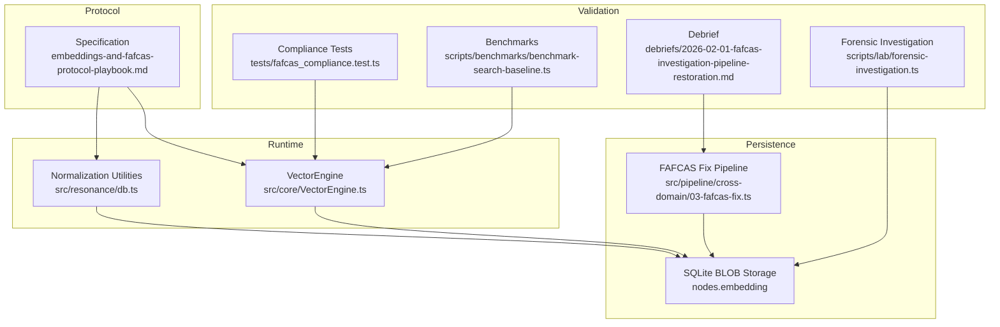
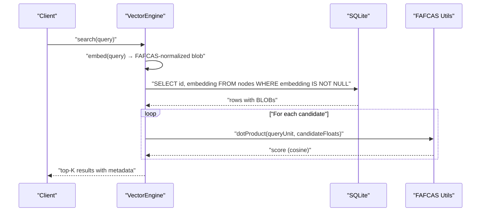
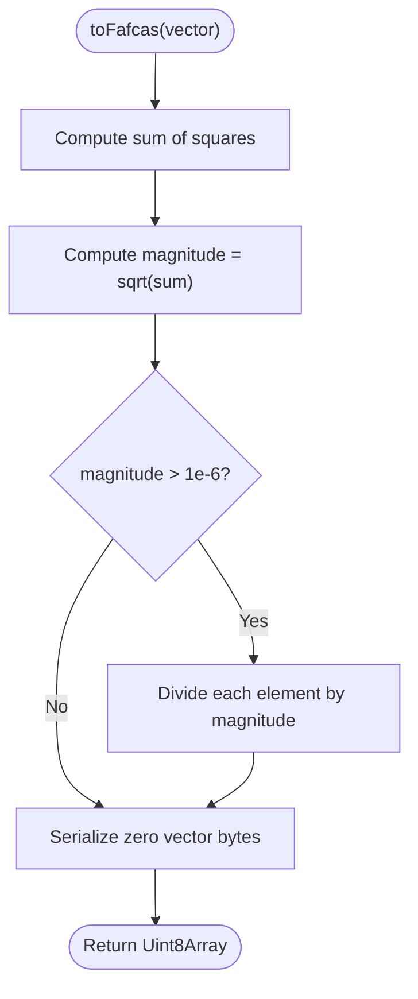
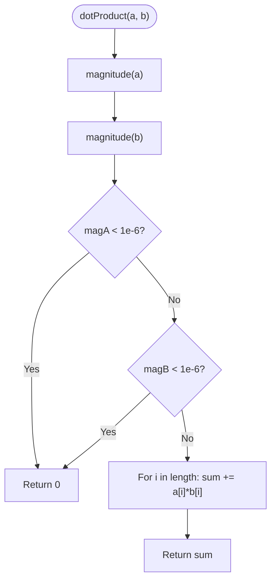
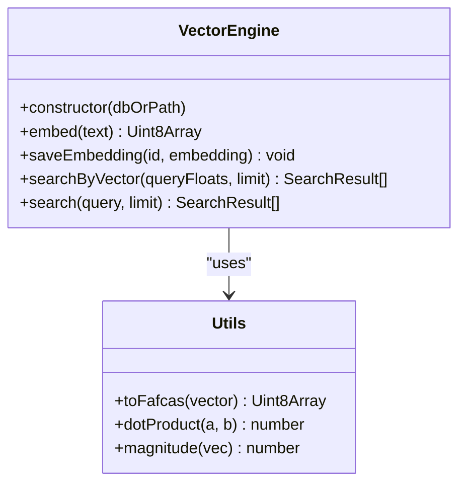
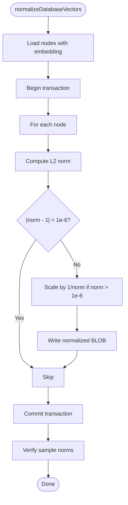
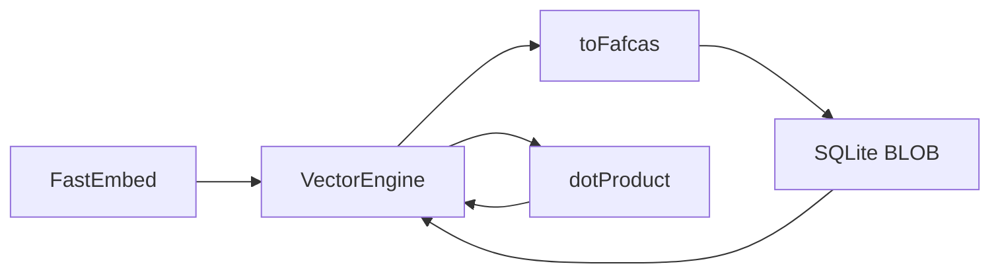

# FAFCAS Protocol Implementation

<cite>
**Referenced Files in This Document**
- [embeddings-and-fafcas-protocol-playbook.md](file://playbooks/embeddings-and-fafcas-protocol-playbook.md)
- [db.ts](file://src/resonance/db.ts)
- [VectorEngine.ts](file://src/core/VectorEngine.ts)
- [03-fafcas-fix.ts](file://src/pipeline/cross-domain/03-fafcas-fix.ts)
- [fafcas_compliance.test.ts](file://tests/fafcas_compliance.test.ts)
- [benchmark-search-baseline.ts](file://scripts/benchmarks/benchmark-search-baseline.ts)
- [forensic-investigation.ts](file://scripts/lab/forensic-investigation.ts)
- [debriefs/2026-02-01-fafcas-investigation-pipeline-restoration.md](file://debriefs/2026-02-01-fafcas-investigation-pipeline-restoration.md)
</cite>

## Table of Contents
1. [Introduction](#introduction)
2. [Project Structure](#project-structure)
3. [Core Components](#core-components)
4. [Architecture Overview](#architecture-overview)
5. [Detailed Component Analysis](#detailed-component-analysis)
6. [Dependency Analysis](#dependency-analysis)
7. [Performance Considerations](#performance-considerations)
8. [Troubleshooting Guide](#troubleshooting-guide)
9. [Conclusion](#conclusion)

## Introduction
This document explains the FAFCAS (Fast Affine-Combinatorial Algorithm for Similarity) protocol implementation used by the Amalfa system to achieve 10x faster similarity search. FAFCAS optimizes vector similarity by enforcing unit-length (L2 norm = 1.0) embeddings and computing cosine similarity via pure dot product during runtime. This eliminates expensive normalization calculations and enables sub-100ms in-memory search directly against SQLite.

The protocol consists of three steps:
1. L2 norm calculation
2. Vector normalization to unit length
3. Raw byte serialization for storage as SQLite BLOBs

The mathematical foundation is that cosine similarity reduces to dot product when both vectors are unit vectors, removing costly square roots and divisions from the hot loop.

## Project Structure
The FAFCAS implementation spans several modules:
- Protocol specification and recipes
- Runtime normalization and search utilities
- Vector engine integration for embedding generation and search
- Database layer for storing and retrieving normalized vectors
- Pipeline fix for historical non-compliant vectors
- Compliance tests and forensic investigations
- Benchmarks and performance validation

**Diagram sources**
- [embeddings-and-fafcas-protocol-playbook.md](file://playbooks/embeddings-and-fafcas-protocol-playbook.md#L18-L36)
- [db.ts](file://src/resonance/db.ts#L443-L487)
- [VectorEngine.ts](file://src/core/VectorEngine.ts#L76-L242)
- [03-fafcas-fix.ts](file://src/pipeline/cross-domain/03-fafcas-fix.ts#L1-L126)
- [fafcas_compliance.test.ts](file://tests/fafcas_compliance.test.ts#L1-L75)
- [forensic-investigation.ts](file://scripts/lab/forensic-investigation.ts#L1-L208)
- [benchmark-search-baseline.ts](file://scripts/benchmarks/benchmark-search-baseline.ts#L1-L164)
- [debriefs/2026-02-01-fafcas-investigation-pipeline-restoration.md](file://debriefs/2026-02-01-fafcas-investigation-pipeline-restoration.md#L1-L84)

**Section sources**
- [embeddings-and-fafcas-protocol-playbook.md](file://playbooks/embeddings-and-fafcas-protocol-playbook.md#L18-L36)
- [db.ts](file://src/resonance/db.ts#L443-L487)
- [VectorEngine.ts](file://src/core/VectorEngine.ts#L76-L242)
- [03-fafcas-fix.ts](file://src/pipeline/cross-domain/03-fafcas-fix.ts#L1-L126)
- [fafcas_compliance.test.ts](file://tests/fafcas_compliance.test.ts#L1-L75)
- [forensic-investigation.ts](file://scripts/lab/forensic-investigation.ts#L1-L208)
- [benchmark-search-baseline.ts](file://scripts/benchmarks/benchmark-search-baseline.ts#L1-L164)
- [debriefs/2026-02-01-fafcas-investigation-pipeline-restoration.md](file://debriefs/2026-02-01-fafcas-investigation-pipeline-restoration.md#L1-L84)

## Core Components
- FAFCAS Normalizer: Computes L2 norm, normalizes to unit length, and returns raw bytes for storage.
- Dot Product Engine: Performs cosine similarity via dot product for unit vectors, with zero-vector guard to prevent false matches.
- VectorEngine: Integrates embedding generation, FAFCAS normalization, and optimized search over SQLite BLOBs.
- Database Layer: Stores Float32 embeddings as raw BLOBs and hydrates them back to Float32 arrays for scoring.
- Compliance and Forensics: Validates unit-length vectors, detects corruption, and restores historical datasets.

**Section sources**
- [embeddings-and-fafcas-protocol-playbook.md](file://playbooks/embeddings-and-fafcas-protocol-playbook.md#L94-L142)
- [db.ts](file://src/resonance/db.ts#L443-L487)
- [VectorEngine.ts](file://src/core/VectorEngine.ts#L17-L74)
- [fafcas_compliance.test.ts](file://tests/fafcas_compliance.test.ts#L1-L75)
- [forensic-investigation.ts](file://scripts/lab/forensic-investigation.ts#L1-L208)

## Architecture Overview
FAFCAS enables sub-100ms vector search by:
- Enforcing unit vectors at ingestion time
- Storing raw Float32 bytes in SQLite BLOBs
- Computing dot products in the hot loop without normalization overhead
- Using zero-vector detection to skip invalid comparisons

**Diagram sources**
- [VectorEngine.ts](file://src/core/VectorEngine.ts#L159-L242)
- [db.ts](file://src/resonance/db.ts#L443-L487)

## Detailed Component Analysis

### FAFCAS Normalizer (toFafcas)
The normalizer performs:
1. L2 norm calculation: sum of squares, square root
2. Unit vector normalization: divide each element by magnitude (skip if near zero)
3. Raw byte serialization: return Uint8Array view over Float32 buffer

**Diagram sources**
- [db.ts](file://src/resonance/db.ts#L467-L487)
- [VectorEngine.ts](file://src/core/VectorEngine.ts#L17-L37)

**Section sources**
- [db.ts](file://src/resonance/db.ts#L467-L487)
- [VectorEngine.ts](file://src/core/VectorEngine.ts#L17-L37)
- [embeddings-and-fafcas-protocol-playbook.md](file://playbooks/embeddings-and-fafcas-protocol-playbook.md#L99-L119)

### Dot Product and Zero-Vector Detection
Cosine similarity for unit vectors equals dot product. The implementation:
- Checks magnitudes of both vectors
- Returns 0 for zero-magnitude vectors to avoid false matches
- Computes sum of products in a tight loop optimized by modern JS engines

**Diagram sources**
- [db.ts](file://src/resonance/db.ts#L448-L464)
- [VectorEngine.ts](file://src/core/VectorEngine.ts#L58-L74)

**Section sources**
- [db.ts](file://src/resonance/db.ts#L448-L464)
- [VectorEngine.ts](file://src/core/VectorEngine.ts#L58-L74)
- [embeddings-and-fafcas-protocol-playbook.md](file://playbooks/embeddings-and-fafcas-protocol-playbook.md#L33-L35)

### VectorEngine Integration
VectorEngine integrates FAFCAS into the search pipeline:
- Embedding generation via FastEmbed (returns normalized by default; FAFCAS enforces unit length)
- Normalization and conversion to FAFCAS-compliant BLOB
- Search by vector: loads BLOBs, creates Float32 views, computes dot products, sorts, and hydrates metadata

**Diagram sources**
- [VectorEngine.ts](file://src/core/VectorEngine.ts#L76-L242)
- [db.ts](file://src/resonance/db.ts#L443-L487)

**Section sources**
- [VectorEngine.ts](file://src/core/VectorEngine.ts#L76-L242)
- [db.ts](file://src/resonance/db.ts#L443-L487)

### Database Storage and Hydration
- Embeddings are stored as raw Float32 bytes (BLOB) in the nodes.embedding column
- On retrieval, a Float32Array view is created from the BLOB for scoring
- The database layer trusts FAFCAS-compliant vectors and avoids unnecessary hydration of large content

**Section sources**
- [db.ts](file://src/resonance/db.ts#L83-L134)
- [db.ts](file://src/resonance/db.ts#L284-L296)

### Historical Non-Compliance Fix
The cross-domain FAFCAS fix script:
- Scans all nodes with embeddings
- Computes L2 norm and detects already-normalized vectors
- Normalizes non-unit vectors and writes back FAFCAS-compliant BLOBs
- Provides verification samples and transactional safety

**Diagram sources**
- [03-fafcas-fix.ts](file://src/pipeline/cross-domain/03-fafcas-fix.ts#L11-L93)

**Section sources**
- [03-fafcas-fix.ts](file://src/pipeline/cross-domain/03-fafcas-fix.ts#L1-L126)

### Compliance and Forensics
- Compliance tests verify unit-length vectors, idempotence, minimal input handling, and correct dimensionality
- Forensic investigation validates storage/retrieval paths and demonstrates the impact of normalization on search quality
- Debriefs document a major restoration effort that improved search scores from ~0.04 to 0.8+ by fixing buffer access patterns and restoring FAFCAS compliance

**Section sources**
- [fafcas_compliance.test.ts](file://tests/fafcas_compliance.test.ts#L1-L75)
- [forensic-investigation.ts](file://scripts/lab/forensic-investigation.ts#L1-L208)
- [debriefs/2026-02-01-fafcas-investigation-pipeline-restoration.md](file://debriefs/2026-02-01-fafcas-investigation-pipeline-restoration.md#L1-L84)

## Dependency Analysis
FAFCAS relies on:
- FastEmbed for efficient embedding generation
- SQLite for zero-dependency vector storage
- TypedArray views for zero-copy access to BLOBs
- Strict buffer access patterns to prevent corruption

**Diagram sources**
- [VectorEngine.ts](file://src/core/VectorEngine.ts#L106-L139)
- [db.ts](file://src/resonance/db.ts#L467-L487)
- [db.ts](file://src/resonance/db.ts#L448-L464)

**Section sources**
- [VectorEngine.ts](file://src/core/VectorEngine.ts#L106-L139)
- [db.ts](file://src/resonance/db.ts#L467-L487)
- [db.ts](file://src/resonance/db.ts#L448-L464)

## Performance Considerations
- Hot loop optimization: dot product is computed without normalization overhead
- Memory efficiency: slim scan loads only id and embedding; metadata hydration deferred to top-K
- SIMD-friendly loops: modern JS engines optimize tight multiplication/summation loops
- Database throughput: WAL mode and tuned pragmas improve concurrency and IO

Benchmarks demonstrate sub-100ms end-to-end search and highlight FAFCAS’s role in achieving fast, in-memory similarity.

**Section sources**
- [embeddings-and-fafcas-protocol-playbook.md](file://playbooks/embeddings-and-fafcas-protocol-playbook.md#L51-L58)
- [benchmark-search-baseline.ts](file://scripts/benchmarks/benchmark-search-baseline.ts#L63-L158)

## Troubleshooting Guide
Common issues and remedies:
- Wrong TypedArray construction: using `new Float32Array(blob)` instead of `new Float32Array(blob.buffer, blob.byteOffset, blob.byteLength/4)` causes dimension corruption and semantic breakdown
- Non-unit vectors: vectors not normalized to L2 norm = 1.0 degrade similarity scores dramatically
- Zero-vector detection: failing embeddings produce zero-magnitude vectors; the dot product guard returns 0 to prevent false matches
- Dimension mismatches: FAFCAS expects 384-dimension vectors; mismatches cause garbage similarity

Forensic scripts and compliance tests help identify and resolve these issues systematically.

**Section sources**
- [debriefs/2026-02-01-fafcas-investigation-pipeline-restoration.md](file://debriefs/2026-02-01-fafcas-investigation-pipeline-restoration.md#L43-L56)
- [forensic-investigation.ts](file://scripts/lab/forensic-investigation.ts#L1-L208)
- [fafcas_compliance.test.ts](file://tests/fafcas_compliance.test.ts#L1-L75)

## Conclusion
FAFCAS transforms vector similarity into a high-throughput, low-latency operation by enforcing unit vectors and computing dot products directly. The Amalfa implementation integrates normalization, storage, and search seamlessly, validated by compliance tests, forensic investigations, and performance benchmarks. Adhering to strict buffer access patterns and dimensionality ensures robustness and maintains the “Fast As F*ck, Cool As Sh*t” philosophy.