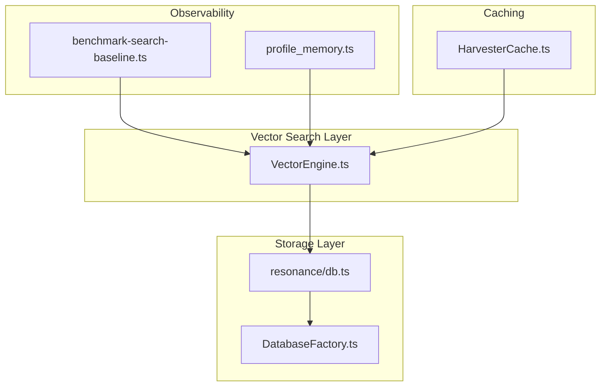
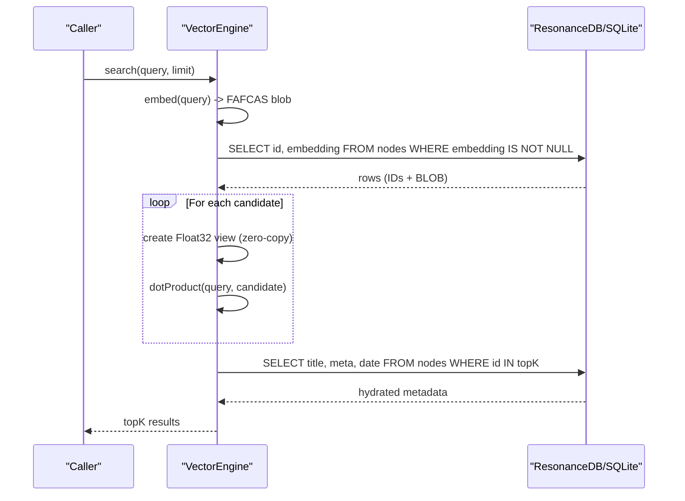
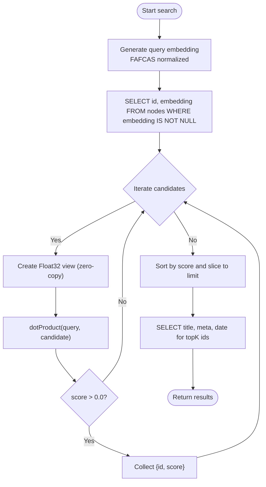
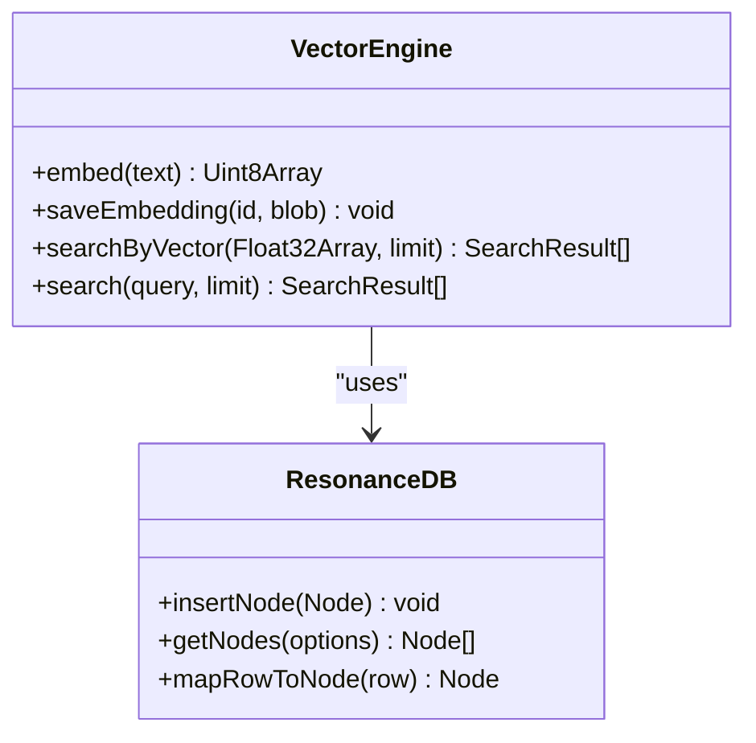
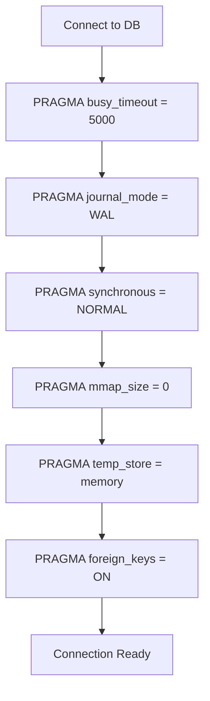
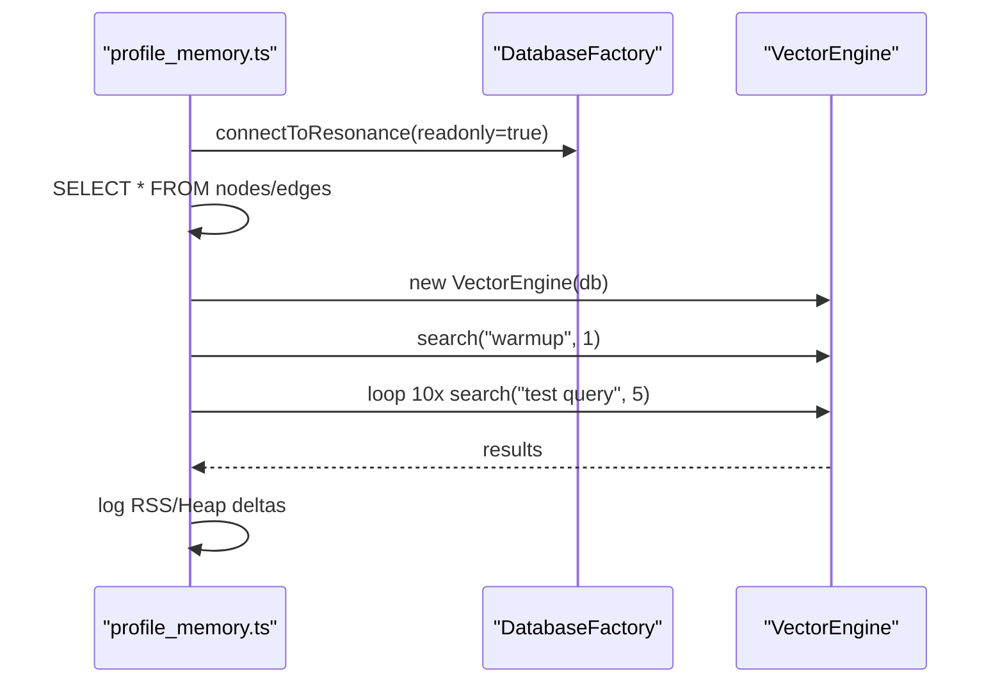
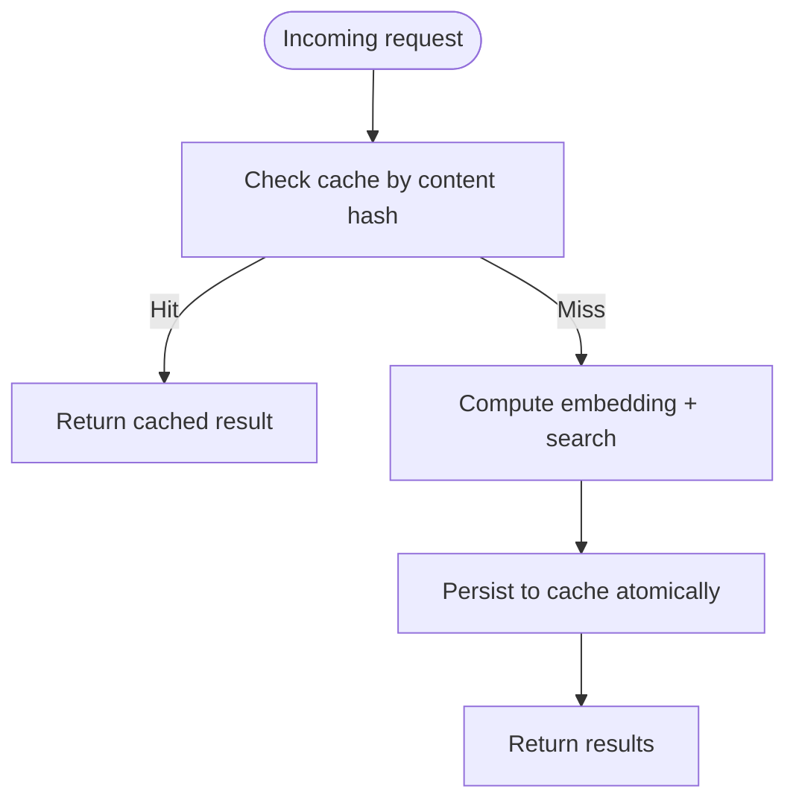
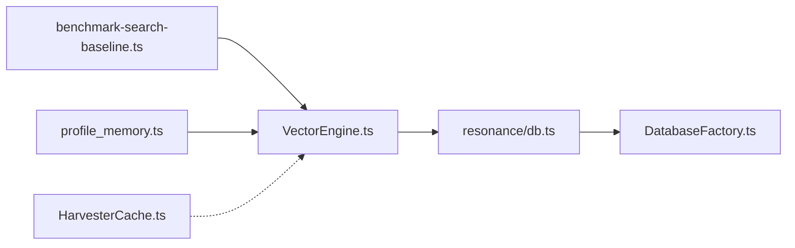

# Performance Optimization and Memory Management

<cite>
**Referenced Files in This Document**
- [VectorEngine.ts](file://src/core/VectorEngine.ts)
- [DatabaseFactory.ts](file://src/resonance/DatabaseFactory.ts)
- [db.ts](file://src/resonance/db.ts)
- [sqlite-standards.md](file://playbooks/sqlite-standards.md)
- [sqlite-wal-readonly-trap.md](file://docs/references/sqlite-wal-readonly-trap.md)
- [hardened-sqlite.md](file://docs/references/hardened-sqlite.md)
- [profile_memory.ts](file://scripts/profile_memory.ts)
- [benchmark-search-baseline.ts](file://scripts/benchmarks/benchmark-search-baseline.ts)
- [HarvesterCache.ts](file://src/core/HarvesterCache.ts)
- [defaults.ts](file://src/config/defaults.ts)
</cite>

## Table of Contents
1. [Introduction](#introduction)
2. [Project Structure](#project-structure)
3. [Core Components](#core-components)
4. [Architecture Overview](#architecture-overview)
5. [Detailed Component Analysis](#detailed-component-analysis)
6. [Dependency Analysis](#dependency-analysis)
7. [Performance Considerations](#performance-considerations)
8. [Troubleshooting Guide](#troubleshooting-guide)
9. [Conclusion](#conclusion)
10. [Appendices](#appendices)

## Introduction
This document focuses on advanced performance optimization techniques implemented in the vector search engine, including the slim scan optimization, memory management strategies for large embedding matrices, SQLite configuration hardening, profiling and benchmarking, out-of-memory handling, result caching, batch processing, monitoring, bottleneck identification, and scaling strategies for large knowledge bases.

## Project Structure
The vector search engine centers around a few key modules:
- VectorEngine: performs embedding generation and optimized similarity search
- ResonanceDB and DatabaseFactory: enforce hardened SQLite configuration and safe access patterns
- Benchmarks and profiling scripts: capture latency baselines and memory usage
- Caching utilities: reduce recomputation and I/O overhead

**Diagram sources**
- [VectorEngine.ts](file://src/core/VectorEngine.ts#L76-L242)
- [DatabaseFactory.ts](file://src/resonance/DatabaseFactory.ts#L13-L103)
- [db.ts](file://src/resonance/db.ts#L25-L431)
- [benchmark-search-baseline.ts](file://scripts/benchmarks/benchmark-search-baseline.ts#L63-L158)
- [profile_memory.ts](file://scripts/profile_memory.ts#L1-L94)
- [HarvesterCache.ts](file://src/core/HarvesterCache.ts#L44-L68)

**Section sources**
- [VectorEngine.ts](file://src/core/VectorEngine.ts#L76-L242)
- [DatabaseFactory.ts](file://src/resonance/DatabaseFactory.ts#L13-L103)
- [db.ts](file://src/resonance/db.ts#L25-L431)
- [sqlite-standards.md](file://playbooks/sqlite-standards.md#L1-L78)
- [sqlite-wal-readonly-trap.md](file://docs/references/sqlite-wal-readonly-trap.md#L1-L199)
- [hardened-sqlite.md](file://docs/references/hardened-sqlite.md#L1-L16)
- [benchmark-search-baseline.ts](file://scripts/benchmarks/benchmark-search-baseline.ts#L63-L158)
- [profile_memory.ts](file://scripts/profile_memory.ts#L1-L94)
- [HarvesterCache.ts](file://src/core/HarvesterCache.ts#L44-L68)

## Core Components
- VectorEngine: Implements FAFCAS normalization, zero-copy views over BLOB embeddings, and a slim scan search pipeline that minimizes memory and I/O by loading only IDs and embeddings during candidate selection.
- ResonanceDB and DatabaseFactory: Enforce a hardened SQLite configuration including WAL mode, busy_timeout, synchronous, mmap_size, temp_store, and foreign_keys, ensuring concurrency and durability.
- Benchmarks and Profiling: Capture latency baselines and memory growth across stages (database load, model warm-up, search execution).
- Caching: Atomic cache writes and content-addressable caching to reduce repeated computation and I/O.

**Section sources**
- [VectorEngine.ts](file://src/core/VectorEngine.ts#L76-L242)
- [DatabaseFactory.ts](file://src/resonance/DatabaseFactory.ts#L13-L103)
- [db.ts](file://src/resonance/db.ts#L25-L431)
- [benchmark-search-baseline.ts](file://scripts/benchmarks/benchmark-search-baseline.ts#L63-L158)
- [profile_memory.ts](file://scripts/profile_memory.ts#L1-L94)
- [HarvesterCache.ts](file://src/core/HarvesterCache.ts#L44-L68)

## Architecture Overview
The vector search pipeline follows a strict separation of concerns:
- Embedding generation uses an in-process model with FAFCAS normalization
- Candidate selection uses a slim scan to load only IDs and embeddings
- Scoring leverages zero-copy Float32Array views for unit vectors
- Metadata hydration occurs only for top-K results
- SQLite is configured for concurrency and durability

**Diagram sources**
- [VectorEngine.ts](file://src/core/VectorEngine.ts#L159-L240)
- [db.ts](file://src/resonance/db.ts#L368-L431)

## Detailed Component Analysis

### Slim Scan Optimization
Slim scan reduces memory and I/O by selecting only IDs and embeddings during candidate selection, deferring metadata hydration to a second pass limited to top-K results.

**Diagram sources**
- [VectorEngine.ts](file://src/core/VectorEngine.ts#L159-L240)

**Section sources**
- [VectorEngine.ts](file://src/core/VectorEngine.ts#L159-L240)

### Memory Management Strategies for Large Embedding Matrices
- Zero-copy views: Float32Array views over BLOB buffers avoid copying raw bytes during scoring.
- FAFCAS normalization: Ensures unit vectors, enabling cosine similarity via dot product and simplifying math.
- Typed arrays and typed array copies: When persisting, copy only the view’s backing segment to avoid retaining oversized buffers.

**Diagram sources**
- [VectorEngine.ts](file://src/core/VectorEngine.ts#L76-L242)
- [db.ts](file://src/resonance/db.ts#L83-L134)

**Section sources**
- [VectorEngine.ts](file://src/core/VectorEngine.ts#L17-L37)
- [db.ts](file://src/resonance/db.ts#L83-L134)

### SQLite Configuration Optimizations
- WAL mode: Enables concurrency with readers and writers coexisting.
- Busy timeout: Prevents immediate SQLITE_BUSY under contention.
- Synchronous NORMAL: Balances durability and throughput in WAL.
- mmap_size disabled: Stability over speed for embedded workloads.
- Foreign keys ON: Enforces referential integrity.
- Health checks: Verify pragma compliance and perform basic write/read tests.

**Diagram sources**
- [DatabaseFactory.ts](file://src/resonance/DatabaseFactory.ts#L44-L65)

**Section sources**
- [DatabaseFactory.ts](file://src/resonance/DatabaseFactory.ts#L44-L102)
- [sqlite-standards.md](file://playbooks/sqlite-standards.md#L14-L25)
- [sqlite-wal-readonly-trap.md](file://docs/references/sqlite-wal-readonly-trap.md#L1-L199)
- [hardened-sqlite.md](file://docs/references/hardened-sqlite.md#L1-L16)

### Profiling and Benchmarking
- Memory profiling script measures RSS and heap deltas across steps: database load, model initialization, and search execution.
- Baseline benchmark captures latency across difficulty levels and persists results for regression tracking.

**Diagram sources**
- [profile_memory.ts](file://scripts/profile_memory.ts#L1-L94)
- [benchmark-search-baseline.ts](file://scripts/benchmarks/benchmark-search-baseline.ts#L63-L158)

**Section sources**
- [profile_memory.ts](file://scripts/profile_memory.ts#L1-L94)
- [benchmark-search-baseline.ts](file://scripts/benchmarks/benchmark-search-baseline.ts#L63-L158)

### Out-of-Memory Handling and Result Caching
- Out-of-memory safeguards: The slim scan and metadata hydration on top-K reduce peak memory footprint; zero-copy views avoid duplicating embedding data.
- Result caching: Atomic cache writes and content-addressable hashing prevent redundant recomputation and I/O.

**Diagram sources**
- [HarvesterCache.ts](file://src/core/HarvesterCache.ts#L44-L68)

**Section sources**
- [HarvesterCache.ts](file://src/core/HarvesterCache.ts#L44-L68)

### Batch Processing Optimizations
- Transactions: Wrap bulk inserts to achieve significant throughput improvements.
- Column selection: Use targeted SELECT statements to avoid large BLOBs when scanning metadata-only subsets.

**Section sources**
- [sqlite-standards.md](file://playbooks/sqlite-standards.md#L64-L72)
- [db.ts](file://src/resonance/db.ts#L194-L239)

## Dependency Analysis
VectorEngine depends on ResonanceDB for database access and DatabaseFactory for a hardened connection. Benchmarks and profiling scripts depend on VectorEngine and ResonanceDB to measure performance and memory usage.

**Diagram sources**
- [VectorEngine.ts](file://src/core/VectorEngine.ts#L76-L242)
- [db.ts](file://src/resonance/db.ts#L25-L431)
- [DatabaseFactory.ts](file://src/resonance/DatabaseFactory.ts#L13-L103)
- [benchmark-search-baseline.ts](file://scripts/benchmarks/benchmark-search-baseline.ts#L63-L158)
- [profile_memory.ts](file://scripts/profile_memory.ts#L1-L94)
- [HarvesterCache.ts](file://src/core/HarvesterCache.ts#L44-L68)

**Section sources**
- [VectorEngine.ts](file://src/core/VectorEngine.ts#L76-L242)
- [db.ts](file://src/resonance/db.ts#L25-L431)
- [DatabaseFactory.ts](file://src/resonance/DatabaseFactory.ts#L13-L103)
- [benchmark-search-baseline.ts](file://scripts/benchmarks/benchmark-search-baseline.ts#L63-L158)
- [profile_memory.ts](file://scripts/profile_memory.ts#L1-L94)
- [HarvesterCache.ts](file://src/core/HarvesterCache.ts#L44-L68)

## Performance Considerations
- Prefer WAL mode and avoid readonly connections in concurrent environments; readers must be able to update the shared memory file.
- Keep mmap disabled for stability; tune synchronous and busy_timeout for your workload.
- Use slim scan and top-K metadata hydration to bound memory usage.
- Normalize embeddings to unit vectors to enable efficient dot-product scoring.
- Cache results and leverage atomic writes to reduce I/O and contention.
- Use transactions for bulk operations to achieve orders-of-magnitude throughput improvements.

[No sources needed since this section provides general guidance]

## Troubleshooting Guide
- Disk I/O errors in WAL mode: Ensure connections are not opened with readonly true; readers must be able to write to the shared memory file.
- Busy timeouts and SQLITE_BUSY: Increase busy_timeout and ensure proper transaction boundaries.
- Health verification: Use DatabaseFactory’s health check to validate pragma settings and perform a write/read test.
- Memory spikes: Confirm slim scan is active and metadata hydration is limited to top-K results; monitor with the memory profiler.

**Section sources**
- [sqlite-wal-readonly-trap.md](file://docs/references/sqlite-wal-readonly-trap.md#L1-L199)
- [DatabaseFactory.ts](file://src/resonance/DatabaseFactory.ts#L72-L101)
- [profile_memory.ts](file://scripts/profile_memory.ts#L1-L94)

## Conclusion
The vector search engine employs a combination of slim scan, zero-copy views, FAFCAS normalization, and hardened SQLite configuration to deliver high-throughput, low-latency semantic search. Benchmarks and profiling provide continuous visibility into performance and memory behavior, while caching and batching further reduce I/O and CPU overhead. These techniques scale effectively to large knowledge bases with millions of nodes.

[No sources needed since this section summarizes without analyzing specific files]

## Appendices

### Appendix A: SQLite Pragmas and Best Practices
- WAL mode mandatory for concurrency
- Busy timeout to handle contention
- mmap disabled for stability
- Foreign keys enabled for integrity
- Synchronous NORMAL for throughput in WAL
- Health checks to validate configuration

**Section sources**
- [sqlite-standards.md](file://playbooks/sqlite-standards.md#L14-L25)
- [DatabaseFactory.ts](file://src/resonance/DatabaseFactory.ts#L44-L65)
- [db.ts](file://src/resonance/db.ts#L361-L367)

### Appendix B: Configuration Directory Layout
- Centralized directories for logs, runtime, agent, cache, and tasks to support observability and caching.

**Section sources**
- [defaults.ts](file://src/config/defaults.ts#L16-L59)