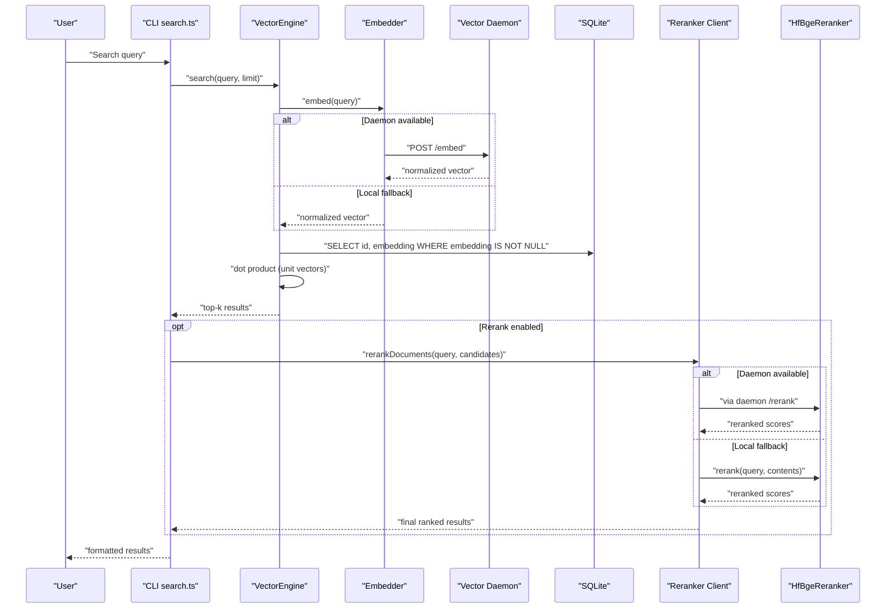
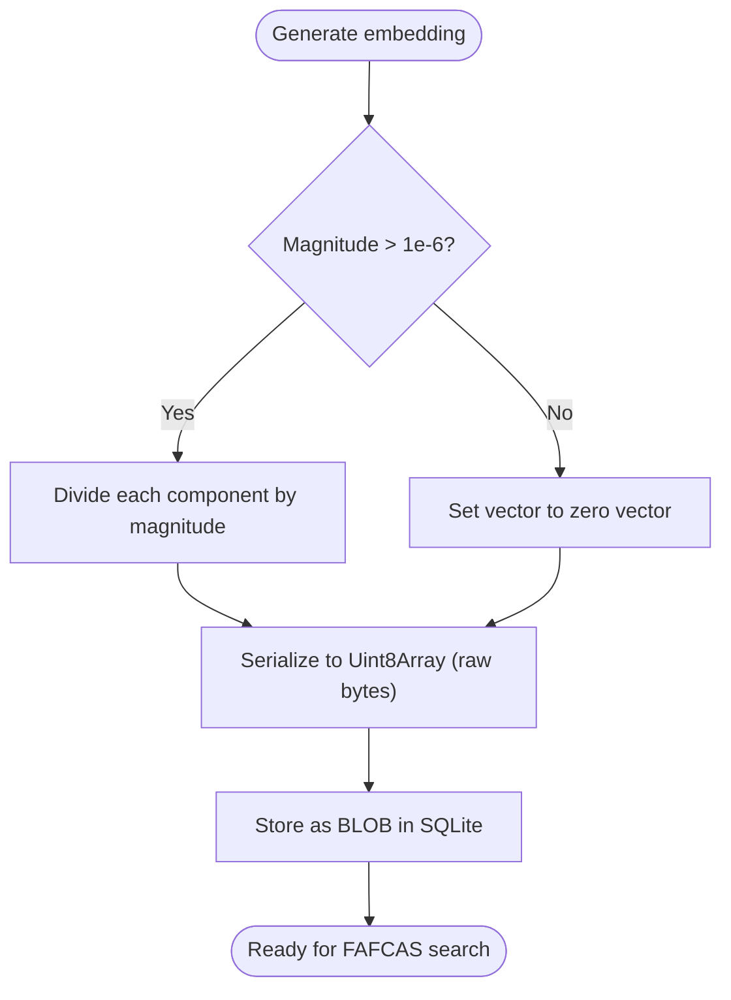
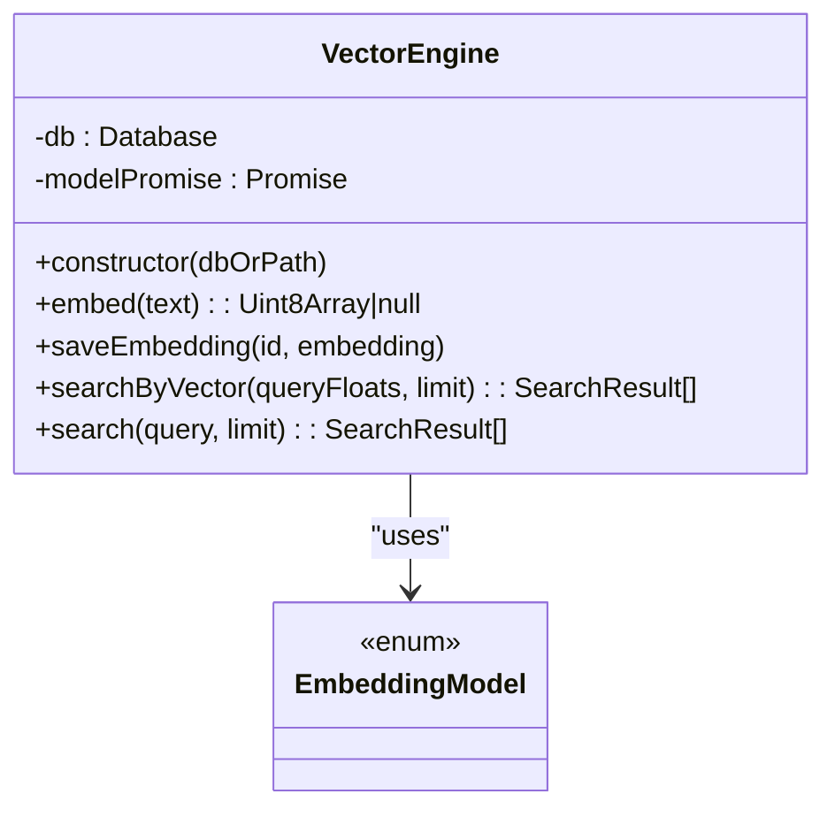
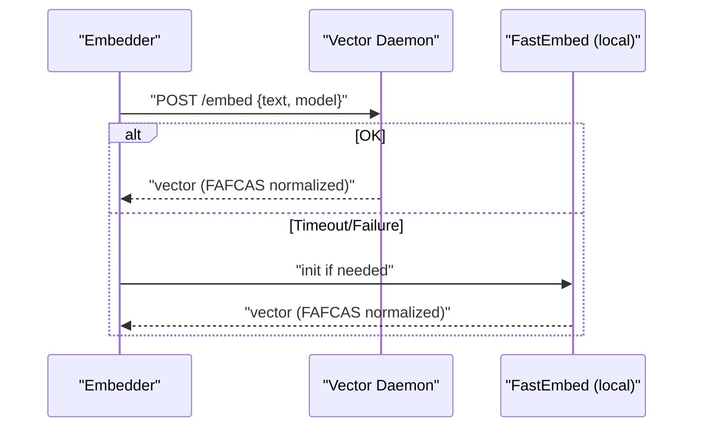
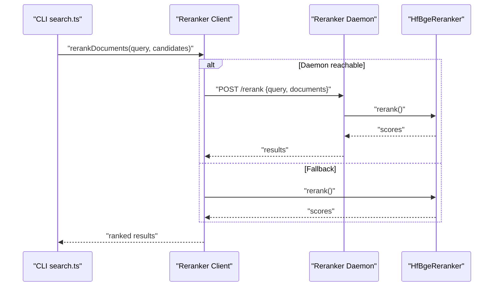
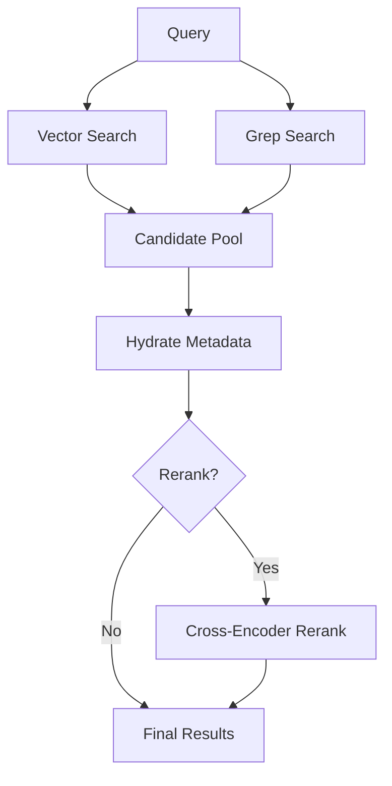
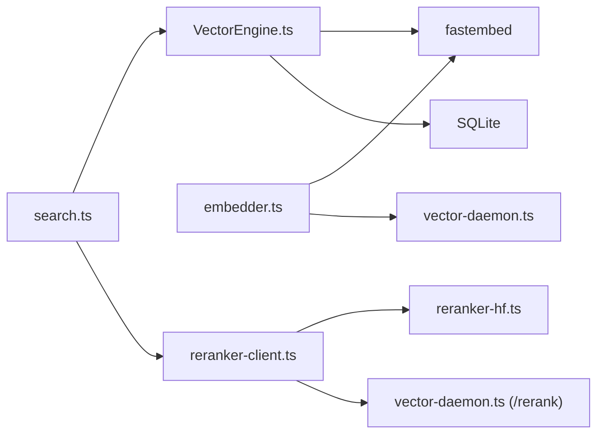

# Vector Search Engine

<cite>
**Referenced Files in This Document**
- [VectorEngine.ts](file://src/core/VectorEngine.ts)
- [embedder.ts](file://src/resonance/services/embedder.ts)
- [vector-daemon.ts](file://src/resonance/services/vector-daemon.ts)
- [reranker-hf.ts](file://src/services/reranker-hf.ts)
- [reranker-client.ts](file://src/utils/reranker-client.ts)
- [search.ts](file://src/cli/commands/search.ts)
- [embeddings-and-fafcas-protocol-playbook.md](file://playbooks/embeddings-and-fafcas-protocol-playbook.md)
- [fafcas_compliance.test.ts](file://tests/fafcas_compliance.test.ts)
- [simple-forensics.ts](file://scripts/lab/simple-forensics.ts)
- [test-small-reingestion.ts](file://scripts/lab/test-small-reingestion.ts)
- [verify_daemon_client.ts](file://scripts/verify/verify_daemon_client.ts)
- [2026-01-26-late-fusion-hybrid-search.md](file://briefs/archive/2026-01-26-late-fusion-hybrid-search.md)
- [local-first-vector-db-playbook.md](file://playbooks/local-first-vector-db-playbook.md)
- [ingestion-pipeline.md](file://docs/architecture/ingestion-pipeline.md)
- [profile_memory.ts](file://scripts/profile_memory.ts)
</cite>

## Table of Contents
1. [Introduction](#introduction)
2. [Project Structure](#project-structure)
3. [Core Components](#core-components)
4. [Architecture Overview](#architecture-overview)
5. [Detailed Component Analysis](#detailed-component-analysis)
6. [Dependency Analysis](#dependency-analysis)
7. [Performance Considerations](#performance-considerations)
8. [Troubleshooting Guide](#troubleshooting-guide)
9. [Conclusion](#conclusion)
10. [Appendices](#appendices)

## Introduction
This document explains Amalfa’s vector search engine implementation with a focus on the FAFCAS protocol for vector normalization, the VectorEngine’s role in query processing and result ranking, the tiered inference strategy combining semantic search with cross-encoder reranking using BGE-M3, and the embedder service configuration for different embedding models and dimensionality. It also covers the reranker daemon’s role in improving precision, performance optimization techniques, memory management for large embedding matrices, strategies for handling out-of-memory scenarios, and the integration between vector search and the knowledge graph for hybrid retrieval.

## Project Structure
Amalfa’s vector search spans several modules:
- Core vector engine and FAFCAS normalization
- Embedder service with daemon and local fallback
- Reranker service with daemon and client wrapper
- CLI search command orchestrating hybrid retrieval
- Supporting tests, scripts, and playbooks validating correctness and performance

```mermaid
graph TB
subgraph "CLI"
CLI["search.ts"]
end
subgraph "Vector Layer"
VE["VectorEngine.ts"]
EMB["embedder.ts"]
DAEM["vector-daemon.ts"]
end
subgraph "Reranking Layer"
RC["reranker-client.ts"]
RER["reranker-hf.ts"]
RDAEM["vector-daemon.ts (/rerank)"]
end
subgraph "Data"
DB["SQLite (nodes.embedding BLOB)"]
end
CLI --> VE
CLI --> RC
VE --> DB
EMB --> DAEM
RC --> RDAEM
DAEM --> VE
RDAEM --> RER
```

**Diagram sources**
- [search.ts](file://src/cli/commands/search.ts#L1-L195)
- [VectorEngine.ts](file://src/core/VectorEngine.ts#L76-L242)
- [embedder.ts](file://src/resonance/services/embedder.ts#L1-L126)
- [vector-daemon.ts](file://src/resonance/services/vector-daemon.ts#L1-L234)
- [reranker-client.ts](file://src/utils/reranker-client.ts#L1-L225)
- [reranker-hf.ts](file://src/services/reranker-hf.ts#L1-L130)

**Section sources**
- [VectorEngine.ts](file://src/core/VectorEngine.ts#L1-L242)
- [embedder.ts](file://src/resonance/services/embedder.ts#L1-L126)
- [vector-daemon.ts](file://src/resonance/services/vector-daemon.ts#L1-L234)
- [reranker-client.ts](file://src/utils/reranker-client.ts#L1-L225)
- [reranker-hf.ts](file://src/services/reranker-hf.ts#L1-L130)
- [search.ts](file://src/cli/commands/search.ts#L1-L195)

## Core Components
- FAFCAS Protocol: Normalization to unit vectors stored as raw Float32 byte blobs for fast dot-product similarity.
- VectorEngine: In-process vector generation, FAFCAS normalization, and in-memory brute-force search over SQLite BLOBs.
- Embedder: Hybrid embedder with remote daemon (port 3010) and local fallback using FastEmbed.
- Reranker Client: Tiered reranking via daemon (port 3011) or local BGE cross-encoder.
- CLI Search: Orchestrates late-fusion hybrid search combining vector and grep results, optionally reranking.

**Section sources**
- [embeddings-and-fafcas-protocol-playbook.md](file://playbooks/embeddings-and-fafcas-protocol-playbook.md#L18-L36)
- [VectorEngine.ts](file://src/core/VectorEngine.ts#L17-L37)
- [embedder.ts](file://src/resonance/services/embedder.ts#L80-L124)
- [reranker-client.ts](file://src/utils/reranker-client.ts#L137-L209)
- [search.ts](file://src/cli/commands/search.ts#L82-L127)

## Architecture Overview
The system uses a local-first, in-memory-first approach:
- Embeddings are normalized (FAFCAS) and stored as BLOBs in SQLite.
- VectorEngine performs brute-force similarity using pure dot products on unit vectors.
- The embedder prefers a long-lived daemon for sub-100ms latency; otherwise, FastEmbed is used locally.
- Reranking uses a cross-encoder (BGE) either via a dedicated daemon or locally, improving precision.



**Diagram sources**
- [search.ts](file://src/cli/commands/search.ts#L82-L127)
- [VectorEngine.ts](file://src/core/VectorEngine.ts#L227-L240)
- [embedder.ts](file://src/resonance/services/embedder.ts#L80-L124)
- [vector-daemon.ts](file://src/resonance/services/vector-daemon.ts#L162-L219)
- [reranker-client.ts](file://src/utils/reranker-client.ts#L137-L209)
- [reranker-hf.ts](file://src/services/reranker-hf.ts#L74-L128)

## Detailed Component Analysis

### FAFCAS Protocol and Vector Normalization
FAFCAS enforces:
- Float32, little-endian storage
- Unit-length vectors (L2 norm ≈ 1.0) before storage
- Raw BLOB storage in SQLite
- Dot product as similarity (cosine for unit vectors)



**Diagram sources**
- [embeddings-and-fafcas-protocol-playbook.md](file://playbooks/embeddings-and-fafcas-protocol-playbook.md#L18-L36)
- [VectorEngine.ts](file://src/core/VectorEngine.ts#L17-L37)
- [fafcas_compliance.test.ts](file://tests/fafcas_compliance.test.ts#L14-L30)

**Section sources**
- [embeddings-and-fafcas-protocol-playbook.md](file://playbooks/embeddings-and-fafcas-protocol-playbook.md#L18-L36)
- [VectorEngine.ts](file://src/core/VectorEngine.ts#L17-L37)
- [fafcas_compliance.test.ts](file://tests/fafcas_compliance.test.ts#L14-L30)

### VectorEngine: Query Processing, Embedding Generation, and Ranking
Responsibilities:
- Embedding generation using FastEmbed (in-process)
- FAFCAS normalization and saving to DB
- In-memory brute-force search over BLOBs using dot product
- Metadata hydration for top-K results

Optimization highlights:
- Zero-copy views on BLOBs for similarity computation
- Threshold filtering and sorting only on candidates
- Metadata hydration deferred until top-K



**Diagram sources**
- [VectorEngine.ts](file://src/core/VectorEngine.ts#L76-L242)

**Section sources**
- [VectorEngine.ts](file://src/core/VectorEngine.ts#L76-L242)

### Embedder Service: Daemon and Local Fallback
Capabilities:
- Remote daemon at port 3010 with short timeout
- Local FastEmbed fallback with model selection via environment
- FAFCAS normalization enforced at generation boundary
- Model resolution supports multiple embedding models



**Diagram sources**
- [embedder.ts](file://src/resonance/services/embedder.ts#L80-L124)
- [vector-daemon.ts](file://src/resonance/services/vector-daemon.ts#L162-L219)

**Section sources**
- [embedder.ts](file://src/resonance/services/embedder.ts#L1-L126)
- [verify_daemon_client.ts](file://scripts/verify/verify_daemon_client.ts#L1-L27)

### Reranker Daemon and Client: Cross-Encoder Precision
Tiered reranking:
- Daemon at port 3011 exposes /rerank endpoint
- Client tries daemon first, falls back to local BGE reranker
- Results mapped back to original documents with rerank scores



**Diagram sources**
- [reranker-client.ts](file://src/utils/reranker-client.ts#L137-L209)
- [reranker-hf.ts](file://src/services/reranker-hf.ts#L74-L128)
- [vector-daemon.ts](file://src/resonance/services/vector-daemon.ts#L97-L160)

**Section sources**
- [reranker-client.ts](file://src/utils/reranker-client.ts#L1-L225)
- [reranker-hf.ts](file://src/services/reranker-hf.ts#L1-L130)
- [vector-daemon.ts](file://src/resonance/services/vector-daemon.ts#L1-L234)

### Hybrid Retrieval: Late Fusion of Vector + Grep + Graph
The CLI orchestrates a late-fusion pipeline:
- Concurrent vector and grep search
- Merge candidates, deduplicate, hydrate
- Optional reranking with cross-encoder



**Diagram sources**
- [2026-01-26-late-fusion-hybrid-search.md](file://briefs/archive/2026-01-26-late-fusion-hybrid-search.md#L32-L49)
- [search.ts](file://src/cli/commands/search.ts#L82-L127)

**Section sources**
- [2026-01-26-late-fusion-hybrid-search.md](file://briefs/archive/2026-01-26-late-fusion-hybrid-search.md#L32-L108)
- [search.ts](file://src/cli/commands/search.ts#L82-L127)

## Dependency Analysis
Key dependencies and relationships:
- VectorEngine depends on FastEmbed for in-process embeddings and SQLite for persistence.
- Embedder depends on FastEmbed and optionally the Vector Daemon for remote embeddings.
- Reranker Client depends on HfBgeReranker and optionally the Reranker Daemon.
- CLI integrates VectorEngine, GrepEngine, and reranker client for hybrid search.



**Diagram sources**
- [VectorEngine.ts](file://src/core/VectorEngine.ts#L1-L2)
- [embedder.ts](file://src/resonance/services/embedder.ts#L2-L3)
- [vector-daemon.ts](file://src/resonance/services/vector-daemon.ts#L14-L15)
- [reranker-client.ts](file://src/utils/reranker-client.ts#L8-L9)
- [reranker-hf.ts](file://src/services/reranker-hf.ts#L9-L14)
- [search.ts](file://src/cli/commands/search.ts#L1-L7)

**Section sources**
- [VectorEngine.ts](file://src/core/VectorEngine.ts#L1-L2)
- [embedder.ts](file://src/resonance/services/embedder.ts#L1-L3)
- [reranker-client.ts](file://src/utils/reranker-client.ts#L1-L9)
- [reranker-hf.ts](file://src/services/reranker-hf.ts#L1-L14)
- [search.ts](file://src/cli/commands/search.ts#L1-L7)

## Performance Considerations
- FAFCAS removes sqrt and division from the hot loop, enabling dot-product-only similarity.
- VectorEngine uses zero-copy typed-array views over BLOBs and computes scores in a tight loop.
- Daemon-based embedding reduces cold-start latency by keeping models loaded in memory.
- Reranking is the primary latency bottleneck; batching and daemon usage help mitigate cost.
- Memory profiling indicates stable growth during search loops, with predictable RSS/heap behavior.

Practical tips:
- Prefer daemon embedding for interactive workflows.
- Tune fetch limits (e.g., fetch 3×–50 depending on reranker usage).
- Use FAFCAS-compliant vectors to avoid costly recomputation.
- Monitor SQLite pragmas and memory-mapped IO for large datasets.

**Section sources**
- [embeddings-and-fafcas-protocol-playbook.md](file://playbooks/embeddings-and-fafcas-protocol-playbook.md#L29-L36)
- [VectorEngine.ts](file://src/core/VectorEngine.ts#L159-L225)
- [verify_daemon_client.ts](file://scripts/verify/verify_daemon_client.ts#L1-L27)
- [profile_memory.ts](file://scripts/profile_memory.ts#L71-L93)

## Troubleshooting Guide
Common issues and resolutions:
- Daemon unreachable or slow: Verify daemon health endpoint and ports; confirm model initialization logs.
- Non-unit vectors: Validate FAFCAS normalization in embedder and daemon; tests assert unit norm and idempotence.
- Dimension mismatches: Ensure consistent model selection across embedder and VectorEngine.
- Out-of-memory scenarios: Reduce batch sizes, limit fetch limits, and rely on daemon to avoid repeated model loads.
- Reranker failures: Check daemon readiness and model availability; client gracefully degrades to local reranker.

Diagnostic aids:
- FAFCAS compliance tests validate unit vectors and consistent dimensions.
- Forensic scripts inspect retrieval patterns and vector norms from the database.
- Small reingestion tests verify round-trip fidelity of BLOB storage and retrieval.

**Section sources**
- [fafcas_compliance.test.ts](file://tests/fafcas_compliance.test.ts#L1-L74)
- [simple-forensics.ts](file://scripts/lab/simple-forensics.ts#L45-L76)
- [test-small-reingestion.ts](file://scripts/lab/test-small-reingestion.ts#L91-L123)
- [vector-daemon.ts](file://src/resonance/services/vector-daemon.ts#L82-L95)

## Conclusion
Amalfa’s vector search engine leverages FAFCAS normalization and in-memory brute-force search to achieve sub-100ms latency for semantic similarity. The tiered inference strategy—combining fast bi-encoder retrieval with cross-encoder reranking—significantly improves precision. The embedder and reranker services integrate seamlessly via daemons, providing fast, scalable, and resilient search. Hybrid retrieval further strengthens results by incorporating exact-symbol and structural signals. Together, these components deliver a local-first, high-performance vector search system.

## Appendices

### Embedding Model Configuration and Dimensionality
- Supported models are selectable via environment variables and resolved to FastEmbed enums.
- Default model aligns with FAFCAS constraints (unit vectors, float32).
- Tests and scripts validate dimensionality and normalization.

**Section sources**
- [embedder.ts](file://src/resonance/services/embedder.ts#L27-L57)
- [ingestion-pipeline.md](file://docs/architecture/ingestion-pipeline.md#L221-L225)
- [fafcas_compliance.test.ts](file://tests/fafcas_compliance.test.ts#L65-L73)

### SQLite and BLOB Storage Notes
- Vectors are stored as raw BLOBs; retrieval uses zero-copy typed arrays.
- Playbooks demonstrate dot-product UDFs and dimension checks for correctness.

**Section sources**
- [VectorEngine.ts](file://src/core/VectorEngine.ts#L165-L178)
- [local-first-vector-db-playbook.md](file://playbooks/local-first-vector-db-playbook.md#L165-L186)