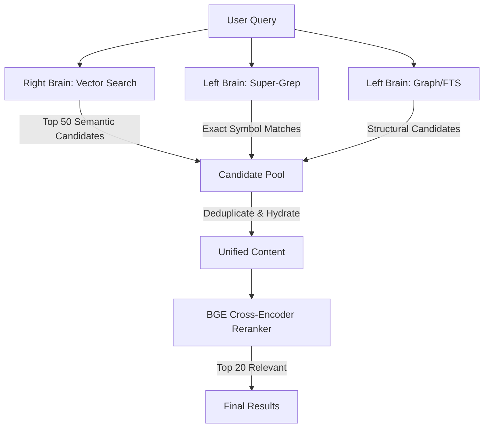

---
tags:
  - feature
  - sidecar
  - python
  - mcp
  - lang-extract
---
# Brief: Late-Fusion Hybrid Search (The Bicameral Implementation)

**Date:** 2026-01-26
**Status:** Proposed
**Context:** Search Quality & Architecture
**Philosophy:** [The Bicameral Graph](../docs/philosophy/THE_BICAMERAL_GRAPH.md)

## The Problem: The Silence of the Vectors

Our current search pipeline is linear and "Right-Brain" dominant:
`Vector Search (Embeddings) → Reranker → Results`

While effective for "vibes" and concepts (e.g., "how does auth work?"), it suffers from specific cognitive deficits:
1.  **Symbol Blindness:** It often misses exact keyword matches (e.g., specific function names, error codes) if the embedding model treats them as generic noise.
2.  **Structural Myopia:** It finds a node but ignores its vital context (e.g., finding a `README` but missing the implementation file directly linked to it).
3.  **The "Apple vs. Orange" Problem:** We previously couldn't easily merge "Keyword Hits" (PageRank/BM25) with "Vector Hits" (Cosine Similarity) because their scores are mathematically incompatible.

## The Solution: Late-Fusion Hybrid Architecture

We propose implementing a **Convergent Pipeline** where the **BGE Cross-Encoder Reranker** acts as the "Great Equalizer" (The Corpus Callosum).

By moving the reranking step to the *end* of the retrieval phase, we can treat diverse retrieval methods as independent "voters" that submit candidates to a shared pool. The reranker then judges them all by a single standard: **Relevance to Query**.

### The New Pipeline

## Implementation Details

### 1. The Right Brain (Existing)
*   **Mechanism:** FastEmbed (Bi-Encoder).
*   **Role:** Retrieval of conceptual/semantic matches.
*   **Target:** `Top-K` results based on Cosine Similarity.

### 2. The Left Brain (New/Restored)
We will re-introduce deterministic retrieval layers.

#### A. Super-Grep (The Surveyor)
*   **Mechanism:** `ripgrep` (rg) or system `grep`.
*   **Role:** The "Ground Truth" search. Scans the actual files (the Territory), not just the database (the Map).
*   **Target:** Finds exact symbol matches (`validateUser`, `Error404`), crucial for code queries.
*   **Decision:** We are explicitly **skipping SQLite FTS**. Searching the live filesystem avoids data duplication ("Hollow Node" philosophy) and sync complexity.

#### B. Graph Structure (The Librarian)
*   **Mechanism:** Graph Traversal (SQL Queries).
*   **Role:** Structural metadata search.
*   **Data Source:** Relies on the **[LangExtract Squash Protocol](2026-01-26-lang-extract-squash.md)** to populate the graph with high-fidelity symbols (classes, functions) and relationships.
*   **Target:** Finds documents by title, "Pillar" neighbors (high PageRank connections), or specific symbolic edges (e.g., `DEFINES`, `INHERITS`).

### 3. The Breakdown (The Reranker)
The BGE Reranker (implemented in `src/services/reranker-hf.ts`) does not care about the source score.
*   It takes pairs: `(Query, Content)`.
*   It outputs: `Relevance Probability (0-1)`.
*   **Benefit:** A document found via exact keyword match (FTS) and a document found via semantic similarity (Vector) are now ranked on the exact same scale.

## Execution Plan

### Phase 1: The "Left Brain" Restoration
1.  **Grep Engine:** Implement `GrepEngine` service wrapping `ripgrep` (Done).
2.  **Path Mapping:** Ensure `GrepEngine` can map file paths back to Node IDs (via DB metadata).

### Phase 2: The Fusion Engine
1.  **Update `src/mcp/index.ts`:**
    *   Run `vectorEngine.search()` and `grepEngine.search()` in parallel.
    *   Merge results into a `Map<ID, Candidate>` to deduplicate.
    *   Pass the combined list (up to ~100 docs) to `reranker.rerank()`.
2.  **Update `src/cli/commands/search.ts`:** Mirror the logic for the CLI.

### Phase 3: Validation
*   **Test Case:** "validateToken" (Symbol).
    *   *Expectation:* Vector might rank generic auth docs high. Graph/FTS should find the specific function definition. Reranker should place the definition #1.
*   **Test Case:** "How does the system think?" (Concept).
    *   *Expectation:* Vector finds philosophy docs. Graph finds little. Reranker promotes Vector hits.

## Success Criteria

1.  **Unified Scoring:** A single sorted list returning the best *mixed* results.
2.  **Symbolic Precision:** Searching for specific variable names or error codes works reliably.
3.  **Conceptual Recall:** Vague queries still return "vibes-based" results.
4.  **Performance:** Total search latency remains under 500ms (Reranker is the bottleneck; batching 100 docs is acceptable).

---

**Recommendation:** Proceed immediately. This architecture fully leverages the BGE Reranker investment and aligns perfectly with the Bicameral Graph philosophy.
