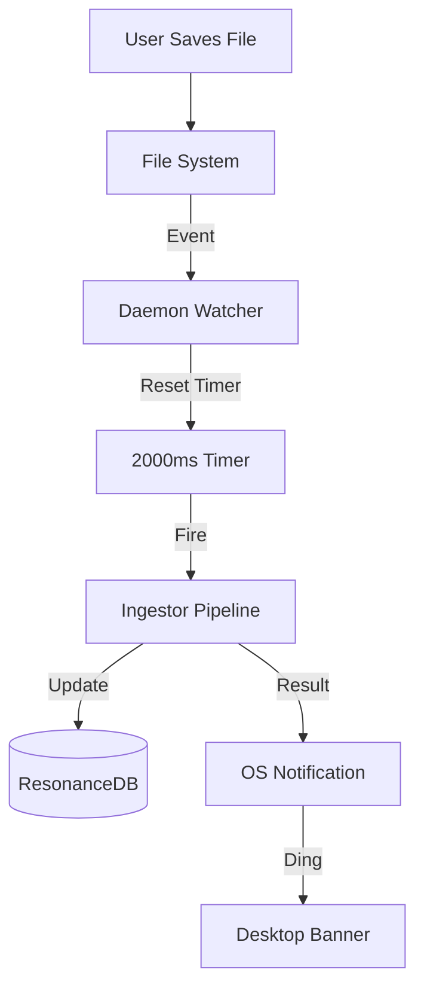

# Brief: The Active Daemon (Watcher Upgrade)
**Date:** 2025-12-16
**Status:** Approved for Implementation

## 1. The Problem: The "Save" Gap
Currently, the PolyVis Knowledge Graph is **Passive**.
1.  User saves a file (e.g., `briefs/new-idea.md`).
2.  The file sits on disk.
3.  The Graph/Vector DB remains stale.
4.  User must manually run `bun run build:data` to see changes.

This "Save Gap" creates friction and reduces trust in the system's "Context Awareness".

## 2. The Solution: The Active Daemon
Turn `src/resonance/daemon.ts` into an **Active Custodian** that watches the filesystem and maintains the graph in real-time.

### Core Capabilities
1.  **The Ear (Watcher):** Uses `fs.watch` (Recursive) to monitor content directories.
2.  **The Pace (Debouncer):** Implements a **2000ms Silence Timer**. It waits for the user to *stop* typing/saving before triggering. This prevents "thrashing" and CPU spikes during rapid edits.
3.  **The Brain (Ingestor):** Calls the idempotent `Ingestor.run()` pipeline. Because we enforce `LocusLedger` hashing, re-running the ingestor is cheap and safe.
4.  **The Voice (Notifier):** Uses native macOS `osascript` to trigger System Notifications.
    -   ✅ "PolyVis: Graph Updated (3 files)"
    -   ❌ "PolyVis: Ingestion Failed"

## 3. Architecture

## 4. Implementation Details

### Configuration (Target Directories)
The watcher will monitor sources defined in `polyvis.settings.json`:
-   `debriefs/`
-   `playbooks/`
-   `briefs/`
-   `docs/`

### Zero Dependencies
-   **Watcher:** `fs.watch` (Bun/Node native).
-   **Notification:** `osascript` (macOS native).

## 5. Success Criteria
-   [ ] **Latency:** Graph updates < 5s after final save.
-   [ ] **Feedback:** User hears/sees confirmation of update.
-   [ ] **Stability:** Daemon does *not* crash on syntax errors or rapid deleting.
