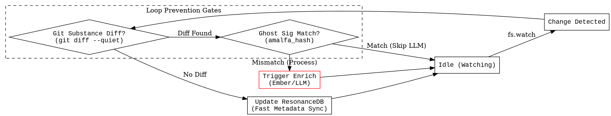
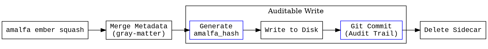

## Task: Implement Auditable Ghost Signature for Loop Prevention

**Objective:** Prevent the "Infinite Billing Loop" in the Amalfa cycle by implementing a content-only hash check (Ghost Signature) backed by Git-based change verification.

- [ ] **Establish Audibility**: Use Git as the primary substrate for change history and reversibility.
- [ ] **Dual-Gate Loop Prevention**: Implement both a coarse Git-check and a fine-grained Substance Hash check.
- [ ] **MIME-Aware Substance Hashing**: Ensure the hashing utility handles Markdown prose and TypeScript source code appropriately.
- [ ] **Signature Persistence**: Standardize `amalfa_hash` as the persistent "Mirror Test" marker.

## Frontmatter Tags
- `refactoring`
- `infrastructure`
- `loop-prevention`
- `git-substrate`

## Key Actions Checklist:

- [ ] **Utility: `get_substance_hash(filePath)`**:
    - [ ] For **Markdown**: Extract only the body (string after the second `---`).
    - [ ] For **Source Code (.ts)**: Process the entire file (excluding existing `// amalfa_hash` lines).
- [ ] **Ingest Modification (The Coarse Filter)**:
    - [ ] Integrate a `git diff --quiet [filePath]` check. If no changes exist in the substance of the file, skip the LLM.
- [ ] **Ingest Modification (The Fine Filter)**:
    - [ ] If `get_substance_hash(file) === frontmatter.amalfa_hash`, log "Self-write detected; skipping" and terminate the trigger.
- [ ] **Squash Modification**:
    - [ ] Calculate the final `substance_hash` after metadata merging.
    - [ ] Inject `amalfa_hash: [hash]` into YAML frontmatter (MD) or as a trailing comment (TS).

## Detailed Requirements / Visuals

### 1. Ingest Service: The "Self-Awareness" Gate
We are adding a two-step validation before passing "Stuff" to the "Ember" service.


**Modified State Machine Logic:**
```dot
Ingest -> GitCheck [label="Substance Diff?"];
GitCheck -> CheckSignature [label="Yes"];
GitCheck -> Idle [label="No"];
CheckSignature -> TriggerEnrich [label="Hash Mismatch (User Edit)"];
CheckSignature -> Idle [label="Hash Match (Amalfa Write)"];

```

### 2. Enrich Service: The "Fingerprint" Step

The `Squasher` now "seals" the document, creating an auditable commit in Git and a signature in the file.

**Modified State Machine Logic:**

```dot
Merge -> SignFile [label="Generate amalfa_hash"];
SignFile -> WriteFile [label="Commit with Signature"];

```

### 3. Component Requirements

| Component | Logic Requirement | Goal |
| --- | --- | --- |
| **Parser** | MIME-aware separation of metadata vs. substance. | **PHI-14**: Specialized processing. |
| **Ingestor** | Check `git diff` + `amalfa_hash` equality. | **COG-12**: Deductive Minimalism. |
| **Squasher** | Append/Update `amalfa_hash` during write. | **PHI-13**: Workflow Durability. |

## Best Practices

* **Git is Source of Truth**: Never override the ability for the user to manually revert via Git.
* **Sovereign Pen**: Allow users to edit frontmatter; the system only triggers if the *prose/code* changes.
* **Silent Operation**: Self-write detection should log locally but not disturb the user's flow.

---

These modifications integrate the auditability of Git with the precision of content-hashing.

### 1. Ingest Service: The Dual-Gate Logic

We are inserting two "Decision Diamonds" before the expensive `Trigger Enrich` state. This ensures we do as little work as possible.



---

### 2. Enrich Service: The "Seal & Audit" Step

The `Squash` process is now responsible for providing the empirical evidence (the signature) and the audit trail (the commit).



---

### Ctx Assessment

By modifying the graphs this way, we visualize the **Sovereign Simplicity** of the system:

1. **Git** provides the "Coarse Filter" (Auditable History).
2. **The Ghost Signature** provides the "Fine Filter" (Process Status).
3. **ResonanceDB** stays updated even when the LLM is skipped, ensuring the "Mental Metabolism" is always accurate without being expensive.

The "Feedback Loop Warning" in `00-system.md` is effectively mitigated by these gates.

