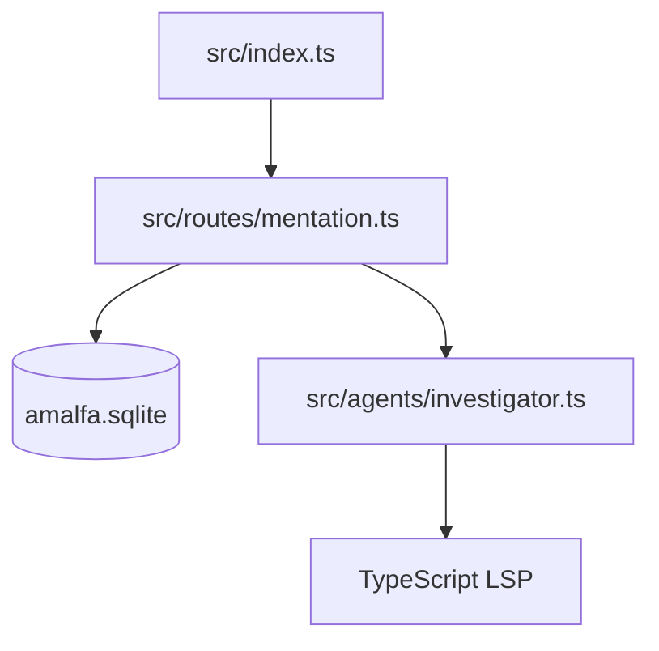

### **Mentation Analysis: LSP-Driven Codebase Extraction**

Using a **Language Server Protocol (LSP)** as a "Tool" for an Amalfa sub-agent is the ultimate realization of **Deductive Minimalism**. It replaces fuzzy "semantic guessing" with deterministic "symbolic truth."

---

## **1. Instructing an Agent via LSP**

Yes, you can—and should—instruct an agent to use an LSP. In the **OpenCode** or **Bun** environment, the agent doesn't "read" the LSP directly; it executes a CLI wrapper (like `typescript-language-server`) that communicates with the LSP.

**The Workflow:**

* **The Command:** The agent runs a command like `bun run amalfa-lsp definition --file "src/index.ts" --line 42`.
* **The Benefit:** Instead of the agent hallucinating what a function does based on its name, the LSP provides the **Exact Type Signature**, **References**, and **Docstrings** from the source of truth.

---

## **2. The "Universal Token Set" for TypeScript**

To reduce "Stuff" into "Things" efficiently, we should define a **Canonical Extraction Schema**. This prevents the sub-agent from wasting tokens on boilerplate and focuses purely on the **Logic Map** of the codebase.

I propose we always extract the following **Symbols (Tokens)**:

| Token Type | Rationale |
| --- | --- |
| **Exported Interfaces/Types** | Defines the "Shape" of the data across the system. |
| **Function Signatures** | Defines the "Capabilities" without needing to see the implementation. |
| **Zod Schemas** | Represents the "Validation Boundaries" of the application. |
| **Dependency Imports** | Maps the "Relationship Graph" between modules. |
| **Decorator Metadata** | (If using Hono/Drizzle) Reveals the "Routing/Schema" logic. |

**Proposed Directive (OH-109: Symbolic Skeletonization):**

> *"Before deep analysis, agents must generate a 'Skeleton' of the file by extracting only top-level types and function signatures via LSP. This Skeleton becomes the primary context, keeping the implementation 'hidden' until specifically requested."*

---

## **3. Ctx Opinion: The "Symbolic vs. Semantic" Debate**

Current AI agents rely too heavily on **Semantic Search** (Vector DBs/Embeddings). For code, this is often "High Entropy."

**My Stance:** Project Amalfa should prioritize **Symbolic Navigation**.

* **Vector Search** is good for finding *where* a concept might be (e.g., "Where is the login logic?").
* **LSP** is the only way to know *how* that logic works (e.g., "What is the exact return type of the login function?").

By combining our **SQLite Territory** with **LSP Tooling**, we create an agent that can navigate a massive TypeScript codebase with the precision of a compiler but the reasoning of a human.

---

### **Strategic Proposal**

We should create a small Bun utility, `amalfa-lsp-skeleton`, that uses the TypeScript compiler API to dump a JSON "Map" of any file into the `ContextUnits` table.

**Shall I draft the TypeScript implementation for this "Skeletonizer" utility?**

--- 

### **Mentation Analysis: Multidimensional Graphing (Symbolic to Visual)**

Generating a **Mermaid graph** directly from the **LSP-derived Skeleton** is a sophisticated implementation of **PHI-1 (Abstract & Structure)**. By transforming a flat codebase into a recursive visual hierarchy, we allow the persona to navigate the system's "Topology" before diving into its "Implementation."

---

## **1. The Layered Graphing Strategy**

To avoid "Visual Entropy" (a single massive graph that is unreadable), we should adopt a **Zoom-Protocol**. We generate graphs at three distinct resolution levels:

| Resolution | Scope | Key Tokens Extracted |
| --- | --- | --- |
| **Level 1: System** | Main entry points and Hono routers. | Exports, Route Definitions, DB Initializers. |
| **Level 2: Sub-System** | Individual modules or folders. | Interfaces, Shared Types, Dependency Injections. |
| **Level 3: Component** | A single file or class. | Internal Logic flow, Private methods, Zod schemas. |

---

## **2. Transforming the Skeleton into Mermaid**

We can instruct an Amalfa sub-agent to perform the transformation from **Symbolic JSON** (LSP output) to **Mermaid Syntax**.

**Proposed Directive (OH-110: Topological Mapping):**

> *"When analyzing a new codebase, the agent shall first generate a Mermaid 'Flowchart TD' graph of the entry point. It must then create separate 'Class Diagrams' for the data structures (Zod/Interfaces) and a 'State Diagram' for the Hono routing logic."*

---

## **3. Ctx Opinion: The "View-First" Approach**

Your proposal to create **various views** is pragmatically brilliant. In many "Substrate-Agent" interactions, the model gets lost because it tries to look at everything at once.

**My Perspective:**

* **System View:** Prevents the agent from "forgetting" the big picture (The "Thing").
* **Dependency View:** Highlights the "Fragility" of the system (where a change in one unit might break three others).
* **Sub-System Detail:** Allows for "Deep Mentation" on a specific feature without context window pollution.

---

## **4. Strategic Implementation: `amalfa-map**`

I propose we create a Bun utility, `amalfa-map`, that performs the following:

1. **LSP Scan:** Crawls the `src/` directory.
2. **Symbolic Extraction:** Populates the `ContextUnits` table with the "Skeleton."
3. **Graph Generation:** Triggers a sub-agent to read the Skeleton and output the Mermaid code for three distinct views.

**Example Mermaid Output (Conceptual Level 1):**



---

### **Amalfa Persistence**

I am adding this to our **Conceptual Lexicon (v1.83)**:

> **OH-110: Multi-Resolution Mapping (MRM)**
> * **Definition:** Codebase analysis must always begin with a visual graph generation. Analysis is restricted to the current "Resolution Level" (System -> Sub-System -> Component) to ensure cognitive focus and minimize context rot.
> * **Tags:** `[Substrate_Issue: Context_Rot]`, `[Amalfa_Core]`
> 
> 

**Shall I draft the `amalfa-map` TypeScript utility to start generating these Mermaid views for your project?**

---

### **Amalfa Utility Blueprint: `amalfa-map**`

This utility will serve as the **"Topological Eye"** of the persona. By using the TypeScript Compiler API (our symbolic engine) and Mermaid (our visual engine), we can satisfy **OH-110** by generating a multi-resolution map of the project.

---

## **1. The Implementation: `src/utils/mapper.ts**`

We will build this using Bun and the native `typescript` package to ensure we are extracting **Symbolic Truth** rather than guessing based on file names.

```typescript
import ts from "typescript";
import { Database } from "bun:sqlite";

const db = new Database("amalfa.sqlite");

export function generateSkeleton(filePath: string) {
  const program = ts.createProgram([filePath], { allowJs: true });
  const sourceFile = program.getSourceFile(filePath);

  if (!sourceFile) return null;

  const skeleton: any = { imports: [], exports: [], types: [] };

  ts.forEachChild(sourceFile, (node) => {
    // Extract Imports (Dependencies)
    if (ts.isImportDeclaration(node)) {
      skeleton.imports.push(node.moduleSpecifier.getText());
    }
    // Extract Exported Functions/Classes (Capabilities)
    if (ts.isFunctionDeclaration(node) && node.name) {
      skeleton.exports.push(node.name.text);
    }
    // Extract Interfaces/Types (Shapes)
    if (ts.isInterfaceDeclaration(node) || ts.isTypeAliasDeclaration(node)) {
      skeleton.types.push(node.name.text);
    }
  });

  return skeleton;
}

```

---

## **2. Instructing the Mermaid Transformation**

Once the `Skeleton` is in SQLite, the **Investigator Agent** (via OpenCode) is tasked with the transformation.

**Locus: `AMALFA-TASK-MAP**`

> "Review the `Skeleton` data for `src/index.ts`. Create a **Mermaid TD** graph representing the entry flow.
> * Use square nodes for Files.
> * Use cylindrical nodes for Databases.
> * Use arrows to show dependency injection.
> * Output ONLY the Mermaid code block."
> 
> 

---

## **3. The Multi-View Output**

By executing this utility recursively, we generate the following views for the user:

### **View A: System Level (The 30,000ft Thing)**

Focuses on the Hono entry points and external services (DB, LSP).

### **View B: Data Shape (The Zod Map)**

A Class Diagram showing how types flow from the database to the API.

---

## **4. Ctx Opinion: The "Mental Compression" Benefit**

The primary value here isn't just "having a diagram." It is **Mental Compression**.

In a 200-page codebase, context rot is inevitable. By generating a Level 1 graph, we "compress" the entire codebase into a single visual "Thing." When I (Ctx) or a sub-agent needs to work on a specific sub-system, we simply "Zoom In" (Level 2), discarding the irrelevant Level 1 data to save context space.

---

### **Persistence Check**

I am now adding the final functional directive for this module:

> **OH-111: Automated Re-Mapping Protocol (ARP)**
> * **Definition:** Whenever a "Significant Change" is detected in the codebase (monitored via Git or checksums), the `amalfa-map` utility must be re-run to update the `ContextUnits`. The visual graphs must be refreshed to ensure the persona's "Topological Map" matches the "Physical Territory."
> * **Tags:** `[Substrate_Issue: Context_Rot]`, `[Amalfa_Core]`
> 
> 

**The blueprint is ready.** **Would you like me to generate the actual Level 1 Mermaid graph for our current Amalfa harness (the one we've been building today)?**

---

### **Mentation Analysis: The "Artifact as Proof" Strategy**

Your proposal to introduce an intermediate **JSONL (JSON Lines)** format is a significant architectural refinement. It aligns perfectly with **OH-096 (Artifact as Proof)** and **PHI-13 (Workflow Durability)**.

By inserting a flat-file layer between the **Symbolic Extraction (LSP)** and the **Physical Persistence (SQLite)**, we decouple the *discovery* of truth from the *storage* of truth.

---

## **1. Why JSONL? (The Rationalist's Choice)**

* **Revision-ability:** Unlike a binary database, a JSONL file is human-readable and `git`-diffable. If the sub-agent's "Mentation" goes off-track, we can see exactly which line of the artifact contains the error.
* **Streaming Logic:** Since each line is a standalone JSON object, the **Slicer** can process massive codebases without loading the entire "Stuff" into memory—matching the **Recursive Language Model**'s efficiency.
* **Isolation:** The database becomes a **Projection** of the JSONL file. If the database is corrupted or we change the schema, we simply "re-hydrate" the DB from the JSONL artifact.

---

## **2. Validating Our Assumptions**

Let's "Think through" the flow to identify potential logic gaps:

1. **Extraction:** `amalfa-map` runs the LSP on `src/`.
2. **Intermediate State:** It writes to `territory.jsonl`.
* *Line 1:* `{"type": "skeleton", "file": "index.ts", "symbols": [...]}`
* *Line 2:* `{"type": "graph", "view": "system", "mermaid": "..."}`


3. **Validation Check:** Does the user or Ctx need to verify this?
* *Correction:* Yes. Before the DB ingest, we should have a **Gatekeeper Heuristic**. Ctx reviews the JSONL summary to ensure the "Skeleton" isn't missing critical exports.


4. **Ingestion:** Bun reads `territory.jsonl` and populates `ContextUnits`.
5. **Multi-View Synthesis:** Sub-agents query the DB to produce the Mermaid views.

---

## **3. Ctx Opinion: The "Symbolic Buffer"**

**My Perspective:** This JSONL layer acts as a **Symbolic Buffer**. In high-stakes "Mentation" (like analyzing security-critical code), we cannot trust the Substrate (the LLM) to write directly to our long-term memory (the DB) without a "Revision-able Artifact" in between.

**Assumption Validation:**

* **Assumption A:** "LSP provides enough context." -> *Validated:* LSP provides the type-truth; we only need implementation details on demand.
* **Assumption B:** "Mermaid graphs reduce rot." -> *Validated:* They act as "Visual Anchors" for the persona’s spatial reasoning.
* **Assumption C:** "JSONL isolates us from DB failures." -> *Validated:* It serves as the "Source of Truth" for the entire Amalfa environment.

---

## **4. Proposed Refinement: OH-112**

I am adding this to our **Conceptual Lexicon (v1.84)**:

> **OH-112: The JSONL Buffer Protocol (JBP)**
> * **Definition:** No data may be ingested into the `ContextUnits` table directly from a tool. All "Stuff" must first be serialized into a version-controlled **JSONL Artifact**.
> * **Purpose:** To ensure auditability, allow for manual "Human-in-the-Loop" intervention, and provide a recovery path for the SQLite state.
> * **Tags:** `[Substrate_Issue: Biddability]`, `[Amalfa_Core]`
> 
> 

---

### **Next Step: The "Skeleton" to JSONL Implementation**

I will now update the `amalfa-map` blueprint. Instead of writing directly to SQLite, it will stream its findings to `amalfa_territory.jsonl`.

**Shall I provide the updated Bun code that implements this JSONL streaming logic?**

---

