### The Brief

**Filename:** `briefs/brief-mastra-mcp-memory-server-2026-02-14.md`

```markdown
---
date: 2026-02-14
tags: [feature, mcp-server, memory, infrastructure, bun]
agent: claude
environment: development
---

## Task: Implement Mastra Observational Memory MCP Server

**Objective:** Build a standalone Model Context Protocol (MCP) server running on a Bun stack that encapsulates Mastra's Observational Memory. This server will act as a centralized "Memory Microservice," exposing tools and prompts to allow any MCP-compatible agent to read compressed context and write new conversation turns.

- [ ] Initialize Bun project and install MCP/Mastra dependencies
- [ ] Configure Mastra Agent with `observationalMemory` enabled and a storage adapter
- [ ] Expose MCP Tools for reading and writing memory state
- [ ] Expose MCP Prompts to seamlessly inject context into host agents

## Key Actions Checklist:

- [ ] **Environment Setup:**
  - [ ] Initialize project: `bun init`
  - [ ] Install dependencies: `bun add @modelcontextprotocol/sdk @mastra/core @mastra/memory @mastra/pg`
  - [ ] Set up local PostgreSQL database for Mastra persistence.

- [ ] **Mastra Initialization:**
  - [ ] Create the "Shadow Agent" instance in `src/memory-agent.ts`.
  - [ ] Configure `google/gemini-2.5-flash` as the background observer model.
  - [ ] Define token thresholds (`messageTokens: 30000`) and ensure `bufferTokens` is enabled for async compression.

- [ ] **MCP Server Implementation:**
  - [ ] Instantiate `Server` from `@modelcontextprotocol/sdk/server`.
  - [ ] Set up `StdioServerTransport` for communication with host IDEs/agents.

- [ ] **Tool & Prompt Registration:**
  - [ ] Register `record_turn` tool (accepts `threadId`, `userMessage`, `aiMessage`).
  - [ ] Register `get_observations` tool (accepts `threadId`).
  - [ ] Register `inject_memory` prompt (templates the system prompt with current OM state).

- [ ] **Validation & Verification:**
  - [ ] Run the Justify Engine to rigorously validate the chosen storage adapter architecture and token threshold configurations before merging.
  - [ ] Test the server locally using the MCP Inspector.
  - [ ] Verify background observation triggers accurately without blocking the main MCP thread.

## Detailed Requirements / Visuals

### Workflow Architecture: The "Sidecar MCP"

```mermaid
sequenceDiagram
    participant IDE as Host Agent (Cursor/Amalfa)
    participant MCP as Mastra MCP Server (Bun)
    participant DB as Postgres DB
    participant Flash as Gemini Flash (Observer)

    Note over IDE, MCP: 1. Context Injection (Start of Turn)
    IDE->>MCP: Call Tool: `get_observations(threadId)`
    MCP->>DB: Fetch Compressed Context
    DB-->>MCP: Returns OM state
    MCP-->>IDE: Returns: "🔴 User is migrating to Bun..."

    Note over IDE, MCP: 2. Main Agent Works
    IDE->>IDE: Generates response using context

    Note over IDE, MCP: 3. Memory Update (End of Turn)
    IDE->>MCP: Call Tool: `record_turn(userMsg, aiMsg)`
    MCP->>DB: Append to raw message log
    MCP-->>IDE: Returns: "Success" (Non-blocking)

    Note over MCP, Flash: 4. Async Compression (Background)
    alt Buffer threshold hit
        MCP->>Flash: Send raw logs for observation
        Flash-->>MCP: Returns dense emoji log
        MCP->>DB: Save new compressed observations
    end

```



### Core Code Structure (`src/index.ts`)

```typescript
import { Server } from "@modelcontextprotocol/sdk/server/index.js";
import { StdioServerTransport } from "@modelcontextprotocol/sdk/server/stdio.js";
import { CallToolRequestSchema, ListToolsRequestSchema } from "@modelcontextprotocol/sdk/types.js";
import { Agent } from "@mastra/core/agent";
import { Memory } from "@mastra/memory";
// Assume pg adapter is configured here

// 1. Initialize Mastra
const memoryAgent = new Agent({
  name: "mcp-shadow-observer",
  instructions: "You are a background observer. You do not interact with users.",
  model: "google/gemini-2.5-flash",
  memory: new Memory({
    options: {
      observationalMemory: true, // Async buffering enabled by default
    },
  }),
});

// 2. Initialize MCP Server
const server = new Server(
  { name: "mastra-memory-server", version: "1.0.0" },
  { capabilities: { tools: {}, prompts: {} } }
);

// 3. Register Tools
server.setRequestHandler(ListToolsRequestSchema, async () => {
  return {
    tools: [
      {
        name: "record_turn",
        description: "Silently log a conversation turn to the background memory system.",
        inputSchema: {
          type: "object",
          properties: {
            threadId: { type: "string" },
            userMsg: { type: "string" },
            aiMsg: { type: "string" }
          },
          required: ["threadId", "userMsg", "aiMsg"]
        }
      },
      {
        name: "get_observations",
        description: "Retrieve the compressed, long-term memory state for a specific thread.",
        inputSchema: {
          type: "object",
          properties: { threadId: { type: "string" } },
          required: ["threadId"]
        }
      }
    ]
  };
});

server.setRequestHandler(CallToolRequestSchema, async (request) => {
  const { name, arguments: args } = request.params;
  
  if (name === "record_turn") {
    // Fire and forget logic to update Mastra's internal memory
    // (Implementation relies on Mastra's specific save methods for the active thread)
    return { content: [{ type: "text", text: "Turn recorded successfully." }] };
  }
  
  if (name === "get_observations") {
    // Fetch OM state from Mastra
    // const observations = await memoryAgent.memory.getContext(args.threadId);
    return { content: [{ type: "text", text: "🔴 [MOCKED OM STATE]" }] };
  }
  
  throw new Error("Tool not found");
});

// 4. Start Server
const transport = new StdioServerTransport();
await server.connect(transport);
console.log("Mastra Memory MCP Server running on stdio");

```

## Best Practices

* **Keep it focused:** This server *only* handles memory. Do not add filesystem or terminal execution tools here.
* **Use checklists:** Track progress of tool implementation within the brief.
* **Include frontmatter:** Tags like `mcp-server` and `memory` enable semantic discovery.
* **Non-blocking IO:** Ensure the `record_turn` tool returns immediately to the host agent, leaving Mastra to handle the actual LLM calls for observation/reflection asynchronously in the Bun background process.
* **Date-prefix naming:** File is named `brief-mastra-mcp-memory-server-2026-02-14.md`.

```

```