Here is the brief formatted according to your `briefs-playbook.md` standards, followed by my opinion on your integration strategy.

### The Brief

**Filename:** `briefs/brief-mastra-observational-memory-2026-02-13.md`

```markdown
---
date: 2026-02-13
tags: [feature, infrastructure, memory, poc, mastra]
agent: claude
environment: development
---

## Task: Implement Mastra Observational Memory Integration

**Objective:** Integrate Mastra's Observational Memory (OM) system into Amalfa to handle long-context retention. Specifically, validate if OM can operate as a modular "sidecar" or standalone utility within our existing architecture without requiring a full rewrite to the Mastra framework.

- [ ] Validate "Shadow Agent" pattern (using Mastra only for memory management)
- [ ] Configure PostgreSQL/LibSQL adapter for persistence
- [ ] benchmark token usage reduction on long threads

## Key Actions Checklist:

- [ ] **Scaffold Mastra Instance:**
    - [ ] Install `@mastra/core` and `@mastra/memory` in a strictly isolated module/directory.
    - [ ] Configure the `Agent` with `observationalMemory: true`.
    - [ ] Set up the default model (`google/gemini-2.5-flash`) for the Observer/Reflector to ensure low costs.

- [ ] **Database Connection:**
    - [ ] Spin up a local Postgres or LibSQL instance (or use existing Amalfa DB).
    - [ ] Connect the Mastra storage adapter to ensure observations persist between restarts.

- [ ] **Integration POC (The "Sidecar" Test):**
    - [ ] Create an interface where the main Amalfa application pushes chat messages to the Mastra agent *without* relying on Mastra for generation.
    - [ ] Implement a method to retrieve the "Compressed Context" (Observations + Reflections) from Mastra to inject back into the main Amalfa prompt.

- [ ] **Verification & Tuning:**
    - [ ] Set `messageTokens` threshold low (e.g., 2,000) for testing immediate observation generation.
    - [ ] Verify that the "Observer" background agent is firing correctly.
    - [ ] Compare "Raw Context" vs. "Observational Context" for relevance and token count.

## Detailed Requirements / Visuals

**Architecture Goal: "The Librarian Pattern"**
Instead of rewriting Amalfa to be a Mastra app, we treat Mastra as a Memory Microservice.

```ascii
[ Amalfa Main App ] <-----> [ Mastra "Librarian" Agent ]
       |                            |
   (1) User sends msg           (2) Store msg & run Observer/Reflector
   (4) Generate reply           (3) Return "Compressed Context"

```

**Configuration Constraints:**

* **Scope:** Use `scope: "thread"` initially. Avoid `resource` scope until stability is proven.
* **Async Buffering:** Ensure `bufferTokens` is enabled to prevent UI blocking during observation steps.

```

---

### Opinion: Can you integrate *just* the Memory?

**Short Answer:** Yes, and it is the smarter architectural choice.

**The "Shadow Agent" Strategy**
You typically cannot just `import { ObservationalMemory }` and run it like a utility function because the system relies on an active agent loop (the Observer and Reflector need to "wake up," check token counts, and call an LLM).

However, you **don't** need to move your main application logic to Mastra. You should treat Mastra as a **"Context Microservice"**.

1.  **The Decoupling:** Keep your existing prompts, tool definitions, and business logic exactly where they are.
2.  **The Handoff:** When a user sends a message in Amalfa:
    * **Step A:** Send that message to your internal Mastra instance (the "Shadow Agent") just for storage.
    * **Step B:** Ask the Shadow Agent: *"Give me the current context state."*
    * **Step C:** The Shadow Agent returns the compressed "Observations" string.
    * **Step D:** You inject that string into your *existing* system prompt and generate the response using your current setup.

**Why this is better:**
* **Risk Mitigation:** If Mastra updates or breaks, your main app still works (it just falls back to raw context).
* **Separation of Concerns:** "Thinking" (your app) and "Remembering" (Mastra) become separate problems.
* **Model Independence:** You can use `Claude 3.5` for your main app's intelligence, but use the cheaper `Gemini 2.5 Flash` inside Mastra strictly for the background memory cleanup. This optimizes cost without sacrificing quality.

```

---

This is a sophisticated architectural pattern often called the **"Sidecar Memory"** pattern.

Instead of your main application *being* the agent, your main application *consults* a specialized background agent solely for memory.

### The Architecture: "The Librarian Sidecar"

Here is the flow. Your Main App (Amalfa) handles the user, the tools, and the expensive reasoning. The "Shadow Agent" (Mastra) sits quietly in the corner, taking notes.

#### **Sequence Diagram**

```mermaid
sequenceDiagram
    participant U as User
    participant App as Amalfa (Main App)
    participant Shadow as Mastra (Shadow Agent)
    participant LLM as Main LLM (Claude/GPT-4)

    Note over App, Shadow: 🟢 INITIALIZATION
    App->>Shadow: Initialize Session (Load previous memory)

    Note over App, Shadow: 🔵 RUNTIME LOOP
    U->>App: Sends Message ("Fix the login bug")
    
    par Parallel Process
        App->>Shadow: Push Message ("User: Fix the login bug")
        App->>Shadow: Request Current Context (Observations)
    end
    
    Shadow-->>App: Returns "Compressed Memory" (e.g., "User is working on Auth...")
    
    App->>App: Construct Prompt: <br/>[System Prompt] + <br/>[Compressed Memory] + <br/>[Recent Raw Msgs]
    
    App->>LLM: Generate Response
    LLM-->>App: Returns Response ("I see the bug in auth.ts...")
    
    App->>U: Display Response
    
    App->>Shadow: Push AI Response ("AI: I see the bug...")
    
    Note over Shadow: 🟠 ASYNC BACKGROUND WORK
    Shadow->>Shadow: Check Token Threshold
    alt Threshold Exceeded
        Shadow->>Shadow: Run "Observer" Model (Gemini Flash)
        Shadow->>Shadow: Compress old raw msgs -> New Observation
        Shadow->>Shadow: Update Database
    end

```



---

### Step-by-Step Explanation

#### **Step 1: The Setup (The "Shadow" Instance)**

You spin up a lightweight Mastra instance. This instance has **no tools** and **no complex system prompt**. Its only job is to exist and listen.

* **Model:** `google/gemini-2.5-flash` (Fast, cheap, large context).
* **Memory Config:** `observationalMemory: true`.
* **Role:** Passive listener.

#### **Step 2: The Retrieval (Get the "Gist")**

When the user sends a new message, you don't send *all* 50,000 tokens of past chat history to your main LLM (e.g., Claude 3.5 Sonnet).
Instead, you ask the Shadow Agent: *"What do I need to know?"*

* The Shadow Agent returns a concise list of **Observations** (e.g., *"User is debugging the `useAuth` hook,"* *"Project uses Supabase,"* *"User prefers concise answers"*).
* These observations might be only 500 tokens, representing 20,000 tokens of actual conversation.

#### **Step 3: The Generation (Smart Context)**

You construct your final prompt for the Main LLM like this:

1. **System Prompt:** "You are an expert coder..."
2. **Shadow Memory (Injected):** "Here is what we know about this session so far: [Insert Observations]"
3. **Recent History:** The last 5-10 raw messages (for immediate context).
4. **Current User Message:** "Fix the login bug."

*Result:* The Main LLM knows everything relevant but processes a fraction of the tokens.

#### **Step 4: The Update (Async "Fire and Forget")**

After you generate the response, you send both the User's message and the AI's response to the Shadow Agent.

* **Crucial Detail:** You **do not wait** for this to finish. You send the response to the user immediately.
* In the background, the Shadow Agent adds these messages to its log.
* If the log gets too long (e.g., >30k tokens), the Shadow Agent wakes up its internal "Observer" (Gemini Flash) to compress the oldest messages into new observations. This happens invisibly to the user.

---

### Why this is the "Gold Standard" approach

1. **Zero Latency Penalty:** Because the heavy lifting (summarization/compression) happens *after* the turn or in parallel, the user never waits for the memory to update.
2. **Model Agnostic:** You can use **Claude 3.5 Sonnet** for your brilliant coding logic, but use **Gemini 2.5 Flash** for the mundane task of "remembering what happened." This is a massive cost optimization.
3. **Resilience:** If the Shadow Agent crashes or the database locks up, your Main App can degrade gracefully (just sending raw history) without failing completely.

### Integration Brief (Updated Section)

Here is the specific implementation logic to add to your brief:

```markdown
## Implementation Logic: The "Shadow Agent" Interface

We will expose a simple interface in `lib/memory.ts` that wraps the Mastra instance.

```typescript
// Conceptual Interface
interface MemoryService {
  /**
   * 1. CALL AT START OF TURN:
   * Returns the "Compressed Context" to inject into system prompt.
   * Format: "- 🔴 User is working on feature X..."
   */
  getContext(threadId: string): Promise<string>;

  /**
   * 2. CALL AT END OF TURN (Fire & Forget):
   * Pushes the new interaction to the Shadow Agent.
   * Triggers async observation if thresholds are met.
   */
  addTurn(threadId: string, userMsg: string, aiMsg: string): void;
}

```
