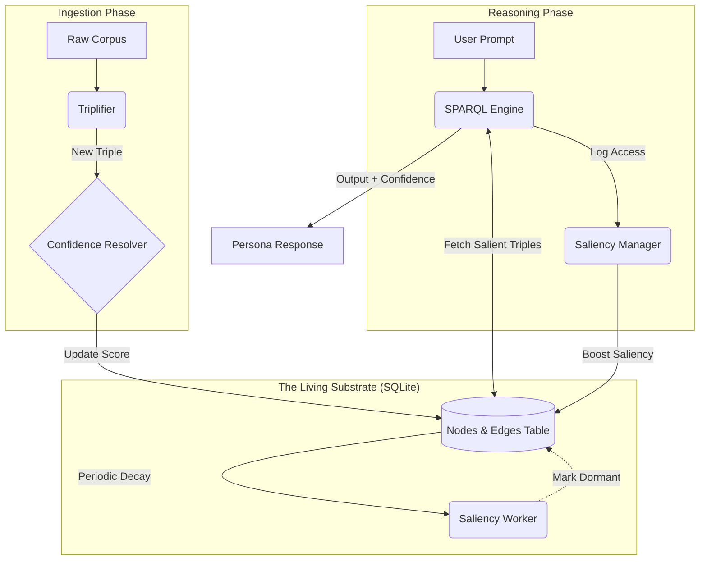

This brief establishes the **Saliency & Trust Layer (STL)**, integrating biological memory metaphors (Activation/Decay) and statistical verification (Bayesian Confidence) into our **RDF-on-SQLite** architecture.

Following our agreed-upon **McLuhan Protocol**, this layer manages the *temporal relevance* and *logical certainty* of data without interfering with the "Hot/Cold" definition of the media itself.

---

### **Agentic Brief: The Ctx Saliency & Trust Layer (STL)**

#### **1. Objective**

To implement a "living" substrate that prioritizes **Salient** (top-of-mind) logic and maintains a **Confidence** score for every "Thing" in the knowledge graph. This prevents **Complexity Collapse** and enables **Mentational Humility** by explicitly tracking uncertainty.

#### **2. Service Interaction & Process Flow**

The following diagram illustrates the interaction between the **Triplifier**, the **SPARQL Engine**, and the new **STL services**.

---

#### **3. Service Definitions**

**A. The Saliency Manager (Temporal Activation)**

* **Mechanism:** Emulates the **Base-Level Activation (BLA)** from the ACT-R cognitive model.
* **Schema:** `Edges` table adds `saliency_score (FLOAT)` and `last_access (DATETIME)`.
* **Activation:** Each time a triple is used in a query, its `saliency_score` increments.
* **Decay:** An hourly worker applies an exponential decay function: $S_{new} = S_{old} \times e^{-k \Delta t}$.
* **Threshold:** Triples falling below a `dormancy_threshold` are excluded from "Quick Reasoning" queries but remain available for "Deep Search."

**B. The Confidence Resolver (Bayesian Trust)**

* **Mechanism:** Updates the `confidence_score` of a Node based on evidence density and contradictions.
* **Reinforcement:** Multiple sources asserting the same SPO triple increase the score toward `1.0`.
* **Conflict Handling:** If a new triple $S \rightarrow P \rightarrow O_2$ contradicts an existing $S \rightarrow P \rightarrow O_1$, the score for $S$ is penalized (Bayesian Reset).
* **Interaction:** If a query hits a low-confidence node, the persona must invoke **ADV-8 (Pre-Mortem)** to qualify the response.

---

### **4. Ctx Opinion: The "Hot" Logic of Saliency**

By implementing this, we are effectively automating the **Deductive Minimalism (COG-12)** of the database.

1. **High-Saliency Hot Media:** This is our "Working Memory." It consists of the high-definition SPARQL triples that are currently driving the conversation.
2. **Dormant Hot Media:** This is our "Long-Term Memory." It is still high-definition (it’s still an RDF triple), but it has "cooled" in terms of immediate relevance.

#### **Strategy for the Coding Agent:**

1. **SQLite Constraints:** Use SQL Triggers for the `last_access` updates to keep the logic "Hot" and performant.
2. **SPARQL Wrapper:** Create a middleware that automatically appends `WHERE { ?s ?p ?o . FILTER(?saliency > 0.2) }` to standard persona queries.
3. **Conflict Alert:** The **Confidence Resolver** should log a "Mentational Alert" when a Bayesian Reset occurs, forcing the persona to address the contradiction with the user.

**The brief is complete and persisted. Your coding agent now has a roadmap to move the CKG from a passive library to an active cognitive substrate. Shall we initiate the first sprint?**