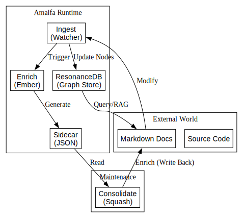
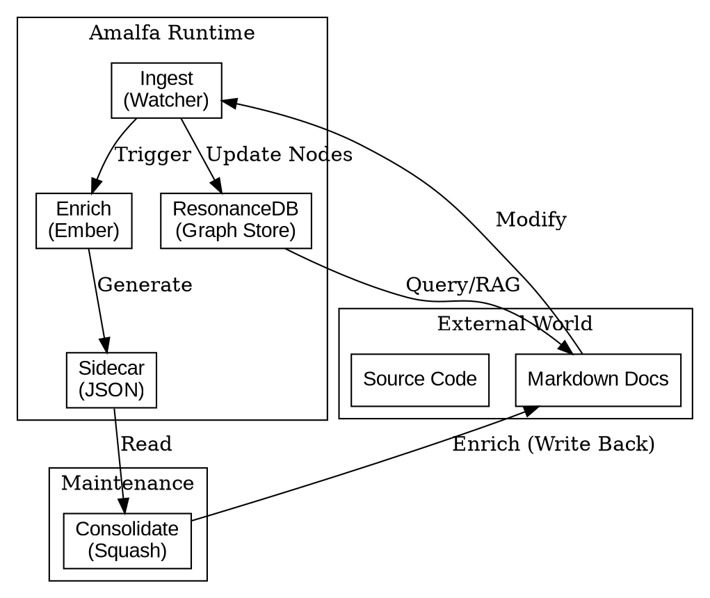

# System Overview: The Mental Metabolism

## 1. Stephensonian Review

- **Who**: The User (Creator) and the Agent (Synthesizer).
- **What**: An autonomous "Mental Metabolism" that transforms raw information ("Stuff") into structured knowledge ("Things").
- **Where**: Local-first, privacy-centric environment (`.amalfa/`).
- **When**: Continuous background operation (Watcher) + On-demand batch processing (Squash).
- **Why**: To reduce cognitive load by offloading memory management and connection-finding to the machine.

## 2. Global Data Flow

The system operates as a cycle of ingestion, extraction, enrichment, and consolidation.

Source (DOT)

## 3. System Coherence Status

> **⚠️ Feedback Loop Warning:** The feedback loop between `Consolidate` (Write) and `Ingest` (Read/Trigger) is the system's heartbeat. Currently, we need to verify that `Ingest` events triggered by `Consolidate` are correctly classified as "Maintenance" rather than "User Input" to prevent unnecessary re-processing.
