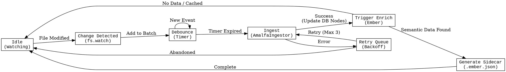

# Ingest Service (Watcher)

## 1. Stephensonian Review

- **Who**: `AmalfaDaemon` (Node.js Service).
- **What**: File System Watcher (`chokidar`/`fs.watch`).
- **Where**: `src/daemon/index.ts`.
- **When**: Real-time on file modification (Debounced 1000ms).
- **Why**: To maintain an up-to-date registry of all nodes in `ResonanceDB` without manual sync.

## 2. State Machine

Source (DOT)

## 3. Critical Paths & Risks

*   **Atomicity**: `Ingest` must update `ResonanceDB` atoms (Nodes) atomically.
*   **Retry Logic**: The `Retry Queue` handles transient file locks (common on macOS).
*   **Trigger**: The `Ingest` service is the *only* component authorized to trigger the `Enrich` cycle automatically.
