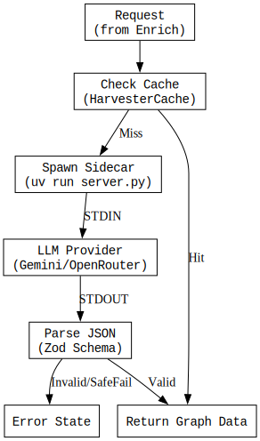
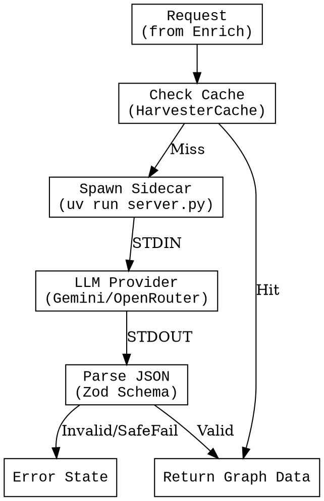

# Extract Service (LLM / Left Brain)

## 1. Stephensonian Review

- **Who**: `LangExtractClient` (Node.js) & `server.py` (Python Sidecar).
- **What**: Semantic Analysis using Large Language Models (Gemini/OpenRouter).
- **Where**: `src/services/LangExtractClient.ts` & `src/sidecars/lang-extract/`.
- **When**: Triggered by `Enrich Service` upon cache miss.
- **Why**: To extract structured entities, relationships, and tags from unstructured text.

## 2. State Machine

Source (DOT)

## 3. Operational Notes

*   **Cost/Latency**: This is the most expensive operation. Caching (`HarvesterCache`) is essential.
*   **Robustness**: The Python sidecar includes retry logic for API limits (429).
*   **Validation**: Zod schemas enforce the JSON structure coming back from the LLM, protecting the unpredictable nature of stochastic parrots.
