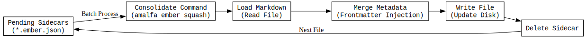

# Enrich Service (Ember)

## 1. Stephensonian Review

- **Who**: `EmberService` & `EmberSquasher`.
- **What**: The mechanism for transforming extracted insights into permanent storage (Sidecars -> Frontmatter).
- **Where**: `src/ember/index.ts`.
- **When**: After analysis (Generation) and during "Maintenance Mode" (Squash).
- **Why**: To ensure knowledge is not just transient (DB) but persistent (Filesystem), adhering to the Local-First philosophy.

## 2. State Machine

```dot
digraph EnrichService {
    rankdir=LR;
    node [shape=box, fontname="Courier New"];
    
    Pending [label="Pending Sidecars\n(*.ember.json)"];
    Consolidate [label="Consolidate Command\n(amalfa ember squash)"];
    LoadFile [label="Load Markdown\n(Read File)"];
    Merge [label="Merge Metadata\n(Frontmatter Injection)"];
    WriteFile [label="Write File\n(Update Disk)"];
    Cleanup [label="Delete Sidecar"];
    
    Pending -> Consolidate [label="Batch Process"];
    Consolidate -> LoadFile;
    LoadFile -> Merge;
    Merge -> WriteFile;
    WriteFile -> Cleanup;
    
    Cleanup -> Pending [label="Next File"];
}
```

Source (DOT)

## 3. Resilience & Gaps

> **⚠️ Implementation Status:** Fast-moving target. The "Consolidate" logic is conceptually sound but operationally risky.

*   **Idempotency**: We must rely on `gray-matter` to ensure we don't duplicate tags if they already exist.
*   **Loop Prevention**: Writing the file triggers the `Ingest Service`. We *must* verify that this doesn't trigger a new `Extract` call, creating an infinite billing loop.
*   **Gap**: Currently, loop prevention relies on the file content hash matching the last processed hash. If `Squash` changes the content (by adding tags), the hash changes. This is a known issue we need to solve (e.g., by hashing *content minus frontmatter*).
