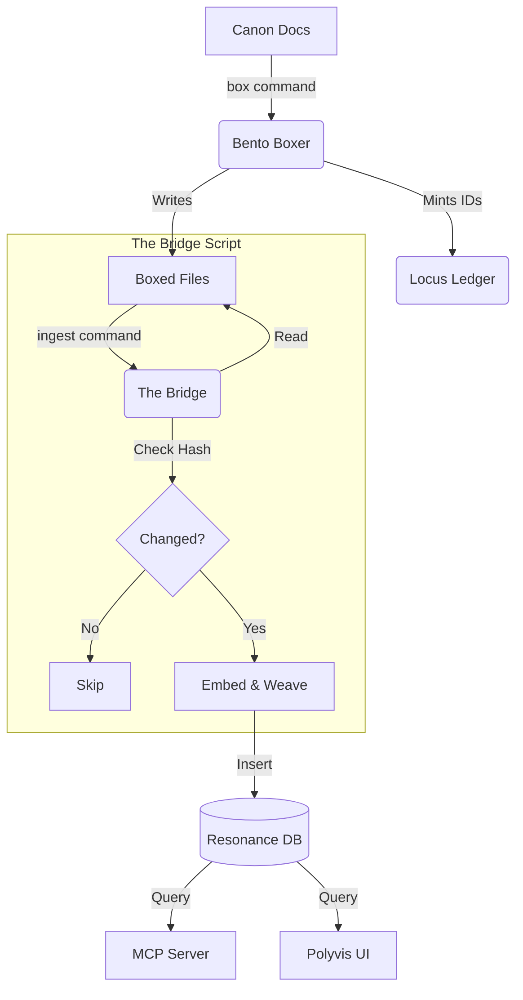

# Ingestion Pipeline Architecture

**Status:** Canon
**Version:** 1.0

## Overview

The Polyvis ingestion pipeline separates content generation (The Factory) from content storage (The Brain) via a rigorous, audit-safe Bridge script. Ideally, the "Brain" (`resonance.db`) is a single-file payload that can be distributed via the Model Context Protocol (MCP) or loaded into the web client.

## Component Map

### 1. The Factory (`/src`)
*   **Role:** Deterministic Text Processing.
*   **Input:** Raw Markdown Files (Canon Docs).
*   **Output:** Bento-Boxed Text (Chunks with Locus Tags).
*   **State:** `bento_ledger.sqlite` (Minting & Tracking IDs).
*   **Key Logic:** `BentoBoxer`, `LocusLedger`, `MarkdownMasker`.

### 2. The Bridge (`scripts/pipeline/ingest.ts`)
*   **Role:** Extract, Transform, Load (ETL).
*   **Input:** Boxed Files + `resonance.db` (for diffing).
*   **Action:**
    *   **Scan:** Reads files marked with `<!-- locus:UUID -->`.
    *   **Delta Check:** Hashes content; skips if `hash` matches DB.
    *   **Embed:** Generates Vectors if content is new/changed.
    *   **Weave:** Links entities via `EdgeWeaver`.
*   **Output:** Updates `resonance.db`.

### 3. The Brain (`/resonance`)
*   **Role:** Semantic Storage & Retrieval.
*   **State:** `resonance.db` (SQLite + Vectors).
*   **Logic:** `ResonanceDB` (Query), `Embedder` (Vector Generation model).

## Flow Diagram



## Protocols

### 1. The "Diff-Safe" Audit
Ingestion is idempotent. We rely on cryptographic hashes of the *content* (excluding Locus Tags) to determine if a re-embed is necessary. This saves compute/cost on embeddings and preserves edge stability.

### 2. The "Single-File" Payload
The entire knowledge graph is self-contained in `resonance.db`. This file is the "Artifact" of the pipeline. It contains:
- **Nodes:** Content chunks, Concepts.
- **Edges:** Semantic links (Cites, Exemplifies, Next).
- **Vectors:** FAFCAS-normalized embeddings.
- **Hash:** Integrity checksums.

## Usage

### Boxing (Factory)
```bash
bun run src/index.ts box --file path/to/doc.md --output path/to/boxed_doc.md
```

### Ingestion (Bridge)
```bash
# Ingest all configured sources
bun run scripts/pipeline/ingest.ts

# Ingest specific file
bun run scripts/pipeline/ingest.ts --file path/to/boxed_doc.md
```
