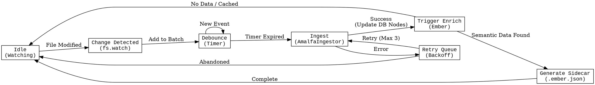
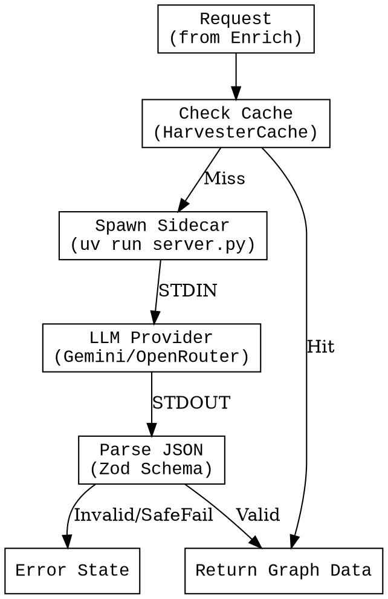
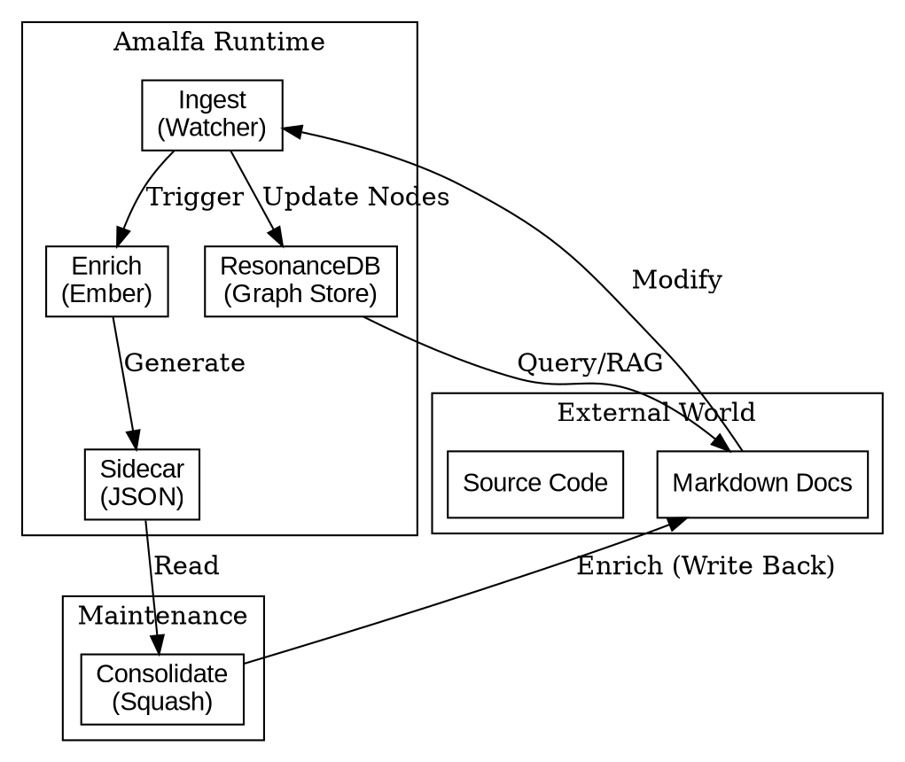

# System Architecture: State Machines & Data Flow

This document maps the state machines and data flows of the Amalfa system. It serves as a blueprint for understanding the lifecycle of data ("Stuff" into "Things") and identifying resilience gaps.

## 1. Ingest Service (Watcher)

The Ingest Service (formerly Harvester) is the entry point for data. It monitors the filesystem and maintains the `ResonanceDB` node registry.

### Critical Paths
*   **Ingest**: Must update `ResonanceDB` atoms (Nodes) atomically.
*   **Retry**: Handles transient locks or partial writes.

---

## 2. Extract Service (Left Brain)

The `Extract Service` (formerly LangExtract) is a Python sidecar responsible for semantic extraction (LLM wrappper).

### Critical Paths
*   **Provider**: External dependency (Network/API Key). Primary source of latency/failure.
*   **Parse**: robustness against LLM hallucinations (JSON formatting).

---

## 3. Enrich Service (Ember)

The `Enrich Service` manages the transformation of sidecars into persistent knowledge (Consolidation).

```dot
digraph EnrichService {
    rankdir=LR;
    node [shape=box, fontname="Courier New"];
    
    Pending [label="Pending Sidecars\n(*.ember.json)"];
    Consolidate [label="Consolidate Command\n(amalfa ember squash)"];
    LoadFile [label="Load Markdown\n(Read File)"];
    Merge [label="Merge Metadata\n(Frontmatter Injection)"];
    WriteFile [label="Write File\n(Update Disk)"];
    Cleanup [label="Delete Sidecar"];
    
    Pending -> Consolidate [label="Batch Process"];
    Consolidate -> LoadFile;
    LoadFile -> Merge;
    Merge -> WriteFile;
    WriteFile -> Cleanup;
    
    Cleanup -> Pending [label="Next File"];
}
```

### Resilience Gap: The Infinite Loop
*   `WriteFile` triggers `IngestService` (Change Detected).
*   **Risk**: If `Ingest` re-analyzes the enriched file and generates a *new* sidecar, the cycle repeats.
*   **Mitigation**: `Analyzer` must detect existing enrichment and skip generation ("Idempotency").

> **⚠️ Implementation Status:** The "Consolidate" (Squash) process has not yet been fully rigorously exercised in a production loop. The Idempotency logic is critical but currently relies on basic heuristics. **Action Item:** Stress test the `squash` command on a corpus of >100 documents to verify loop prevention.

---

## 4. Overall Amalfa Process

The macroscopic view of the "Mental Metabolism".

> **⚠️ System Coherence:** The feedback loop between `Consolidate` (Write) and `Ingest` (Read/Trigger) is the system's heartbeat. Currently, we need to verify that `Ingest` events triggered by `Consolidate` are correctly classified as "Maintenance" rather than "User Input" to prevent unnecessary re-processing. This requires `FileWatcher` to be aware of the `EmberService`'s activity.

## Recommended Resilience Improvements

Based on this state mapping, we recommend the following tests and logs:

### 1. Loop Detection Log
*   **Where**: `HarvesterDaemon` (Ingest).
*   **What**: Log if a file modification event occurs within `X` seconds of a `Squash` operation on the same file.
*   **Why**: To detect runaway enrichment loops.

### 2. Idempotency Test
*   **Where**: `tests/resilience/idempotency.test.ts`.
*   **What**:
    1.  Create Doc -> Harvest -> Squash.
    2.  Assert Doc has metadata.
    3.  Harvest again.
    4.  Assert **NO** new sidecar is generated.
*   **Why**: Ensures the "Squash" state is a stable equilibrium.

### 3. "Zombie" Sidecar Monitor
*   **Where**: Dashboard (Squash Service).
*   **What**: Alert if sidecars exist > 24 hours.
*   **Why**: Indicates failed squashes or orphaned processes.

### 4. LLM Circuit Breaker
*   **Where**: `LangExtractClient`.
*   **What**: If 5 consecutive errors occur (API Limit/Network), pause extraction for 5 minutes.
*   **Why**: Prevent spamming logs and burning retries during outages.
