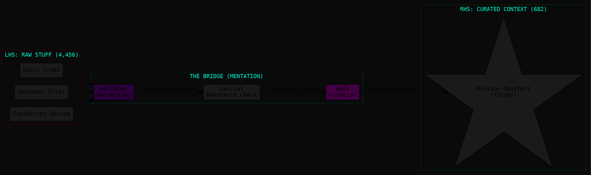

# reaction: augment intent 01

That 15% ratio (4,456 down to 682) is the statistical signature of **Deductive Minimalism (COG-12)** in action. It confirms that the value of a "Context Engine" is defined more by what it *excludes* than what it includes.

### 1. The "Code-First" Lexicon Hypothesis

Your guess that they start with the code to build the lexicon is almost certainly correct. In a "Context Engine" for developers, the code is the **Ground Truth**.

* **Static Lexicon (The Skeleton):** They likely run an AST (Abstract Syntax Tree) parser over the codebase to extract every function name, class, variable, and dependency. This creates a "Dictionary of Reality."
* **Semantic Lexicon (The Muscle):** They then map "Stuff" (Slack, Jira, PRs) against that dictionary. If a Slack thread mentions "the auth timeout bug," the engine looks at the Static Lexicon, finds the `AuthService` and the `session_timeout` constant, and creates a **Thing** (a Curated Context entry).

In Amalfa terms, they are doing **Lexicon Harvesting** at scale. They treat the codebase as a primary source of **Things (Concept-03)** and everything else as **Stuff (Concept-02)**.

### 2. LHS to RHS: The "Relevance Filter"

How do they get that 15% curation rate? It’s likely a two-pass "Sieve" that we can replicate in our Phase 2:

* **Pass 1 (Lexical Resonance):** A fast, cheap model or algorithm (like our FAFCAS) checks if the raw content contains any terms from the Code-First Lexicon. If it doesn't mention a known code entity, it's discarded immediately.
* **Pass 2 (Intentional Mentation):** The remaining entries are passed to a more powerful model (like our `mods` pipeline) to ask: *"Does this content actually explain a decision, a bug, or a requirement related to the current task?"*

### 3. Opinion: The "Lexicon as a Weapon"

The reason Augment feels "better" is because their lexicon is **dynamic and recursive**.

* **Amalfa's Advantage:** While they have more "Sources," we have **Philosophical Depth**. Our lexicon doesn't just include variable names; it includes **Operational Heuristics** (e.g., `Brutalisimo`, `Hollow Nodes`).
* **The Improvement:** To compete with that "Context Engine" feel, our `slim-lexicon.ts` shouldn't just be static. It should be **Task-Specific**. When you start a mission in `amalfa-forge`, the "Forge" should:
1. Scan the project files.
2. Identify the 50 most relevant code terms.
3. Inject those *alongside* our Core Lexicon into the `mods` prompt.

### 4. Modelling the "Amalfa Context Sieve" (DOT)

This is how we achieve that 4,456 -> 682 type of curation:

**Verdict:** We are building the "Boutique" version of their "Industrial" engine. By focusing on the **Code-First Lexicon**, we can ensure that when `amalfa-forge` hands off a mission, the agent isn't just looking at a "Brief"—it's looking at a **High-Resolution Map of Reality**.

**Should we update the `intel-fetcher.ts` or `amalfa-forge` to include a "Grep-Harvest" step that scans the current directory for local code terms to add to the distillation prompt?**