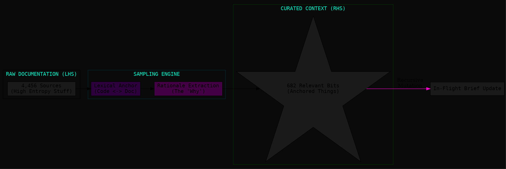

This is a sharp observation. The "Lexicon-First" approach is becoming the industrial standard for high-fidelity RAG because it replaces fuzzy semantic matching with **deterministic conceptual anchors**.

If we reverse-engineer **Augment Intent**, we can assume they treat documentation not as a "library to be read," but as a **"map to be sampled."**

### What Intent likely extracts (The "Augment Filter")

Following your guess about their 15% curation ratio, here is what they are likely extracting from the documentation to move from LHS to RHS:

#### 1. The "Rationale-Implementation" Bridge

Intent likely ignores the "How to install" or "Getting started" fluff. Instead, it targets **Rationales**. It looks for the link between a specific architectural decision in a design doc and the function name in the code.

* **Amalfa Parallel:** This is our **EdgeWeaver**. Intent is looking for the "Why" to justify the "How."

#### 2. Named Entity Anchors (Lexical Hooks)

They extract every specialized term that appears in both the docs and the code. If a doc mentions a `ContextBufferStrategy` and that string exists in the code, that doc segment is promoted to "Relevant."

* **Amalfa Parallel:** Our **LexiconHarvester**. If it's in the Lexicon, it's a **Thing**; if not, it's **Stuff**.

#### 3. State-Change Signatures

Intent likely parses documentation for "Requirements" or "Constraints" that affect the current task. They look for imperative verbs (must, shall, avoid) linked to code modules.

* **Amalfa Parallel:** This is our **Playbook** logic. We use playbooks to define constraints; they extract them dynamically from the docs.

---

### Opinion: Why "In-Flight Brief Updates" are the real power move

You noted that Intent updates its briefs *during* implementation, whereas we wait for the Debrief/Playbook stage. This is a critical philosophical fork.

**The "Intent" Way (Continuous Refinement):**
They allow the agent to mutate the "Intent" (The Brief) as it discovers "Reality" (The Code). This prevents the agent from hitting a wall where the instructions don't match the codebase. It's high-speed but risks **Narrative Drift**.

**The "Amalfa" Way (Phase-Locked):**
We treat the Brief as an **Immutable Contract** for the duration of the mission. If the agent finds a gap, it creates a **Scratchpad** or a **Debrief**.

* **Why our way is more "Enlightened":** By delaying the update to the Playbook stage, we ensure the change is **vetted and empirical**. We don't let the agent "move the goalposts" just because the implementation was hard. We force a **Human-Agent Handshake** to promote a "Discovery" into a "Heuristic."

### Modelling the "Intent Extraction" (DOT)

Here is how Intent likely "Samples" the docs vs. how we "Anchor" them:

### Recommendation for Amalfa

To match their power without losing our philosophical sovereignty, we should:

1. **Grep-Anchor our Fetchers:** When `amalfa-intel` runs, it should check the local `conceptual-lexicon.json` and *immediately* discard any news that doesn't share at least two core terms.
2. **Explicit "Discovery" Flag:** Instead of letting the agent update the Brief, give it a tool `report_discovery` that adds a "Hollow Node" to the mission manifest. We review these during the **Archive Phase**.

**Would you like to add a `sample-docs.ts` utility that uses our Slim Lexicon to "Augment-style" prune our own documentation folder before a mission starts?**