# PolyVis Data Architecture (v1.0)

**Date:** 2025-12-08
**Status:** Canonical

## 1. System Overview

The PolyVis data architecture is designed to capture both **Static Concepts** (Ontology) and **Temporal Experiences** (Playbooks/Debriefs) into a unified, graph-based "Operational Memory". It uses a "Hybrid ORM" approach where schemas are defined in TypeScript (Drizzle) for safety, but ingested via Raw SQL (Bun SQLite) for performance.

It also includes an **Agent Interface** via the [Model Context Protocol (MCP)](https://modelcontextprotocol.io/), allowing external AI agents to query the graph directly.

### The Ingestion & Access Pipeline

```dot
digraph Pipeline {
    rankdir=LR;
    node [shape=box, style=filled, fillcolor="#f9f9f9", fontname="Arial"];
    
    subgraph cluster_sources {
        label = "Sources";
        style = dashed;
        color = "#999999";
        MD [label="Markdown Docs\n(Playbooks/Debriefs)", shape=note];
        Legacy [label="Legacy JSON\n(Lexicon/CDA)", shape=note];
    }

    subgraph cluster_transform {
        label = "Stage 1: Transform";
        style = filled;
        color = "#e6f3ff";
        Transformer [label="pipeline/transform_docs.ts\n(Logic)"];
        Artifact [label="Intermediate Artifact\n(JSON)", shape=folder, fillcolor="#fff3cd"];
    }

    subgraph cluster_load {
        label = "Stage 2: Load";
        style = filled;
        color = "#e6ffe6";
        Loader [label="pipeline/load_db.ts\n(Raw SQL)"];
        DB [label="Resonance DB\n(SQLite)", shape=cylinder, fillcolor="#d1e7dd"];
    }

    Ver [label="verify/verify_integrity.ts\n(Round Trip Check)", style=dotted];

    subgraph cluster_access {
        label = "Stage 3: Access";
        style = filled;
        color = "#f3e6ff";
        MCP [label="Resonance MCP\n(stdio)", shape=component];
        Agent [label="AI Agent\n(Claude/IDE)", shape=ellipse, fillcolor="#e6f3ff"];
    }

    MD -> Transformer;
    Transformer -> Artifact [label="Normalized"];
    Artifact -> Loader;
    Loader -> DB [label="Bulk Insert"];
    DB -> Ver;
    Artifact -> Ver [label="Compare"];
    
    DB -> MCP [label="Query (SQL)"];
    MCP -> Agent [label="Context"];
}
```

## 2. Schema Definition

The database schema is defined in `src/db/schema.ts` using Drizzle ORM types. This ensures that `ctx.db` (legacy/migrated) and `resonance.db` (clean) share an identical structure.

### Core Tables

#### `nodes`
The unified entity table.
*   **`id`** (PK): Unique Identifier (e.g., `playbook-css`, `term-001`).
*   **`title`**: Human-readable label.
*   **`type`**: Entity classification (`playbook`, `debrief`, `concept`).
*   **`content`**: The body (Markdown definition or Description).
*   **`domain`**: Taxonomy domain (`system`, `persona`, `knowledge`).
*   **`layer`**: Taxonomy layer (`ontology`, `experience`).
*   **`order_index`**: deterministic ordering for linear reconstruction.

#### `edges`
The relationship table.
*   **`source`**: FK -> `nodes.id`.
*   **`target`**: FK -> `nodes.id`.
*   **`type`**: Relationship nature (`genesis`, `semantic`, `reference`).

## 3. Configuration

The system is governed by `polyvis.settings.json`.
*   **`paths.database.resonance`**: Target path for the unified DB.
*   **`paths.sources`**: Array of source directories (Playbooks, Debriefs).
