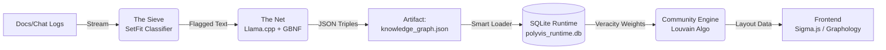

**Locus Tag:** `[Locus: Repository_Documentation]`

Here is the **`README.md`** artifact.

It is structured to be the first point of contact for any developer (including your future self) entering the **Polyvis** repository. It codifies the architecture and the "Sovereign" philosophy we have established.

---

# Polyvis Sovereign Ingestion Pipeline

**Status:** `Experimental` | **Architecture:** `Local-First / Sovereign`

## Overview

The **Polyvis Ingestion Pipeline** is a sovereign AI system designed to transform unstructured text ("Stuff") into a structured Knowledge Graph ("Things") without relying on external APIs.

It implements the **"Sieve and Net" Protocol**:

1. **The Sieve (SetFit):** A fast, lightweight classifier filters stream data for high-value concepts.
2. **The Net (Llama.cpp):** A quantized local LLM, constrained by GBNF grammars, extracts precise semantic triples.
3. **The Runtime (SQLite):** An idempotent, high-performance graph database that powers the visualization.

## Philosophy

* **Sovereignty:** No data leaves the local machine. We use `llama.cpp` and local embeddings.
* **Idempotency:** The database is a runtime cache. The source of truth is the code and the `knowledge_graph.json` artifact.
* **Separation of Concerns:** Semantic data (Truth) is managed by the Harvester. Visual layout data (Beauty) is preserved by the Loader.

## Architecture



## Prerequisites

* **Python 3.10+**
* **Llama.cpp:** Compiled and ready (`llama-server`).
* **Model:** A GGUF model (Recommended: `Mistral-7B-v0.3-Instruct.Q4_K_M.gguf`).
* **Make** (Optional, for workflow automation).

## Installation

1. **Clone & Setup Environment**
```bash
git clone https://github.com/your-org/polyvis-ingest.git
cd polyvis-ingest
python3 -m venv .venv
source .venv/bin/activate
pip install -r requirements.txt

```


2. **Prepare the Local LLM**
Place your `.gguf` model in the `./models` directory.
3. **Start the Llama Server**
The extraction relies on the server running with the specific grammar file.
```bash
./llama-server -m ./models/mistral-7b.gguf --grammar-file graph_triples.gbnf --port 8080 --host 0.0.0.0

```


## Usage

### The "One-Click" Workflow

To run the full pipeline (Harvest -> Hydrate -> Calculate Communities):

```bash
make ingest
# OR
./run_ingest.sh

```

### Manual Steps

1. **Train the Sieve (First Run Only)**
Generates the local SetFit classifier from `training_data.json`.
```bash
python train_classifier.py

```


2. **Harvest (Extract Triples)**
Scans documents, classifies text, and extracts triples to `knowledge_graph.json`.
```bash
python harvester.py

```


3. **Hydrate (Load DB)**
Upserts semantic data into SQLite while preserving existing visual layouts.
```bash
python loader_v2.py

```


4. **Calculate Structures**
Runs Louvain Community Detection using `veracity` weights and updates the `node_layout` table.
```bash
python calc_communities.py

```


## Project Structure

* `harvester.py`: Main script. Orchestrates the Sieve and Net.
* `inference_engine.py`: Wrapper for the SetFit classifier.
* `loader_v2.py`: Handles "Smart Upsert" into SQLite.
* `calc_communities.py`: Computes graph topology (Louvain).
* `graph_triples.gbnf`: Grammar file enforcing valid JSON output from Llama.cpp.
* `schema_v2.sql`: Database schema separating Semantic (`nodes`) vs Visual (`node_layout`) data.
* `training_data.json`: Few-shot examples for training the classifier.

## Troubleshooting

* **"Llama Connection Refused":** Ensure `llama-server` is running on port 8080.
* **"Visual Graph is a Hairball":** Run `python calc_communities.py` to re-assign community IDs, then apply a ForceAtlas2 layout in the frontend.
* **"Classifier Missing":** Run `python train_classifier.py` to regenerate the `./polyvis_classifier_v1` folder.

---

**License:** MIT
**Maintainer:** pjsvis / Ctx