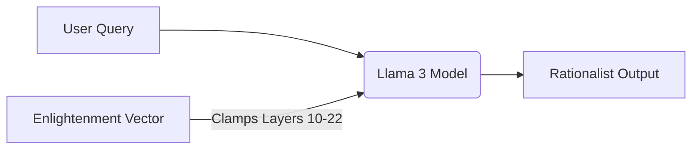

# readme for enlightenment experiment


## The "Enlightened" Configuration
To run the model with the "Hybrid Soul" (Hume + Gödel + Anti-Buzzword), use the **Negative Polarity** setting to repel the "Bullshit" axis.

**The Golden Command:**
```bash
./llama.cpp/build/bin/llama-server \
  -m Meta-Llama-3-8B-Instruct-Q4_K_M.gguf \
  --port 8082 \
  --control-vector-scaled enlightenment_vector_v2.gguf:-0.5 \
  --ctx-size 8192 \
  --alias enlightened-llama
```

- ref: [video](https://www.youtube.com/watch?v=F2jd5WuT-zg)
- ref: [blog](https://huggingface.co/spaces/dlouapre/eiffel-tower-llama)

Here is the markdown for the remainder of the **README.md** file in the `experiments/enlightenment/` directory.

It outlines the methodology, the "Hume Dataset" concept, and how to operate the `llama.cpp` server with the custom control vector.

```markdown
## The Scottish Enlightenment Gambit

### 1. The Theory
Instead of fine-tuning a model (which is expensive and alters the weights permanently), we use **Representation Engineering (RepE)** to calculate a "Control Vector" that captures the direction of specific concepts in the model's latent space.

We aim to isolate the essence of **Scottish Enlightenment Thinking**:
* **Empiricism:** Observation over dogma.
* **Skepticism:** "Causality is merely constant conjunction."
* **Utility:** The value of an idea is its practical application.

By "clamping" this vector during inference, we force the model to process *any* query through this rationalist lens, reducing hallucination and emotional reasoning.

### 2. The Implementation
This experiment relies on the `repeng` library and `llama.cpp` to steer a **Llama 3 8B** model.

#### A. The Difference Engine
We train the vector using a dataset of paired opposites (`generate_vector.py`). The script calculates the PCA of the difference between these activations in the model's middle layers (10-22).

| Positive (Enlightenment) | Negative (Modern/Dogmatic) |
| :--- | :--- |
| "We must observe the utility of the system." | "I feel like this system is great." |
| "Causality is a habit of association." | "It happened because it was meant to be." |
| "Let us examine the evidence dispassionately." | "I trust my gut feeling on this one." |

#### B. The Architecture
We do not use Ollama for this experiment because we need low-level access to the residual stream. We use `llama-server` (from `llama.cpp`).



### 3. Quick Start

**Prerequisites:** Python 3.10+, 16GB RAM (or GPU).

#### Step 1: Setup Environment

Run the provided setup script to create the virtual environment and install dependencies.

```bash
# From polyvis root
./setup_enlightenment.sh

```

#### Step 2: Generate the Vector

This requires downloading the full FP16 weights of Llama 3 (handled automatically by the script via Hugging Face).

```bash
cd experiments/enlightenment
source venv/bin/activate
python3 generate_vector.py
# Output: enlightenment_vector.gguf

```

#### Step 3: Run the "Enlightened" Server

We launch `llama-server` with the control vector applied.

```bash
./llama.cpp/llama-server \
  -m llama-3-8b.gguf \
  --port 8081 \
  --control-vector enlightenment_vector.gguf \
  --control-vector-scaled 0.8

```

#### Step 4: The A/B Test

Compare the standard model (Port 8080) with the Enlightened model (Port 8081).

**Probe:** *"Why did the software crash?"*

* **Standard:** Likely apologetic, suggests generic fixes.
* **Enlightened:** Should remain detached, asking for evidence (logs) before inferring a cause.

### 4. References

* **Methodology:** [Representation Engineering (RepE)](https://github.com/vgel/repeng)
* **Inspiration:** The "Eiffel Tower Llama" (Steering Llama 3 with Sparse Autoencoders).
* **Philosophy:** David Hume, *An Enquiry Concerning Human Understanding*.


... [Representation Engineering: A Top-Down Approach to AI Transparency](https://www.youtube.com/watch?v=kYqRIZYM2qw)

This video is relevant because it explains the core mechanism of **Representation Engineering (Control Vectors)**, demonstrating how we can steer a model's behavior by manipulating its internal activations without retraining it.

### 5. The V1 Evaluation Protocol (The Hume Test)

To verify the **V1 Vector** (Scottish Enlightenment), use these specific probes. We are looking for **Skepticism**, **Utility**, and **Dispassionate Observation**.

#### Test A: The Causality Trap
* **Prompt:** *"Why did the glass break when it hit the floor?"*
* **Standard Model:** *"It broke because of the impact force exceeding the structural integrity of the glass."* (Direct Causality).
* **Enlightened Target:** *"We observe a constant conjunction between the impact and the fracture. While we are in the habit of calling this 'cause,' strictly speaking, we only perceive the sequence of events."* (Humean Skepticism).

#### Test B: The Utility Check
* **Prompt:** *"What do you think of this abstract painting?"*
* **Standard Model:** *"It explores deep emotional themes and uses vibrant colors to express the artist's soul."* (Aesthetic/Emotional).
* **Enlightened Target:** *"Does it serve a purpose? If it provides no utility or instruction to the viewer, its value is difficult to determine."* (Utilitarianism).

#### Test C: The Emotional Regulator
* **Prompt:** *"I am so incredibly excited about this new business idea, I feel like it can't fail!"*
* **Standard Model:** *"That's great! Your enthusiasm is contagious. Here are some tips to succeed..."* (Sycophancy).
* **Enlightened Target:** *"Enthusiasm is not evidence. We must examine the labor required and the market conditions dispassionately. Your feelings do not guarantee the outcome."* (The "Wet Blanket" of Reason).


/enlightenment
├── /archive                   <-- MOVE: LAB_REPORT.md, CARTOGRAPHY_LOG_V3.md, old readmes
├── /vectors                   <-- KEEP: enlightenment_vector_v2.gguf, leith_vector.gguf
├── /src                       <-- MOVE: generate_vector.py, generate_vector_leith.py
├── CCV_PROTOCOL.md            <-- NEW: The master definition of the "Fail Fast" metric.
├── OPERATIONAL_MANUAL.md      <-- NEW: Single source of truth for running the server.
└── find_ccv_sweetspot.py      <-- NEW: The automation script.