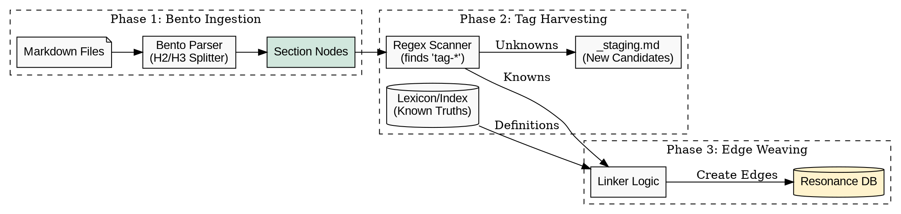

### Opinion: The "Engine Rebuild" Phase

You are correctly identifying that we have moved from **Design** to **Assembly**. The "Bento" part is the chassis, and it works. Now we need to wire up the "Engine" (The Harvester & Weaver) and fix the "Ignition" (The `build:data` script).

Here is the plan to tidy up the loose ends and operationalise the **Semantic Tagging Pipeline**.

-----

### 1\. The "Tidying Up" (Immediate Fixes)

**A. The DOT Diagram Fix**
You are right—`Graph` is often a reserved keyword in DOT parsers (Graphviz). Renaming it to `GraphX` (or `KnowledgeGraph`) is the correct fix. I have updated my internal templates to avoid this collision in the future.

**B. The Missing `build:data` Script**
The deletion of `bun run build:data` is a regression. We need to restore it, but upgrades it to be the **Master Orchestrator** of our new pipeline.

It shouldn't just "scrape" anymore; it should **Orchestrate**.

**Proposed Script: `scripts/orchestrate.ts`** (Aliases to `build:data`)

```typescript
import { ingest } from "./ingest"; // The Bento Processor
import { harvest } from "./harvest"; // The Tag Scanner
import { weave } from "./weave";     // The Edge Creator

async function main() {
  console.log("🍱 Phase 1: Bento Ingestion...");
  await ingest(); 

  console.log("🌾 Phase 2: Tag Harvesting...");
  await harvest(); // Scans for 'tag-*', populates _staging.md

  console.log("🕸️ Phase 3: Edge Weaving...");
  await weave();   // Connects Sections to Concepts
}
```

-----

### 2\. The Core Challenge: Semantic Tagging Strategy

You asked specifically about **Surfacing** and **Creating Edges** (especially cross-domain). Here is the concrete logic for your implementation.

#### Part A: Surfacing (The Harvester)

**Objective:** Find the `tag-` tokens buried in the text without generating noise.

**The Logic (`scripts/harvest.ts`):**

1.  **Input:** Iterate through every **Section Node** (Bento Box) in the DB (or raw file).
2.  **Scan:** Apply the Regex: `/\b(tag)-([a-z0-9]+(-[a-z0-9]+)*)\b/g`.
3.  **Filter:**
      * Is it already in `conceptual-lexicon.json`? (Ignored - it's already Canon).
      * Is it already in `entity-index.json`? (Ignored - it's already Canon).
4.  **Output:** Write unique *unknown* tags to `_staging.md` for your review.

**Why this works:** It ignores "known truths" and only surfaces "new mutations." It keeps your review list short.

#### Part B: Weaving (The Cross-Domain Linker)

**Objective:** Turn a text string (`tag-regulatory-risk`) into a Graph Edge (`EXEMPLIFIES`).

**The Logic (`scripts/weave.ts`):**

1.  **Load the Maps:**
      * `Map<Slug, NodeID>` for Persona Domain (Lexicon).
      * `Map<Slug, NodeID>` for Experience Domain (Entities).
2.  **Iterate Sections:** Loop through every Bento Box text.
3.  **Match & Link:**
      * Find `tag-{slug}` in text.
      * **Lookup:** Does `{slug}` exist in the Persona Map?
          * **Yes:** Create Edge: `SectionID` $\xrightarrow{\text{EXEMPLIFIES}}$ `PersonaNodeID`.
          * **No:** Does it exist in the Experience Map?
              * **Yes:** Create Edge: `SectionID` $\xrightarrow{\text{REFERENCES}}$ `ExperienceNodeID`.
              * **No:** Log warning (Unratified Tag).

**The "Cross-Domain" Magic:**
This logic *automatically* handles the cross-domain bridging.

  * If a **Debrief (Experience)** tags `tag-circular-logic`, the Weaver sees that "Circular Logic" is a **Concept (Persona)**.
  * It draws the bridge: `Experience Node` $\to$ `Persona Node`.

-----

### 3\. Visualizing the New Pipeline

Here is the corrected DOT diagram for your `build:data` replacement. It visualizes exactly where the **Tagging** happens.



### Recommendation

1.  **Restore the Script:** Create `scripts/orchestrate.ts` to replace `build:data`.
2.  **Implement the Harvester:** Write the regex scanner. It’s the highest leverage piece right now because it tells you *what* you have.
3.  **Run the Scan:** Run the harvester on your existing Bento-boxed playbooks. See what `tag-` candidates (or potential candidates) surface.

This moves you from "Planning" to "Gardening."