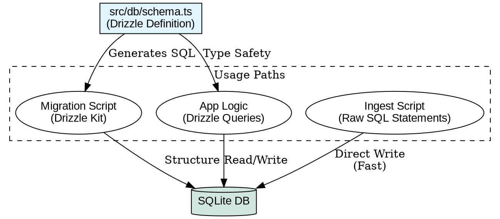

# Playbook: Hybrid Data Schema

**Context:** High-Performance Data Engineering
**Stack:** Bun + SQLite + Drizzle

## 1. The "Hybrid ORM" Pattern

We use Drizzle ORM for **Definition** and Raw SQL for **Execution**.

### Why?
*   **Drizzle (Types):** Ensures the DB structure matches our TypeScript interfaces. Auto-generates migrations.
*   **Raw SQL (Performance):** ORM instantiation overhead is significant for bulk inserts (10k+ nodes). Raw Prepared Statements are 10-50x faster.



## 2. Best Practices

### A. Defining Schema
Always define tables in `src/db/schema.ts`.
```typescript
export const nodes = sqliteTable("nodes", {
  id: text("id").primaryKey(),
  // ...
});
```

### B. Bulk Insertion (Speed)
Do **not** use `db.insert(nodes).values([...])` for thousands of rows inside a loop.
Use `db.prepare()`:
```typescript
const insert = sqlite.prepare("INSERT INTO nodes (id) VALUES ($id)");
const transaction = sqlite.transaction(items => {
    for (const item of items) insert.run({ $id: item.id });
});
transaction(manyItems);
```

### C. Round-Trip Verification
Always verify ingestion pipelines by reading the DB back into the original format.
*   **Input:** `docs.json`
*   **Output:** `db.select()...` -> `reconstructed.json`
*   **Check:** `assert.deepEqual(input, output)`

### D. Implicit vs Explicit Data (ETL)
**Principle:** Graph databases thrive on *connections*, not just entities.
*   **Implicit:** Metadata tags like `[Implements: PHI-2]` or `[Guided_By: OH-058]`.
*   **Explicit:** Graph Edges `(Node A) -[Implements]-> (Node B)`.
*   **Rule:** Your Ingestion Pipeline (ETL) must explicitly parse these implicit tags and insert them as edges.

## 3. Benchmarks

**Test:** Inserting 10,000 nodes (In-Memory SQLite, MacBook M1 Pro)
*   **Drizzle ORM (Transaction):** 116.20ms
*   **Raw SQL (Prepared+Tx):** 8.70ms

**Result:** Raw SQL is ~13x faster for bulk operations.

## 4. Naming Conventions (Title vs Label)
**Issue:** Frontend libraries (Sigma.js) reserve the key `label` for the display text. Our domain model prefers `title` for semantic clarity (e.g., Document Title).
**Resolution:**
1.  **Database (Truth):** Use `title`.
    -   `nodes.title` (TEXT)
    -   *Why?* It's domain-accurate. A document has a title, not a label.
2.  **View (Adapter):** Map `title` -> `label`.
    -   In `sigma-explorer/graph.js`: `label: row.title`
    -   *Why?* Libraries expect specific keys. We adapt our data to the tool, not our schema to the tool.
3.  **Scripts:** Always query `title`.
    -   ❌ `SELECT label FROM nodes`
    -   ✅ `SELECT title FROM nodes`

**Anti-Pattern:** "Zero Magic" does NOT mean "Coupled Schema". Mapping 1 key in a UI adapter is acceptable "Low Magic" to preserve semantic integrity in the DB.

