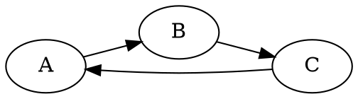
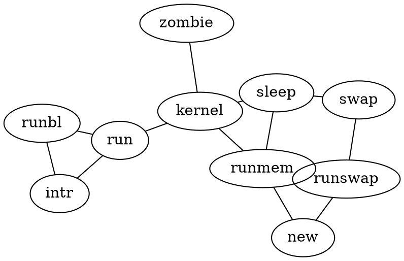

# Markdown Test Suite

This document is designed to test the rendering capabilities of the `markdown.css` stylesheet. It covers standard Markdown elements and edge cases.

## 1. Typography

### Headings
## Heading 1
## Heading 2
### Heading 3
**Heading 4**
**Heading 5**
**Heading 6**

### Paragraphs & Formatting
This is a standard paragraph. It contains **bold text**, *italic text*, and ***bold italic text***. We can also do ~~strikethrough~~.

This is a paragraph with a very long line to test wrapping behavior. It should wrap nicely within the container and not overflow horizontally. Lorem ipsum dolor sit amet, consectetur adipiscing elit. Sed do eiusmod tempor incididunt ut labore et dolore magna aliqua. Ut enim ad minim veniam, quis nostrud exercitation ullamco laboris nisi ut aliquip ex ea commodo consequat.

### Blockquotes
> This is a blockquote.
> It can span multiple lines.
>
> > And it can be nested.

## 2. Lists

### Unordered List
* Item 1
* Item 2
  * Nested Item 2.1
  * Nested Item 2.2
    * Deeply Nested Item 2.2.1
* Item 3

### Ordered List
1. First Item
2. Second Item
   1. Nested Ordered Item
   2. Another Nested Item
3. Third Item

### Mixed List
1. First Item
   * Mixed Nested Bullet
   * Another Bullet
2. Second Item

## 3. Code

### Inline Code
Here is some `inline code` inside a sentence. It should not break the line height awkwardly.

### Code Blocks (Auto-Wrap Test)
This block contains a very long line that should wrap if our CSS is working correctly.

```javascript
function testWrapping() {
    const veryLongString = "This is a string that is intentionally extremely long to verify that the pre tag correctly wraps text instead of forcing a horizontal scrollbar, which breaks the layout on mobile devices and narrow screens. It should break at the nearest word boundary if possible.";
    return veryLongString;
}
```

### Code Blocks (Syntax Highlighting)
```javascript
// This should be highlighted if highlight.js is working
import React from 'react';

const Component = () => {
    return <div>Hello World</div>;
};
```

```css
/* CSS Highlighting */
.className {
    color: red;
    background: url('image.png');
}
```

```python
## Python Highlighting
def hello_world():
    print("Hello World")
```

## 4. Tables

| Header 1 | Header 2 | Header 3 |
| :--- | :---: | ---: |
| Left Aligned | Center Aligned | Right Aligned |
| Row 1 Col 1 | Row 1 Col 2 | Row 1 Col 3 |
| Row 2 Col 1 | Row 2 Col 2 | Row 2 Col 3 |

## 5. Links & Images

[This is a standard link](#).


## 6. Edge Cases

### Horizontal Rules
---

### Long Strings without Spaces
ThisIsAVeryLongStringThatShouldBreakIdeallyButMightNotDependingOnWordBreakSettingsAndItJustKeepsGoingAndGoingAndGoingAndGoing.

### Empty Elements
* 
* 

### Special Characters
& < > " ' © ® ™

## 7. Task Lists (GitHub Flavored)
- [x] Completed Task
- [ ] Incomplete Task
- [ ] Another Task

## 8. Diagrams (DOT/Graphviz)

### Simple Digraph


### Complex Graph
