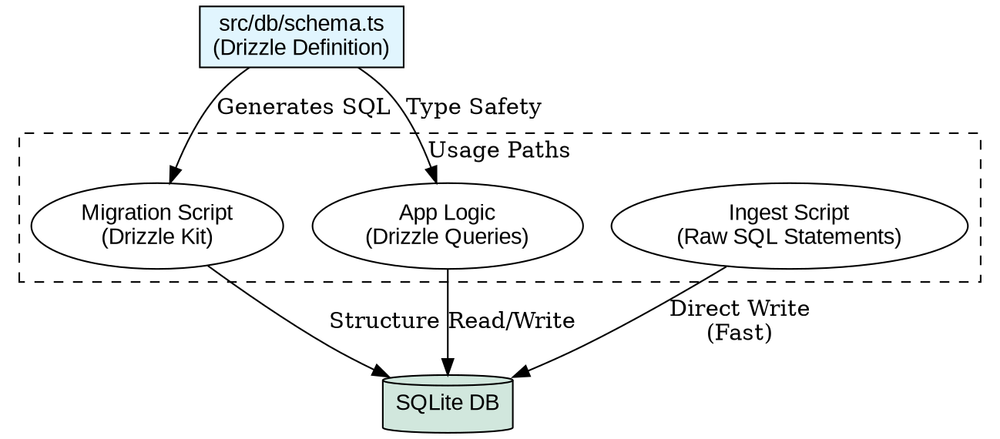

# Playbook: Hybrid Data Schema

**Context:** High-Performance Data Engineering
**Stack:** Bun + SQLite + Drizzle

## 1. The "Hybrid ORM" Pattern

We use Drizzle ORM for **Definition** and Raw SQL for **Execution**.

### Why?
*   **Drizzle (Types):** Ensures the DB structure matches our TypeScript interfaces. Auto-generates migrations.
*   **Raw SQL (Performance):** ORM instantiation overhead is significant for bulk inserts (10k+ nodes). Raw Prepared Statements are 10-50x faster.



## 2. Best Practices

### A. Defining Schema
Always define tables in `src/db/schema.ts`.
```typescript
export const nodes = sqliteTable("nodes", {
  id: text("id").primaryKey(),
  // ...
});
```

### B. Bulk Insertion (Speed)
Do **not** use `db.insert(nodes).values([...])` for thousands of rows inside a loop.
Use `db.prepare()`:
```typescript
const insert = sqlite.prepare("INSERT INTO nodes (id) VALUES ($id)");
const transaction = sqlite.transaction(items => {
    for (const item of items) insert.run({ $id: item.id });
});
transaction(manyItems);
```

### C. Round-Trip Verification
Always verify ingestion pipelines by reading the DB back into the original format.
*   **Input:** `docs.json`
*   **Output:** `db.select()...` -> `reconstructed.json`
*   **Check:** `assert.deepEqual(input, output)`

## 3. Benchmarks

## 3. Benchmarks

**Test:** Inserting 10,000 nodes (In-Memory SQLite, MacBook M1 Pro)
*   **Drizzle ORM (Transaction):** 116.20ms
*   **Raw SQL (Prepared+Tx):** 8.70ms

**Result:** Raw SQL is ~13x faster for bulk operations.

**Conclusion:** Use Drizzle for schemas and individual queries. Use Raw SQL for the Ingestion Loop.
