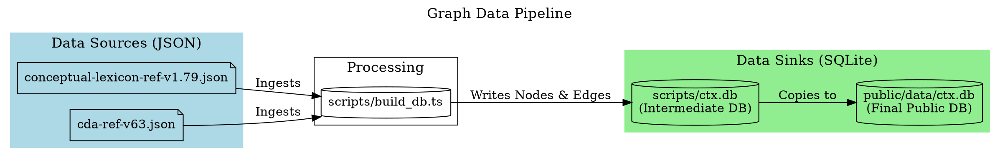
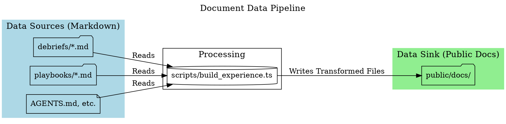

# System Architecture: Data Pipelines

This document provides a definitive overview of the data ingestion and processing pipelines used by the Polyvis application. Understanding these pipelines is crucial before attempting to modify how data is sourced, transformed, or presented.

The system uses two distinct, parallel pipelines:

1.  **The Graph Data Pipeline:** Responsible for creating the SQLite knowledge graph (`ctx.db`) from structured JSON data. This pipeline builds the relational model of concepts and directives.
2.  **The Document Data Pipeline:** Responsible for processing and preparing Markdown documents (like Debriefs and Playbooks) for display in the application's UI.

---

## 1. Graph Data Pipeline

This pipeline's sole purpose is to build the relational knowledge graph that powers the core visualization and data lookup features of Polyvis. It transforms structured JSON definitions into a normalized SQLite database.

**Responsible Script:** `scripts/build_db.ts`

### Visualization (DOT Graph)

### Process Flow

1.  **Sources:** The pipeline begins with two canonical JSON files located in `scripts/`:
    -   `conceptual-lexicon-ref-v1.79.json`: Contains definitions for terms, concepts, and other lexicon entries.
    -   `cda-ref-v63.json`: Contains the Core Directives Architecture.
2.  **Processing:** The `scripts/build_db.ts` script executes the following steps:
    -   Initializes a new SQLite database at `scripts/ctx.db`.
    -   Creates the `nodes` and `edges` table schema.
    -   Parses the source JSON files and inserts each entry as a `node` in the database.
    -   Parses tags (e.g., `[Implements:COG-5]`) to create explicit `edges`.
    -   Performs a keyword-matching pass over all node definitions to generate implicit `semantic` edges.
3.  **Sinks:** The process results in two database files:
    -   **Intermediate Sink:** `scripts/ctx.db` is the direct output of the script.
    -   **Final Sink:** The script then copies the completed database to `public/data/ctx.db`, which is the file ultimately loaded by the front-end application.

---

## 2. Document Data Pipeline

This pipeline's purpose is to gather various Markdown documents from their source locations and make them available to the front-end application. It is responsible for populating the browsable documentation section of the UI.

**Responsible Script:** `scripts/build_experience.ts`

### Visualization (DOT Graph)

### Process Flow

1.  **Sources:** The pipeline gathers Markdown files from several locations:
    -   `debriefs/`: Contains all post-task debriefing documents.
    -   `playbooks/`: Contains procedural guides.
    -   Root-level documents like `AGENTS.md`.
2.  **Processing:** The `scripts/build_experience.ts` script executes the following steps:
    -   Reads the content of each source Markdown file.
    -   Extracts metadata from the content (e.g., title from the first H1 tag, date from the filename).
    -   **Transformation:** Writes the content to the destination. *This is the critical step where transformations, such as reordering sections, can be applied before the final write.*
    -   Generates an index of all processed documents.
3.  **Sink:** The process has one primary sink:
    -   `public/docs/`: The script populates this directory with the processed Markdown files, mirroring the source structure. The front-end application reads directly from this folder to display documentation.